<!-- Auto-generated from AKG Graph. Edit source, not this file. -->
# Component Dependencies

> Auto-generated from AKG Graph
> Source: docs/architecture/akg/graph/current.json
> Commit: 2c3e875
> Generated: 2026-09-13T03:51:42.301Z

## Component Dependency Diagram

Shows how Svelte components use each other.

```mermaid
flowchart LR
    component__Avatar__194cf1187692d0b2["Avatar"]
    component__BottomSheet__fceb7b49ad2de3f9["BottomSheet"]
    component__SettingsPanel__d9b36e4dce4ce2["SettingsPanel"]
    component__SettingsButton__49da9a4a2a0be["SettingsButton"]
    component__ReactionFloat__293914ff96f194["ReactionFloat"]
    component__ScorecardSkeleton__1331e79a1a["ScorecardSkeleton"]
    component__GameViewSkeleton__b27eb1fed6c["GameViewSkeleton"]
    component__GalleryLeaderboard__07c183435["GalleryLeaderboard"]
    component__BugReportTrigger__dcc976ab368["BugReportTrigger"]
    component__PlayerListItem__fcb21a478823a["PlayerListItem"]
    component__EmptyRooms__751ee637f5f85d3a["EmptyRooms"]
    component__AIOpponentSelector__c5b7a8f06["AIOpponentSelector"]
    component__CreateRoomModal__486a0ad15c30["CreateRoomModal"]
    component__JoinRoomModal__2d198194d5173a["JoinRoomModal"]
    component__OpponentPanel__6b0a7b4e60d224["OpponentPanel"]
    component__MultiplayerGameOverModal__063["MultiplayerGameOverModal"]
    component__GameOverModal__e11b4055539166["GameOverModal"]
    component__EndGameSummary__a315ff517bc4a["EndGameSummary"]
    component__MultiplayerScorecard__0c80e09["MultiplayerScorecard"]
    component__AIBadge__b3aa993b7444b466["AIBadge"]
    component__GameHistory__a3931bf01a449479["GameHistory"]
    component__SetupModal__2beccf984dddd4a8["SetupModal"]
    component__StatsDashboard__88c699659d4b5["StatsDashboard"]
    component__ProfileForm__33d3353403a7d6c5["ProfileForm"]
    component__BugReportAdmin__7a7a109210e30["BugReportAdmin"]
    component__AllScorecards__5c234fd2d0157d["AllScorecards"]
    component__SpectatorHeader__4070c05cd34d["SpectatorHeader"]
    component__ScorecardLegend__040dede40436["ScorecardLegend"]
    component__HeroGame__0ed92ae9437b6613["HeroGame"]
    component__NewsDev__f0fda94ccf847704["NewsDev"]

```

## Component List (showing 30 of 36)

- **Avatar**: `packages/web/src/lib/components/ui/Avatar.svelte`
- **BottomSheet**: `packages/web/src/lib/components/ui/BottomSheet.svelte`
- **SettingsPanel**: `packages/web/src/lib/components/settings/SettingsPanel.svelte`
- **SettingsButton**: `packages/web/src/lib/components/settings/SettingsButton.svelte`
- **ReactionFloat**: `packages/web/src/lib/components/chat/ReactionFloat.svelte`
- **ScorecardSkeleton**: `packages/web/src/lib/components/skeleton/ScorecardSkeleton.svelte`
- **GameViewSkeleton**: `packages/web/src/lib/components/skeleton/GameViewSkeleton.svelte`
- **GalleryLeaderboard**: `packages/web/src/lib/components/gallery/GalleryLeaderboard.svelte`
- **BugReportTrigger**: `packages/web/src/lib/components/BugReportTrigger.svelte`
- **PlayerListItem**: `packages/web/src/lib/components/lobby/PlayerListItem.svelte`
- **EmptyRooms**: `packages/web/src/lib/components/lobby/EmptyRooms.svelte`
- **AIOpponentSelector**: `packages/web/src/lib/components/lobby/AIOpponentSelector.svelte`
- **CreateRoomModal**: `packages/web/src/lib/components/lobby/CreateRoomModal.svelte`
- **JoinRoomModal**: `packages/web/src/lib/components/lobby/JoinRoomModal.svelte`
- **OpponentPanel**: `packages/web/src/lib/components/game/OpponentPanel.svelte`
- **MultiplayerGameOverModal**: `packages/web/src/lib/components/game/MultiplayerGameOverModal.svelte`
- **GameOverModal**: `packages/web/src/lib/components/game/GameOverModal.svelte`
- **EndGameSummary**: `packages/web/src/lib/components/game/EndGameSummary.svelte`
- **MultiplayerScorecard**: `packages/web/src/lib/components/game/MultiplayerScorecard.svelte`
- **AIBadge**: `packages/web/src/lib/components/game/AIBadge.svelte`
- **GameHistory**: `packages/web/src/lib/components/profile/GameHistory.svelte`
- **SetupModal**: `packages/web/src/lib/components/profile/SetupModal.svelte`
- **StatsDashboard**: `packages/web/src/lib/components/profile/StatsDashboard.svelte`
- **ProfileForm**: `packages/web/src/lib/components/profile/ProfileForm.svelte`
- **BugReportAdmin**: `packages/web/src/lib/components/BugReportAdmin.svelte`
- **AllScorecards**: `packages/web/src/lib/components/spectator/AllScorecards.svelte`
- **SpectatorHeader**: `packages/web/src/lib/components/spectator/SpectatorHeader.svelte`
- **ScorecardLegend**: `packages/web/src/lib/components/scorecard/ScorecardLegend.svelte`
- **HeroGame**: `packages/web/src/lib/components/hub/HeroGame.svelte`
- **NewsDev**: `packages/web/src/lib/components/hub/NewsDev.svelte`
