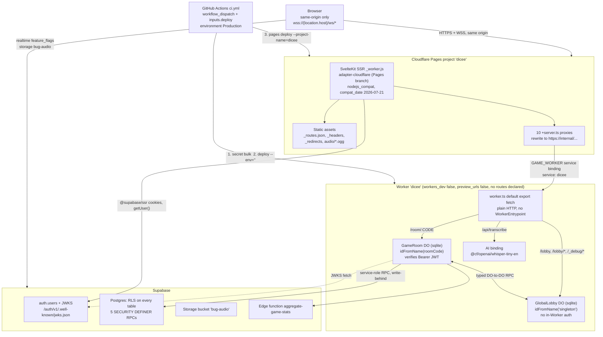

# Dicee Cloudflare current state

- **Status:** current descriptive authority for the implemented topology
- **Last reviewed:** 2026-09-12 (Durable Object lifecycle, `preview_urls`, config line citations and CI deploy gates; other sections as of 2026-07-22)
- **Scope:** what Dicee's Cloudflare architecture *is* today — components, bindings, secrets, ingress, data ownership, deployment paths, and verified defects
- **Authority:** subordinate to [`AGENTS.md`](../../AGENTS.md) and to current source and configuration; see [`docs/cloudflare/README.md`](README.md) for the governance contract
- **Evidence basis:** repository working tree, read offline on 2026-07-22. Every claim carries a `file:line` citation. No authenticated Cloudflare, Supabase, or GitHub operation was performed; see [What this document cannot tell you](#what-this-document-cannot-tell-you).

The repository declares one Cloudflare Pages project and one Cloudflare Worker;
live existence of either is unverified (see
[`operator-evidence.md`](operator-evidence.md) OPS-01 and OPS-07). The Pages
project serves the SvelteKit application and is the intended sole public origin;
the browser never contacts the Worker directly, because all three WebSocket call
sites build their URL from `location.host`. The SvelteKit server layer reaches
the Worker through a single `GAME_WORKER` Service Binding, rewriting every
request to the synthetic origin `https://internal/...`. The Worker is a plain
default-export `fetch` handler that routes to two SQLite-backed Durable Objects
(`GameRoom` per room code, `GlobalLobby` as a hardcoded singleton) plus one
Workers AI binding for audio transcription. Supabase remains the identity
provider, the relational store, the realtime channel for feature flags, and the
only blob store. Durable Objects own all live game and lobby state and write
history forward to Postgres over service-role RPC; Postgres never reads back.

> **Read this before trusting any line below.** The entire Cloudflare
> configuration described here is **uncommitted**. Both `wrangler.jsonc` files
> and this document's own directory are untracked, and both `wrangler.toml`
> files are deleted in the working tree but still present at `HEAD`. A clean
> clone gets a materially different configuration. See
> [CS-1](#cs-1--the-configuration-described-here-is-uncommitted).

> **On defect identifiers.** This document's defects are numbered `CS-1`..`CS-9`.
> They were previously `D1`..`D9`, which collided with Cloudflare D1 the product;
> sibling documents may still carry the old form.

---

## 1. Implemented topology



Evidence for each edge:

| Edge | Evidence |
|---|---|
| Browser reaches only the Pages origin | `packages/web/src/lib/services/roomService.svelte.ts:142`, `packages/web/src/lib/services/spectatorService.svelte.ts:694`, `packages/web/src/lib/stores/lobby.svelte.ts:204` all build `${protocol}//${location.host}/ws/...` |
| Proxy to Worker over the service binding | `packages/web/src/routes/ws/lobby/+server.ts:15,61`; `packages/web/src/routes/ws/room/[code]/+server.ts:19,61`; `packages/web/src/routes/api/transcribe/+server.ts:10,32` |
| Worker routing | `packages/cloudflare-do/src/worker.ts:58-61` (lobby + `_debug`), `:65-71` (`/room/:CODE`), `:48-50` (`/api/transcribe`) |
| Durable Object RPC, both directions | `packages/cloudflare-do/src/GameRoom.ts:263-264` (`env.GLOBAL_LOBBY` stub); `packages/cloudflare-do/src/GlobalLobby.ts:1116-1117,1182-1183` (`env.GAME_ROOM` stub) |
| Worker AI call | `packages/cloudflare-do/src/api/transcribe.ts:70` |
| DO writes forward to Postgres | `packages/cloudflare-do/src/lib/persistence/supabase-rpc.ts:273` (`POST ${supabaseUrl}/rest/v1/rpc/${functionName}`) |
| DO calls the Supabase edge function | `packages/cloudflare-do/src/lib/persistence/persistence-queue.ts:267` |
| DO fetches JWKS | `packages/cloudflare-do/src/auth.ts:183` builds the JWKS URL from the Supabase URL; `:241-247` fails closed when it is empty |

Exactly ten `+server.ts` files reference `GAME_WORKER`
(`grep -rln GAME_WORKER packages/web/src/routes --include='+server.ts'` returns
10); §3 enumerates all ten. Twelve `+server.ts` files exist under
`packages/web/src/routes` — `api/telemetry` and `auth/callback` do not proxy to
the Worker.

There is **no** `WorkerEntrypoint` and no typed RPC surface exposed to the web
app. `packages/cloudflare-do/src/worker.ts:17` is a plain
`export default { async fetch(...) }`, so every web-to-Worker call — including
WebSocket upgrades — is HTTP over the service binding. Typed RPC exists only
between the two Durable Objects.

---

## 2. Components

| Component | Package | Config file | Owns |
|---|---|---|---|
| SvelteKit application and SSR | `packages/web` | `packages/web/wrangler.jsonc` | Public origin, session cookies, admin RBAC gate, all 10 proxy routes to the Worker, static assets |
| Durable Objects Worker | `packages/cloudflare-do` | `packages/cloudflare-do/wrangler.jsonc` | Request routing, `GameRoom`, `GlobalLobby`, audio transcription, write-behind persistence to Supabase |
| `GameRoom` Durable Object | `packages/cloudflare-do/src/GameRoom.ts` | created by migration `v1` at `wrangler.jsonc:13` | Per-room live game state, chat, alarms, hibernatable WebSockets, JWT verification, the persistence outbox |
| `GlobalLobby` Durable Object | `packages/cloudflare-do/src/GlobalLobby.ts` | created by migration `v2` at `wrangler.jsonc:14` | Global presence, lobby chat, the room directory, invite delivery, join-request routing, the `/_debug/*` surface |
| Shared domain types | `packages/shared` | — | Zod schemas and TypeScript types imported by both the Worker and the web app |
| Supabase | `supabase/` | `supabase/config.toml` (local dev only) | Identity, relational history, RLS authorization, `bug-audio` storage, `feature_flags` realtime, `aggregate-game-stats` edge function |

Both `wrangler.jsonc` files declare `"name": "dicee"`
(`packages/cloudflare-do/wrangler.jsonc:3`, `packages/web/wrangler.jsonc:3`).
These are different resource kinds — a Worker script name and a Pages project
name — so the service binding at `packages/web/wrangler.jsonc:7` resolves
unambiguously to the Worker. It is a legibility problem today, not a functional
one.

`GlobalLobby` is single-global by construction, not merely by naming. The
singleton id is hardcoded in two places
(`packages/cloudflare-do/src/worker.ts:58`,
`packages/cloudflare-do/src/GameRoom.ts:263`), and presence, broadcast, and the
debug connection listing all iterate `this.ctx.getWebSockets()` on that one
instance (`packages/cloudflare-do/src/GlobalLobby.ts:201`).

---

## 3. Binding inventory

| Binding | Declared where | Consumed where | Per-environment presence |
|---|---|---|---|
| `GAME_WORKER` (service → `dicee`) | `packages/web/wrangler.jsonc:7`; `env.preview` repeats it at `:14` | `packages/web/src/routes/ws/lobby/+server.ts:15`, `ws/room/[code]/+server.ts:19`, `api/transcribe/+server.ts:10`, `api/lobby/online/+server.ts:10`, `api/lobby/rooms/+server.ts:10`, `_debug/rooms/+server.ts:15`, `_debug/rooms/[code]/+server.ts:15`, `_debug/rooms/all/+server.ts:15`, `_debug/connections/+server.ts:15`, `_debug/storage/+server.ts:15` | Pages production + `preview`. Both point at `service: "dicee"`. |
| `GAME_ROOM` (Durable Object) | `packages/cloudflare-do/wrangler.jsonc:18`, `:42`, `:55` | `packages/cloudflare-do/src/worker.ts:68-69`; `packages/cloudflare-do/src/GlobalLobby.ts:1116-1117`, `:1182-1183` | top-level, `development`, `staging` |
| `GLOBAL_LOBBY` (Durable Object) | `packages/cloudflare-do/wrangler.jsonc:19`, `:43`, `:56` | `packages/cloudflare-do/src/worker.ts:58-59`; `packages/cloudflare-do/src/GameRoom.ts:263-264` | top-level, `development`, `staging` |
| `AI` (Workers AI) | `packages/cloudflare-do/wrangler.jsonc:22`, `:46`, `:59` | `packages/cloudflare-do/src/api/transcribe.ts:70` — the only read in the package | top-level, `development`, `staging` |

`durable_objects`, `ai`, `vars`, and `secrets` are non-inheritable keys, so
their repetition in `env.development` and `env.staging` is required, not
redundant. `migrations`, `observability`, `workers_dev`, and `preview_urls` are
inheritable (installed wrangler 4.113.0 normalizer) and are correctly declared
only at the top level (`packages/cloudflare-do/wrangler.jsonc:5-6`, `:12-15`,
`:26-30`). Do not "fix" this by copying them into the environment blocks.

Durable Object classes are declared with the legacy `migrations` array
(`packages/cloudflare-do/wrangler.jsonc:12-15`): tag `v1` creates `GameRoom` and
tag `v2` creates `GlobalLobby`, both as `new_sqlite_classes`. That is the same
history HEAD's `wrangler.toml` applied. There is no `exports` key. Per the
owner decision recorded in
[ADR-005](../rfcs/adr-005-durable-object-lifecycle.md) on 2026-09-12, declarative
`exports` is deferred to a standalone operator deploy after that ADR is
accepted. Class names must match the `export { GameRoom, GlobalLobby }`
statement at `packages/cloudflare-do/src/worker.ts:15`.

An offline dry run resolves the binding set exactly as declared (re-run on
2026-09-12 against the `migrations` config for `--env=""`, `--env=staging` and
`--env=development`, with the same binding table apart from `ENVIRONMENT`):

```
$ wrangler deploy --dry-run --env="" --outdir=$TMPDIR/dicee-verify   # wrangler 4.113.0
Total Upload: 1083.19 KiB / gzip: 176.45 KiB
env.GAME_ROOM (GameRoom)             Durable Object
env.GLOBAL_LOBBY (GlobalLobby)       Durable Object
env.AI                               AI
env.ENVIRONMENT ("production")       Environment Variable
```

Note that the dry-run binding table prints neither the Durable Object lifecycle
declaration (`migrations` or `exports`) nor `secrets`, so it cannot be used as
positive evidence about either.

---

## 4. Secrets and environment variables

### Worker (`packages/cloudflare-do`)

| Name | Declared in | Read at | Notes |
|---|---|---|---|
| `SUPABASE_URL` | `wrangler.jsonc:24`, `:38`, `:51` | `src/GameRoom.ts:295,328,346,698`; `src/api/transcribe.ts:47`; `src/auth.ts:183` (JWKS URL) and `:241-247` (fail-closed guard); `src/lib/persistence/supabase-rpc.ts:110`; `src/lib/persistence/game-persistence.service.ts:40` | Mandatory. The JWKS URL is derived from it at `auth.ts:183`, and `auth.ts:241-247` fails closed when it is empty. `auth.ts:220` is a JSDoc `@example`, not a read site. |
| `SUPABASE_ANON_KEY` | `wrangler.jsonc:24`, `:38`, `:51` | `src/GameRoom.ts:296,347`; `src/lib/persistence/game-persistence.service.ts:42` | Used as the `Bearer` credential on the `aggregate-game-stats` edge-function call (`src/lib/persistence/persistence-queue.ts:267`). |
| `SUPABASE_SERVICE_ROLE_KEY` | `wrangler.jsonc:24`, `:38`, `:51` | `src/GameRoom.ts:324,329`; `src/lib/persistence/supabase-rpc.ts:111`; `src/lib/persistence/game-persistence.service.ts:41` | Plumbed into `SupabaseRpcClient` for all `/rest/v1/rpc/` writes. |
| `SUPABASE_JWT_SECRET` | **not** in any `secrets.required`; named only in the trailing comment at `wrangler.jsonc:64-66`; hand-declared optional at `src/types.ts:45` | `src/GameRoom.ts:699`; `src/api/transcribe.ts:47` | **Read but undeclared.** `src/auth.ts` never reads it from `env`; it arrives as the optional `jwtSecret` parameter (`src/auth.ts:230`) and is consumed only on the HS256 fallback path (`:278-282`). See [CS-2](#cs-2--supabase_jwt_secret-is-read-but-not-declared). |
| `ENVIRONMENT` (var) | `wrangler.jsonc:32`, `:36`, `:49` | nowhere in production source; the only occurrence is a test fixture at `src/__tests__/worker.integration.test.ts:32` | **Declared but unread.** See [CS-5](#cs-5--dead-configuration). |

An exhaustive scan of `env.<NAME>` reads across
`packages/cloudflare-do/src` (excluding tests) returns exactly seven binding or
secret names: `GAME_ROOM`, `GLOBAL_LOBBY`, `AI`, `SUPABASE_URL`,
`SUPABASE_ANON_KEY`, `SUPABASE_SERVICE_ROLE_KEY`, `SUPABASE_JWT_SECRET`.

`packages/cloudflare-do/src/types.ts` hand-declares a `SecretBindings`
interface covering all four Supabase secrets and exports
`Env = Cloudflare.Env & SecretBindings`, so a change to `secrets.required`
affects type generation, local-dev variable loading, and the deploy-time
presence gate — but does not by itself break compilation.

### Web (`packages/web`)

| Name | Declared in | Read at | Notes |
|---|---|---|---|
| `PUBLIC_SUPABASE_URL` | supplied at build time by CI (`.github/workflows/ci.yml:150`) | `src/routes/+layout.ts:16`; `src/lib/supabase/client.ts:2,10`; `src/lib/supabase/server.ts:3,14` | Imported from `$env/static/public`, so it is inlined at build time and must be present during `vite build`, not at runtime. |
| `PUBLIC_SUPABASE_ANON_KEY` | same | same files | Same build-time semantics. |
| `PUBLIC_WORKER_HOST` | **nowhere** | `src/lib/components/hub/LobbyGate.svelte:18` (`$derived(!!env.PUBLIC_WORKER_HOST)`) | **Read but undefined.** A repository-wide search finds only this read site. The derived `isLive` indicator is permanently false unless the value was set out of band. |
| `ENVIRONMENT` (var) | `packages/web/wrangler.jsonc:11`, `:15` | not read in `packages/web/src` | Declared in both Pages environments; the only `ENVIRONMENT`-shaped matches in web source are unrelated constants in `src/lib/types/device-testing.schema.ts`. |

No service-role material exists anywhere in `packages/web`. The service-role key
lives only on the Worker.

---

## 5. Ingress and trust boundary

### What is intended public

Every row below is repository intent. Live reachability of the Pages origin, and
the set of hostnames it answers on, are unverified — see
[`operator-evidence.md`](operator-evidence.md) OPS-13.

| Surface | Intended status | Evidence |
|---|---|---|
| The Pages origin | Intended public origin, and the only origin the client code contacts; live reachability unverified (OPS-13). | All three WS call sites use `location.host` (§1 table). |
| `/_debug/*` on the Pages origin | Intended to be reachable on that same origin and authorization-gated at the proxy; live reachability unverified (OPS-13). | Five SvelteKit routes exist under `packages/web/src/routes/_debug/`, each gated at line 12 (table below). |

### What is intended private

`packages/cloudflare-do/wrangler.jsonc:5` sets `"workers_dev": false`, `:6`
sets `"preview_urls": false`, and the file declares no `route`, `routes`, or
`custom_domain` key. Both subdomain keys are inheritable and no named
environment overrides them. The repository therefore declares zero public
ingress for the Worker. This is repository configuration, not proof of live
routing; OPS-12 is the check that settles whether any route, custom domain,
`workers.dev` subdomain, or Preview URL is live.

`preview_urls` was made explicit on 2026-09-12. Earlier revisions left it unset,
relying on two documentation facts retrieved 2026-07-22: the default follows
`workers_dev`, and Preview URLs are not generated for Workers that implement a
Durable Object. Installed wrangler 4.113.0 sends no `preview_urls` value when the
key is unset (`getSubdomainValues`), so the outcome depended on the platform
default. The explicit `false` removes that dependence, and
`scripts/cloudflare-config-audit.mjs` B1P now fails if the key is unset or
overridden. At HEAD, `wrangler.toml` set neither key, so `workers_dev` defaulted
to `true` for any deploy made from HEAD; whether that subdomain is live is OPS-12.

### What the code actually enforces

The Worker has **two different trust models** behind one router.

`GameRoom` authenticates. `packages/cloudflare-do/src/GameRoom.ts:677-680`
requires a bearer token in the `Authorization` header and returns 401 without one, then
`:698-706` calls `verifySupabaseJWT` and maps a JWKS failure to 503. It derives
identity from the verified `sub` claim and ignores the identity headers
entirely.

`GlobalLobby` does not. `packages/cloudflare-do/src/GlobalLobby.ts:311-313`
takes identity verbatim from `X-User-Id` / `X-Display-Name` / `X-Avatar-Seed`
with a `crypto.randomUUID()` fallback. A search for
`verifySupabaseJWT|Authorization|requireAdmin` across the 1,380-line file
returns **zero matches** — it never inspects the `Authorization` header the
proxy does send it. The code comment at `:309-310` states the assumption
explicitly: "The Worker is service-binding-only in production."

`/_debug/*` is unauthenticated **inside the Worker**.
`packages/cloudflare-do/src/worker.ts:53-61` forwards any `/_debug/` path to the
lobby stub with no check, and the handlers at
`packages/cloudflare-do/src/GlobalLobby.ts:192-235` and `:243-268` — including
the `roomCode === 'ALL'` mass room-delete branch at `:248-268` — apply none.

**Authorization for that surface lives entirely in the Pages proxy**, and it is
present on all five routes, not just one. Each calls `requireAdminPermission`
at line 12 with a distinct permission:

| Route | Permission |
|---|---|
| `packages/web/src/routes/_debug/rooms/+server.ts:12` | `rooms:view` |
| `packages/web/src/routes/_debug/rooms/[code]/+server.ts:12` | `rooms:close` |
| `packages/web/src/routes/_debug/rooms/all/+server.ts:12` | `rooms:clear_all` |
| `packages/web/src/routes/_debug/connections/+server.ts:12` | `users:view` |
| `packages/web/src/routes/_debug/storage/+server.ts:12` | `audit:view` |

`packages/web/src/lib/server/admin.ts:11` implements the gate against the
database-backed `has_admin_permission` RPC.

Identity headers are likewise **server-authoritative on the intended path**.
Both WebSocket proxies strip client-supplied values before setting them from a
validated session: `packages/web/src/routes/ws/lobby/+server.ts:29-32` and
`packages/web/src/routes/ws/room/[code]/+server.ts:39-42` each delete
`X-User-Id`, `X-Display-Name`, `X-Avatar-Seed`, and `Authorization`.

### Accurate characterization

This is **single-layer authorization at a trust boundary**, not an open hole.
The Worker delegates 100% of lobby identity and all `/_debug` authorization to
the Pages proxy. That delegation holds only while the Worker is unreachable
except through the `GAME_WORKER` service binding. Any second caller of that
binding, or the Worker becoming routable, would expose
`DELETE /_debug/rooms/all` with no in-Worker check. The repository declares the
unroutable posture; live routing state is unverified (OPS-12), as is public
reachability of the Pages origin that carries the gated proxy routes (OPS-13).

Audio transcription is a third, separately authenticated surface:
`packages/cloudflare-do/src/api/transcribe.ts:41` gates on content type, `:45`
requires a bearer token, `:47` verifies it, and `:51`/`:68` enforce byte caps
(`MAX_REQUEST_BYTES = 7 MiB` at `:19`, `MAX_AUDIO_BYTES = 5 MiB` at `:18`).

---

## 6. Data ownership

### Durable Object storage

`GameRoom` uses both KV-style storage and SQLite:

| Key or table | Kind | Evidence |
|---|---|---|
| `room` | KV | `src/GameRoom.ts:689,1143,1146,1165,1176,1239,1255,1292,1298` |
| `room_code` | KV | `src/GameRoom.ts:649,652,756,804,825,842` |
| `game_state` | KV | `src/game/state.ts:41` (`GAME_STATE_KEY`), used at `:98,110` |
| `alarm_data` | KV | `src/game/state.ts:42` (`ALARM_DATA_KEY`), used at `:621-680`; deleted at `src/GameRoom.ts:968,1306,1342,...` |
| `alarm_queue` | KV | `src/lib/alarm-queue.ts:19` (`STORAGE_KEY`), used at `:76,110,138,169,213,224` |
| `chat:messages`, `chat:rateLimits` | KV | `src/chat/ChatManager.ts:35-39` (`STORAGE_KEYS`), used at `:84-85,115,154,355` |
| `pending_domain_events`, `persistence_queue`, `game_metadata` | SQLite | `src/lib/persistence/migrations.ts:15,36,54` |

The three SQLite tables are a write-behind outbox and hibernation-recovery
store, not a query surface. Pruning is limited to
`src/lib/persistence/migrations.ts:65` and `:72`.

`GlobalLobby` is declared `"storage": "sqlite"` but uses **zero SQL** — a search
for `storage.sql` in `src/GlobalLobby.ts` and `src/lib/room-directory.ts`
returns no matches. Its entire persistent state is two KV keys:

| Key | Evidence |
|---|---|
| `lobby:activeRooms` | `src/lib/room-directory.ts:28`; persisted as a whole-array blob at `:85` (`storage.put(STORAGE_KEY, [...rooms.entries()])`) |
| `lobby:chatHistory` | `src/GlobalLobby.ts:221` |

Hibernation is implemented correctly on `GameRoom`: a synchronous constructor,
`setWebSocketAutoResponse` for ping/pong at `src/GameRoom.ts:267`,
`ctx.blockConcurrencyWhile` for async table init at `:283`, tagged
`acceptWebSocket` at `:725`, and an `alarm()` handler at `:839`. `GlobalLobby`
has no `alarm()` handler.

### Supabase Postgres

Flow is one-directional. `GameRoom` writes history forward through five
`SECURITY DEFINER` RPCs over `/rest/v1/rpc/`
(`src/lib/persistence/supabase-rpc.ts:273`):

| RPC | Called at |
|---|---|
| `create_game_atomic` | `src/lib/persistence/supabase-rpc.ts:166` |
| `complete_game_atomic` | `:195` |
| `persist_domain_events` | `:228` |
| `abandon_game_atomic` | `:245` |
| `aggregate_game_stats` | `:259` |

plus one edge-function call to `aggregate-game-stats`
(`src/lib/persistence/persistence-queue.ts:267`). Postgres never reads Durable
Object state.

Tables actually touched by application code via PostgREST are nine:
`bug_reports`, `domain_events`, `feature_flags`, `game_players`, `games`,
`player_stats`, `profiles`, `solo_leaderboard`, `telemetry_events`. Declared
tables with **no** `.from()` reader or writer include `rooms`,
`analysis_events`, `gallery_stats`, `gallery_achievements`, and
`admin_audit_log`. (`admin_permissions` is reached indirectly — the web app
calls only three RPCs: `has_admin_permission`, `get_user_permissions`,
`get_user_role`.)

Supabase also owns capabilities with no Cloudflare equivalent in the current
architecture: the `feature_flags` realtime channel, the `bug-audio` storage
bucket, and the edge function above.

### Blobs

No Cloudflare blob store exists. Generated sound effects are committed `.ogg`
files served as Pages static assets; the only user-uploaded binary is
bug-report voice notes, which live in the Supabase `bug-audio` bucket. The
transcription path streams audio to Workers AI and persists nothing —
`src/api/transcribe.ts:70` returns text only.

There is **no D1 database and no R2 bucket**. `packages/cloudflare-do/wrangler.jsonc`
declares no `d1_databases` and no `r2_buckets` key, and no OpenTofu module
exists (`find . -name "*.tf"` returns nothing).

---

## 7. Deployment paths

### CI — the canonical route

`.github/workflows/ci.yml` defines two deploy jobs. Both are gated on
`workflow_dispatch` with an explicit `deploy` input and on `refs/heads/main`,
both require `validate`, both are pinned to the GitHub `Production` environment,
and both share a non-cancellable `production-deploy` job concurrency group.
Line numbers are from the working tree read on 2026-09-12; `ci.yml` is being
edited concurrently under P1-08.

| Job | Line | Gate | Command |
|---|---|---|---|
| `deploy-worker` | `:95` | `:98` `needs: validate`; `:99` `workflow_dispatch && inputs.deploy && github.ref == 'refs/heads/main'`; `:100` `environment: Production`; `:101-103` `production-deploy`, `cancel-in-progress: false`; `:123-124` builds `@dicee/shared` | `:132` `deploy --env=""` via `cloudflare/wrangler-action` (SHA-pinned) |
| `deploy-pages` | `:142` | `:145` `needs: [validate, deploy-worker]`; `:146` same dispatch/main gate; `:148-150` same concurrency group; `:182-183` builds `@dicee/shared` | `:194` `pages deploy .svelte-kit/cloudflare --project-name=dicee --commit-dirty=true` |

The workflow-level group (`:16-19`) still lets a push to `main` cancel an
in-flight dispatched deploy run. See
[`risk-register.md`](risk-register.md) CF-R10.

Ordering is correct for the service-binding dependency: the Worker deploys
before Pages.

`--env=""` is deliberate. It selects the top-level environment and suppresses
the multi-environment ambiguity warning that Wrangler emits when several
environments are declared.

The `wrangler-action` `secrets:` input uploads secrets **before** running the
`command:`. Per the operator research document dated 2026-07-21, that upload is
itself a version-creating deploy, meaning one CI dispatch produces two Worker
versions with a window where new secrets run against old code; recheck against
current Cloudflare documentation at implementation time.

### Escape hatches — all operator-only, none gated

| Script | Defined at | Runs validation? |
|---|---|---|
| `pnpm do:deploy` | `package.json:43` | No. Wraps `scripts/with-dicee-cloudflare.sh`. |
| `pnpm pages:deploy` | `package.json:45` | Runs `pnpm build` only — no `check`, `lint`, or `test`. |
| `pnpm deploy` | `package.json:47` | Chains the two above. |
| `pnpm --filter @dicee/cloudflare-do deploy` | `packages/cloudflare-do/package.json:20` (`wrangler deploy --env=`) | No, and **unwrapped** — bypasses `scripts/with-dicee-cloudflare.sh`. |
| `pnpm --filter @dicee/cloudflare-do deploy:staging` | `packages/cloudflare-do/package.json:21` | No, unwrapped. Not referenced by any root script. |
| `pnpm --filter @dicee/web pages:deploy` | `packages/web/package.json:31` | No, unwrapped. |
| `wrangler tail --env=` | `packages/cloudflare-do/package.json:22` | Read-only, but unwrapped. |

`pnpm validate` (`package.json:33`) is invoked by **no** deploy script. The only
automated pre-deploy gate is `lefthook` on `pre-push`, which guards `git push`,
not deployment.

There is **no staging deploy path in CI**. A search for `staging` across
`.github/` returns no matches, even though `packages/cloudflare-do/wrangler.jsonc`
declares `env.staging` and a `deploy:staging` script exists. There is no
rollback step anywhere in the workflow.

---

## 8. Safe offline commands

These run without credentials and without network access. All were executed on
2026-07-22 during the preparation of this document except where noted.

| Command | What it proves |
|---|---|
| `pnpm --filter @dicee/cloudflare-do types:check` | Generated Worker types match `wrangler.jsonc` (`packages/cloudflare-do/package.json:24`) |
| `pnpm --filter @dicee/web types:check` | Same for the Pages config (`packages/web/package.json:28`) |
| `pnpm check:workers` | Both of the above, via the root script |
| `cd packages/cloudflare-do && wrangler deploy --dry-run --env="" --outdir=$TMPDIR/x` | Config parses, bundle builds, bindings resolve. Also accepts `--env development` and `--env staging`. Roughly 3 seconds. |
| `pnpm --filter @dicee/cloudflare-do test:agent` | Worker unit suite |
| `pnpm --filter @dicee/web test:agent` | Web unit suite |
| `pnpm akg:check` | Architecture invariants against the committed graph |
| `pnpm validate` | The canonical full local gate (`package.json:33`) |

The dry run does **not** validate `secrets.required` and does not surface
`workers_dev` or `preview_urls`. It emits no Durable Object lifecycle information
in either mode: with `exports`, reconciliation happens server-side, and with the
current `migrations` array, installed wrangler 4.113.0 skips the live
`migration_tag` lookup under `--dry-run`, so it cannot tell a no-op from a first
provision. Treat a clean dry run as evidence about the bundle and bindings only.
`node scripts/cloudflare-config-audit.mjs` (offline, no credentials) is the
companion check for lifecycle mode, applied migration history, and subdomain
exposure.

`wrangler dev`, `wrangler pages dev`, `wrangler secret *`, `wrangler tail`, and
every `deploy` variant are operator-only.

---

## 9. Known divergences and open defects

Ordered by consequence. Each survived independent verification during this
review.

### CS-1 — the configuration described here is uncommitted

**Severity: blocker for any deploy or clean clone.**

`git status --porcelain` reports `?? packages/cloudflare-do/wrangler.jsonc`,
`?? packages/web/wrangler.jsonc`, `?? AGENTS.md`, `?? docs/cloudflare/`,
`?? docs/planning/dicee-cloudflare-resource-guidance.md`, and
` D packages/cloudflare-do/wrangler.toml`, ` D packages/web/wrangler.toml`.
`git ls-files | grep -i wrangler` returns only the two `.toml` paths.

At `HEAD`, `packages/cloudflare-do/wrangler.toml` carries
`compatibility_date = "2025-01-01"` and legacy `[[migrations]]` blocks with
`new_sqlite_classes` — the superseded form. So a clean clone gets a materially
different configuration from the one every document describes.

`.github/workflows/ci.yml` is **also modified** in the working tree. At `HEAD`
its deploy jobs are gated `if: github.ref == 'refs/heads/main' && github.event_name == 'push'`
and run `deploy --env production` (HEAD `:271`, `:301`). The working-tree
version replaces both with `workflow_dispatch` + `inputs.deploy` and
`deploy --env=""`. The working-tree `wrangler.jsonc` declares **no** `production`
environment — only top-level, `development`, and `staging` — so the config file
and the deploy command must move in the same commit or the main-branch deploy
would target an environment the new config does not define.

**Update 2026-09-12.** The working-tree Durable Object lifecycle now matches HEAD.
`wrangler.jsonc:12-15` carries the same `v1`/`v2` `new_sqlite_classes` migrations
as HEAD's `wrangler.toml`. The one remaining lifecycle difference is where they
are declared: once at the top level and inherited, instead of top level plus
`[env.production]`. What still differs is the compatibility date,
`secrets.required`, observability, `workers_dev`/`preview_urls`, and the deploy
target. HEAD CI deployed `dicee-production`; the new config's top level deploys
`dicee`.

### CS-2 — `SUPABASE_JWT_SECRET` is read but not declared

**Severity: high (local dev is silently broken; deploy gate does not cover it).**

Read from `env` at `packages/cloudflare-do/src/GameRoom.ts:699` and
`src/api/transcribe.ts:47` — those are the only two `env.SUPABASE_JWT_SECRET`
sites. Both pass the value into `verifySupabaseJWT`, which takes it as the
optional `jwtSecret` parameter (`src/auth.ts:230`) and uses it only on the HS256
fallback branch (`:278-282`). `src/auth.ts:220` is a JSDoc `@example` line and is
not a read site; earlier revisions of this document cited it as one. Absent from
every `secrets.required` list (`wrangler.jsonc:24`, `:38`, `:51`). The file's own
trailing comment at `:64-66` tells you to provision it.

Consequence, confirmed against installed wrangler 4.113.0: once `secrets` is
declared, only names present in `vars` or in `secrets.required` are loaded from
`.dev.vars` / `.env` during local development, so placing this secret in
`.dev.vars` today does nothing. It is also excluded from generated types —
compilation survives only because `src/types.ts:45` hand-declares it optional.

This does **not** mean the secret disappears at runtime if it was provisioned
with `wrangler secret put`. `secrets.required` governs type generation,
local-dev loading, and a deploy-time presence check; it is not the runtime
environment. The practical loss is the deploy-time guardrail and local
reproducibility.

Resolving this requires one fact nobody in this repository can supply: whether
the Supabase project still issues legacy HS256 tokens. `src/auth.ts` is
JWKS-first and reaches the HS256 path only on a no-matching-key error, so if
the project issues only asymmetric tokens, the correct fix may be to delete the
fallback rather than declare the secret. This is a Supabase question, not a
Cloudflare one, so it has **no** canonical `OPS-NN` entry in
[`operator-evidence.md`](operator-evidence.md); do not invent one. It is carried
as item 9 of [What this document cannot tell you](#what-this-document-cannot-tell-you).

### CS-3 — no Durable Object storage is ever deleted

**Severity: high (unbounded growth against storage that should be planned as billed).**

`rg -n 'deleteAll' packages/cloudflare-do/src` returns **no matches**. On game
over and on room cleanup, `GameRoom` flips `roomState.status` to `completed` or
`abandoned` and writes it back (`src/GameRoom.ts:1143-1146`, `:1165-1176`) —
`room`, `room_code`, `game_state`, `alarm_queue`, `chat:*`, and the per-room
SQLite tables persist indefinitely. The only pruning is of persistence
bookkeeping (`src/lib/persistence/migrations.ts:65,72`).

On the billing status, state the nuance rather than either extreme. The
Cloudflare Durable Objects pricing page, retrieved 2026-07-22, still reads in
future tense: it carries a callout that storage billing on SQLite-backed Durable
Objects "will be enabled in January 2026, with a target date of January 7, 2026
(no earlier)", and that only usage on and after that date incurs charges. The
announced target date is now roughly six months past, but the page has not been
updated out of future tense, so the documentation alone does not confirm the
switch was thrown. Rates on that page are 5 GB-month included on Workers Paid,
then $0.20 per GB-month. Whether *this* account is being charged is answerable
only from the account's own billing and usage view — an operator question, not a
documentation one. Plan as though storage is billed; treat enablement as open.

### CS-4 — `GlobalLobby.scheduleRoomRemoval` uses `setTimeout` inside a Durable Object

**Severity: medium (room-directory entries leak on hibernation).**

`packages/cloudflare-do/src/GlobalLobby.ts:951-952` — the code comment
concedes it: "Note: Using setTimeout for simplicity. Could use DO alarms for
persistence." `GlobalLobby` has no `alarm()` handler (`async alarm(` matches
only `src/GameRoom.ts:839`), so a deferred removal is lost whenever the lobby
object hibernates or is evicted inside the delay window.

### CS-5 — dead configuration

**Severity: low.**

- `ENVIRONMENT` is declared in all three Worker environments
  (`wrangler.jsonc:32,36,49`) and in both Pages environments
  (`packages/web/wrangler.jsonc:11,15`), and is read in neither package's
  production source.
- `PUBLIC_WORKER_HOST` is read at
  `packages/web/src/lib/components/hub/LobbyGate.svelte:18` and defined nowhere
  in the repository.
- `GamePersistenceService` reads three Supabase values
  (`src/lib/persistence/game-persistence.service.ts:40-42`) but is never
  constructed; the live write path is `SupabaseRpcClient`.

### CS-6 — the Workers AI model is hardcoded and the duration cap is unwired

**Severity: low.**

`packages/cloudflare-do/src/api/transcribe.ts:70` passes the literal
`'@cf/openai/whisper-tiny-en'` at the call site rather than reading it from
config. Byte caps exist (`:18-19`, enforced at `:51`, `:68`) but
`estimateAudioDuration`, defined at `:97`, has **no call site** — so there is no
duration cap.

### CS-7 — the Pages `preview` environment binds to the production Worker

**Severity: medium.**

`packages/web/wrangler.jsonc:14` sets `env.preview.services` to
`service: "dicee"`, identical to the top-level production binding at `:7`. Any
preview deployment therefore drives production Durable Object state. Nothing in
the repository consumes the Worker's `development` or `staging` environments.

### CS-8 — the hand-written `App.Platform` type can drift from generated types

**Severity: low.**

`packages/web/src/app.d.ts:54-58` declares `Platform.env.GAME_WORKER`
independently of `packages/web/worker-configuration.d.ts`, and
`packages/web/tsconfig.json` does not reference the generated file (contrast
`packages/cloudflare-do/tsconfig.json:7,21`, which does). It already diverges —
`app.d.ts` omits `ENVIRONMENT`. A binding rename applied to the config and the
generated types but not to `app.d.ts` would still typecheck.

### CS-9 — no test or gate asserts any Cloudflare config invariant

**Severity: medium.**

No test file in the repository references `wrangler.jsonc`, `workers_dev`, or
`secrets`. `pnpm validate` cannot regress-detect a change to any of them. The
existing `lefthook` `worker-types` hook is already glob-scoped to
`packages/{web,cloudflare-do}/wrangler.jsonc`, so it is the natural place to
attach such a check — but note that a strict CI step reading `wrangler.jsonc`
would fail immediately today, because CI checks out `HEAD`, where those files
do not exist (CS-1).

---

## What this document cannot tell you

No authenticated Cloudflare, Supabase, or GitHub operation was performed. Every
statement above is repository evidence. **Repository configuration is not
evidence of live state.** The following remain unverified and require an
authorized operator lane. `OPS-NN` references point at the canonical check
definitions in [`operator-evidence.md`](operator-evidence.md), which is the only
place those checks are defined.

1. **Which script holds the live Durable Object namespaces, whether each is
   SQLite-backed, and which migration tag that script carries** — OPS-02 and
   OPS-03, with OPS-04 for the tag. This is the highest-value unknown. The
   baseline `migrations` deploy to `dicee` is a lifecycle no-op only if `dicee`
   already carries tag `v2`. If the live state sits on `dicee-production`, that
   deploy first-provisions empty namespaces on `dicee` instead. The same evidence
   gates the deferred declarative `exports` adoption.
2. **Whether the Worker `dicee` exists at all, and which version is live** —
   OPS-01, with OPS-05 for the bindings the live version actually carries.
3. **Which secrets are actually set on the Worker**, in particular
   `SUPABASE_JWT_SECRET` — OPS-06.
4. **Whether `workers.dev` and Preview URLs are genuinely disabled live, and
   whether any route or custom domain is attached** — OPS-12. `workers_dev: false`
   and `preview_urls: false` take effect only on a deploy that used this
   configuration, and this configuration has never been committed. A
   `workers.dev` subdomain enabled by a HEAD deploy, where the key was unset and
   defaulted to `true`, is live state until an operator disables it.
5. **Whether the live Pages project has the `GAME_WORKER` binding attached**, and
   how its configuration compares to `packages/web/wrangler.jsonc` — OPS-07 for
   existence, OPS-08 for the config diff, OPS-09 for environment variables and
   secret names, OPS-10 for whether automatic Git deployments are still wired.
   If the binding is missing, every backend route returns 503. This is the same
   reconciliation blocker recorded in [`README.md`](README.md).
6. **Whether `dicee.pages.dev` and per-deployment preview hostnames are publicly
   reachable** — OPS-13. If so, the `_debug` proxy routes are exposed on a
   second origin, and the §5 delegation argument weakens accordingly.
7. **How `dicee.games` is attached**, and whether it is a Cloudflare zone on this
   account — OPS-11. The repository documents nothing about the current
   attachment; `packages/web/_redirects` only notes that the `www` redirect is
   "in CF dashboard".
8. **Whether a `dicee-production`, `dicee-staging`, or `dicee-development` Worker
   exists** as an orphan of the deleted `[env.production]` block — OPS-02. HEAD CI
   ran `deploy --env production`, so `dicee-production` is the expected holder
   of any live state. That makes this a precondition for the first baseline
   deploy (see item 1).
9. **Whether the Supabase project issues asymmetric or legacy HS256 tokens** —
   the single fact that resolves [CS-2](#cs-2--supabase_jwt_secret-is-read-but-not-declared).
   This is a Supabase question and has **no** canonical `OPS-NN` entry; answer it
   from the Supabase project's JWT signing-key settings, and do not file it as a
   Cloudflare operator check.
10. **Whether either CI deploy job has ever completed successfully** — the
    Cloudflare half is OPS-01 (does a deployed version exist, and when). The
    GitHub half — Actions run history, and whether the `Production` environment
    carries required reviewers — is not a Cloudflare check and carries no
    `OPS-NN` id.
11. **Actual Durable Object storage consumption, rows written, and whether the
    account is being charged for SQLite storage**, which
    [CS-3](#cs-3--no-durable-object-storage-is-ever-deleted) makes monotonically
    increasing. There is no canonical `OPS-NN` check for this; it is read from
    the account's Durable Objects usage and billing views. OPS-15 (usage model)
    is adjacent but answers a different question.
12. **Whether the `bug-audio` bucket, the `feature_flags` realtime publication,
    the `pg_cron` retention jobs, and the `aggregate-game-stats` edge function
    are actually provisioned.** All four are declared only in migrations and
    source, and `src/lib/persistence/persistence-queue.ts` returns success when
    the Supabase URL or anon key is empty, so a misconfiguration would be
    invisible in logs. Supabase-side, so no `OPS-NN` id.

Anything in [`docs/planning/dicee-cloudflare-resource-guidance.md`](../planning/dicee-cloudflare-resource-guidance.md)
— separate `dicee-web` and `dicee-game` Workers, a `LobbyShard` rename, D1, R2,
OpenTofu, or custom-domain ownership via Wrangler `routes` — is **proposed and
un-approved**. None of it is implemented, and nothing in this document
authorizes a deploy, migration, secret change, or provider mutation.
