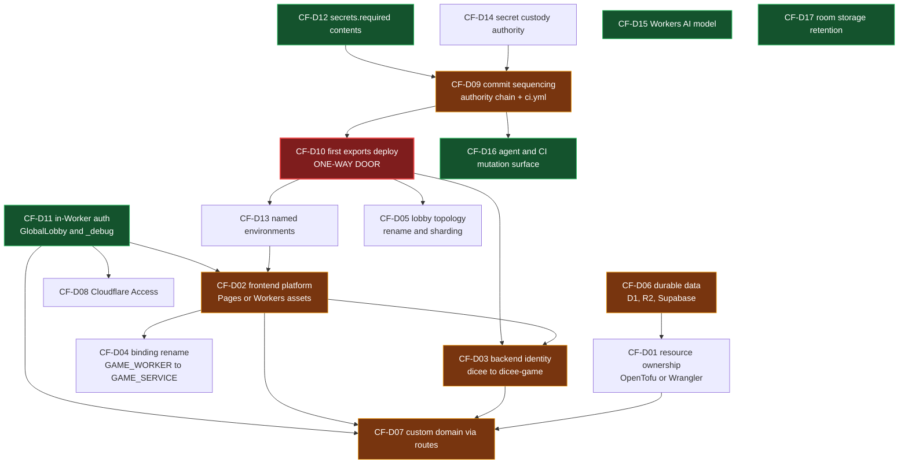

# Dicee Cloudflare decision register

- **Status:** open decision tracking; no entry in this file authorizes implementation, deployment, migration, secret change, or provider mutation
- **Last reviewed:** 2026-07-22
- **Scope:** every open Cloudflare architecture decision for Dicee, with its evidence, blockers, owner, and a labelled recommendation
- **Authority:** [`README.md`](README.md) remains the Cloudflare hub and governance contract. This register is the resumable state it refers to when it says target-state work "must reference an approved RFC or decision."

This file exists so the Cloudflare workstream can stop and restart without losing
state. Each decision carries a stable id, so a later session can resume at an id
rather than re-deriving the situation.

**Read this first.** Three layers are kept strictly apart throughout:

| Layer | What it proves | Marker used below |
|---|---|---|
| Working tree | What the local checkout declares | file path plus line |
| Committed state (HEAD) | What a clean clone and CI actually see | "at HEAD" |
| Live Cloudflare / Supabase / GitHub | What actually exists | `LIVE-UNVERIFIED` unless a receipt id is cited |

No lane in the review that produced this register ran an authenticated Cloudflare
operation. Every statement about deployed state is `LIVE-UNVERIFIED`. Repository
configuration is never evidence of live state.

Platform facts sourced from the operator research document
([`../planning/dicee-cloudflare-resource-guidance.md`](../planning/dicee-cloudflare-resource-guidance.md),
researched against primary sources on 2026-07-21) are marked `research-doc`
where they were not independently re-retrieved. Facts re-retrieved from
developers.cloudflare.com during the review are marked `live-doc 2026-07-22`.
Facts read out of the installed toolchain under `node_modules` are marked
`installed` — authoritative for this repository, never for current upstream.

---

## How to use this register

### Statuses

| Status | Meaning | What moves it forward |
|---|---|---|
| `proposed` | On the table, no blocking unknown, awaiting a call | The owner decides |
| `needs-evidence` | Cannot be decided until a named check runs | Run the named check; record the receipt |
| `needs-RFC` | Consequences are large or long-lived enough that a durable design document is required | Finish the RFC or ADR listed in the closing section, and have the operator accept it |
| `accepted` | Decided in favour | Link the RFC, or record the rationale here, plus implementation evidence |
| `rejected` | Decided against | Record the reason and the trigger that would reopen it |
| `superseded` | Replaced by a later decision | Link the replacement id |

When two markers could apply, `needs-RFC` wins. An entry that the closing section
of this file lists as decided by a required RFC or ADR cannot close before that
document is accepted, whatever else it is also waiting on, so `needs-RFC` is the
status and any outstanding check belongs in the entry's **Evidence still needed**
line. `needs-evidence` is reserved for entries that no RFC decides and that a
single named check would unblock.

### Closing an entry

An entry is closed only when all of the following hold.

1. The status is `accepted`, `rejected`, or `superseded` — never left at
   `proposed` with a comment.
2. The date and the deciding person are recorded on the entry.
3. For `accepted`: either a durable RFC or ADR under [`../rfcs/`](../rfcs/) is
   linked, **or** a recorded rationale is written directly into the entry.
   A recorded rationale is sufficient only when the closing section of this file
   lists the decision as not warranting an RFC.
4. For `accepted`: implementation evidence is linked — the commit, the file and
   line, and where relevant the operator receipt. An accepted decision with no
   implementation evidence stays visibly open in the summary table.
5. For `rejected`: the reopening trigger is stated in concrete terms. "Revisit
   later" is not a trigger; "when the lobby object approaches the documented
   1,000 requests/second per-object soft limit" is.
6. [`README.md`](README.md) is updated in the same change if the decision alters
   the current repository baseline.

Rejections stay in this file with their trigger. They are not deleted, because
the most expensive failure mode in this workstream is re-litigating a settled
rejection without the evidence that produced it.

### Owner column

- **Operator** — requires live access, a credential, an organization policy, or
  an irreversible action. An agent may prepare and recommend; it may not decide
  and may not execute.
- **Agent-recommendable** — an agent can propose a specific answer with
  evidence, and can implement once the operator accepts.

### Decision owners

Closing an entry requires "the date and the deciding person." No roster of named
individuals exists for this workstream, and inventing one would be worse than
recording that gap. Until a roster is added here:

- The **operator** — the repository owner — is the deciding person for every
  operator-gated entry, and by default for every other entry too. Write that
  person's name and the date on the entry when it closes, not the word
  "operator".
- **Agents may only recommend.** An agent may gather evidence, draft the RFC,
  prepare the diff, and write a labelled recommendation. An agent may not move a
  status to `accepted`, `rejected`, or `superseded`, and may not record itself as
  the deciding person.
- If decision authority is ever delegated — for example DNS or domain policy to
  another person — record the delegation in this section before the entry that
  relies on it closes.

---

## Summary

Nothing in this table is decided. Every row is open, the Status column is the
authoritative marker, and the last column records what an agent would recommend
if asked today — it is not an outcome and must not be cited as one.

| Id | Decision | Status | Blocks | Recommended (not decided) |
|---|---|---|---|---|
| [CF-D01](#cf-d01--cloudflare-resource-ownership-opentofu-or-wrangler) | Resource ownership: OpenTofu or Wrangler | `needs-RFC` | CF-D07 | Recommend deferring — there are zero D1/R2 resources to own. |
| [CF-D02](#cf-d02--frontend-platform-pages-or-workers-static-assets) | Frontend platform: Pages or Workers Static Assets | `needs-RFC` | CF-D03, CF-D04, CF-D07 | Recommend not now — no deadline, no cost saving; only observability and gradual deployment are real deltas. |
| [CF-D03](#cf-d03--backend-worker-identity) | Backend identity: `dicee` to `dicee-game-{env}` | `needs-RFC` | CF-D07 | Recommend rejecting as a standalone change — fold into CF-D02 or not at all. |
| [CF-D04](#cf-d04--service-binding-rename) | Binding rename: `GAME_WORKER` to `GAME_SERVICE` | `needs-RFC` | — | Recommend rejecting as a standalone change — pure churn; fold into CF-D02. |
| [CF-D05](#cf-d05--lobby-topology-rename-and-sharding) | Lobby: `GlobalLobby` to `LobbyShard`, and sharding | `proposed` | — | Recommend rejecting the rename now and deferring sharding behind a stated trigger. |
| [CF-D06](#cf-d06--durable-data-d1-r2-and-supabase) | Durable data: D1, R2, Supabase future | `needs-RFC` | CF-D01 | Recommend rejecting R2 as proposed and deferring D1 — neither has a consumer. |
| [CF-D07](#cf-d07--custom-domain-ownership) | Custom domains via Wrangler `routes` | `needs-RFC` | — | Recommend no action — not adoptable while the frontend is a Pages project. |
| [CF-D08](#cf-d08--cloudflare-access-for-testers) | Cloudflare Access for testers | `proposed` | — | Recommend deferring — no ingress exists for it to gate. |
| [CF-D09](#cf-d09--commit-and-deploy-sequencing-for-the-uncommitted-authority-chain) | Commit and deploy sequencing for the untracked config | `proposed` | CF-D10, CF-D16 | Recommend landing the `ci.yml` safety change first, then the config; committing the config first is unsafe. |
| [CF-D10](#cf-d10--first-declarative-exports-deploy) | First declarative `exports` deploy | `needs-RFC` | CF-D03, CF-D05, CF-D13 | Recommend pre-flight, then one deploy in a quiet window — one-way door. |
| [CF-D11](#cf-d11--in-worker-authorization-for-globallobby-and-_debug) | In-Worker authorization for `GlobalLobby` and `/_debug` | `proposed` | CF-D02, CF-D07, CF-D08 | Recommend accepting — highest-value change here; independent of all topology. |
| [CF-D12](#cf-d12--secretsrequired-contents) | `secrets.required` contents | `needs-evidence` | CF-D09 | Recommend keeping the current three and deciding the fourth after one check. |
| [CF-D13](#cf-d13--named-environments-on-the-durable-object-worker) | Named environments on the DO Worker | `proposed` | CF-D02 | Recommend reducing to one or none — nothing consumes them today. |
| [CF-D14](#cf-d14--declared-secret-custody-authority) | Declared secret custody authority | `needs-evidence` | CF-D09 | Recommend making the documentation match CI, or implementing the sync. |
| [CF-D15](#cf-d15--workers-ai-model-identifier-and-model-choice) | Workers AI model identifier and choice | `proposed` | — | Recommend accepting — identifier to config, move off an unpriced Beta model. |
| [CF-D16](#cf-d16--agent-ci-and-mcp-cloudflare-mutation-surface) | Agent, CI, and MCP mutation surface | `proposed` | — | Recommend accepting — cheap, and makes parallel agent work safe. |
| [CF-D17](#cf-d17--durable-object-room-storage-retention) | Durable Object room-storage retention | `proposed` | — | Recommend accepting, with a stated retention window. |

---

## CF-D01 — Cloudflare resource ownership: OpenTofu or Wrangler

**Question.** Should D1 databases and R2 buckets be declared in an OpenTofu
module under `infra/`, with Wrangler retaining Workers and bindings?

**Current state.** There is no `infra/` directory and no `.tf` file anywhere in
the repository. `.gitignore` contains no `*.tfstate`, `*.tfvars`, or
`.terraform/` entry, which the research document's own acceptance checklist
requires before adoption. Nothing is currently managed by any IaC tool.

**Options.**

| Option | Trade-off |
|---|---|
| A. Stand up `infra/` now | Establishes the pattern before it is needed. Costs: a new subsystem, a second credential (an R2 access key pair if remote state is used), and a module that manages zero resources. |
| B. Defer until CF-D06 produces a resource | No cost. Risk: the first resource gets created by hand and is never adopted into state. |
| C. Never — Wrangler owns everything | Simplest. Loses declarative drift detection for any future D1/R2. |

**Evidence.** Provider `cloudflare/cloudflare` 5.22.0 is current
(`live-doc 2026-07-22`, registry). Two defects sit in the research document's
scaffold and would fail on first use:

- [`../planning/dicee-cloudflare-resource-guidance.md`](../planning/dicee-cloudflare-resource-guidance.md) line 278 uses
  `v.database_id`. There is no `database_id` attribute on
  `cloudflare_d1_database` in v5.22.0; the computed identifiers are `id` and
  `uuid`. This fails at plan time and blocks the `${D1_ID}` substitution the
  document's own pipeline section depends on.
- Line 235 comments `primary_location_hint` as "changeable without recreation on
  provider >= 5.8.0". The v5.22.0 schema attaches `RequiresReplace()` to it, and
  the same resource is documented as losing all data on replacement.

Two further constraints, both `live-doc 2026-07-22`. Line 186's `~> 5.22`
resolves to `>= 5.22, < 6.0` — the same ceiling as `~> 5`, not "the 5.22 minor
series"; patch pinning requires `~> 5.22.0`. And line 182's
`required_version = ">= 1.9.0"` is below the OpenTofu 1.10.0 floor where native
`use_lockfile` state locking shipped. If R2 is used as the state backend, note
that R2 implements neither bucket versioning nor object tagging, so OpenTofu's
recommended state-recovery mechanism is unavailable and `state_tags`/`lock_tags`
cannot be used. Locking over R2 is mechanically plausible (R2 implements
conditional `If-None-Match` `PutObject`) but is not vendor-documented and was
not tested.

**Evidence still needed.** None to defer. If accepted, one question that the
canonical operator checklist does not currently carry an id for: does any D1
database or R2 bucket already exist on the account? It is listed under
[open questions with no operator id](#open-questions-with-no-operator-check-id).
[`OPS-16`](operator-evidence.md) (token scopes) also bears on this entry, because
an IaC module needs a credential with edit scopes the current token may not have.

**Owner.** Operator, with organization IaC policy input.

**Blocks.** CF-D07 (a token-scope question if `custom_domain` is ever adopted).
**Blocked by.** CF-D06.

**Status.** `needs-RFC` — covered by the draft
[`rfc-005-durable-data-strategy.md`](../rfcs/rfc-005-durable-data-strategy.md),
which owns ownership and adoption as one decision. Deferring is still the
recommendation; the RFC is where the deferral and its trigger are recorded.

**Recommendation — defer.** Do not create an OpenTofu module that manages zero
resources. The scaffold's two defects should nonetheless be corrected in the
planning document now, because that is a documentation-only change with no live
risk, and leaving a known-broken snippet in a document people copy from is the
expensive part. If CF-D06 is ever accepted, fix both defects, set
`required_version >= 1.10.0` if R2 state is used, add the three `.gitignore`
entries, and plan an out-of-band state backup.

---

## CF-D02 — Frontend platform: Pages or Workers Static Assets

**Question.** Should `packages/web` stay a Cloudflare Pages project, or move to
a `dicee-web` Worker using Static Assets?

**Current state.** [`../../packages/web/wrangler.jsonc`](../../packages/web/wrangler.jsonc)
declares `pages_build_output_dir`, which is what selects the Pages code path in
`@sveltejs/adapter-cloudflare` 7.2.9. The frontend holds exactly one backend
binding, `GAME_WORKER`, consumed only from SSR in ten `+server.ts` handlers.

**Options.**

| Option | Trade-off |
|---|---|
| A. Stay on Pages | Zero work. Forgoes repo-managed frontend observability and gradual deployments. |
| B. Migrate to a `dicee-web` Worker | Gains `observability` as code, Workers Logs, Logpush, Tail Workers, gradual deployments, the Cloudflare Vite plugin. Costs: a forced rename (CF-D03), a CI rewrite, a DNS and certificate cutover, and five specific migration traps below. |
| C. Migrate later, bundled with a stated observability need | Keeps the option open, avoids paying for it before the benefit exists. |

**Evidence — what is refuted and should not be re-litigated.**

- Pages is not deprecated. `live-doc 2026-07-22`: `/pages/` (updated
  2026-04-21) carries no deprecation, sunset, or maintenance banner and states
  "Available on all plans"; the limits page was updated 2026-07-16. The
  strongest official wording is comparative: "Unlike Pages, Workers has a
  distinctly broader set of features available to it." The de-facto signal is a
  Pages *changelog* stale since 2025-04-18. There is no deadline.
- Service Bindings are fully supported on Pages (`live-doc 2026-07-22`,
  `/pages/functions/bindings/`, updated 2026-06-25), and add no request charge.
  The least-privilege one-binding boundary the plan wants is already satisfied.

**Evidence — what is corrected relative to earlier drafts.**

- The migration is **not** established as cost-neutral. Cloudflare's own wording
  is "you can expect a **similar** cost structure" (`live-doc 2026-07-22`).
  Static-asset requests are free on both and Pages Functions bill at the Worker
  rate, but the same docs flag a free-tier `run_worker_first` 429 behaviour, a
  separate build-CI quota surface (Workers Builds versus the Pages
  500-builds/month free limit), and non-shared runtime and build-time variables.
  State it as "similar cost structure per Cloudflare, exact parity unmodelled."
- Smart Placement is **not** a settled non-issue for Dicee. It is supported on
  both platforms at matrix granularity, so it is not a migration *driver* — but
  on Pages it is explicitly beta and carries a caveat that applies directly to
  this codebase: "When using `env.ASSETS.fetch`, assets served via the ASSETS
  fetcher from your Pages Function are served from the same location as your
  Function" (`live-doc 2026-07-22`, `/pages/functions/smart-placement/`, updated
  2026-04-21). `@sveltejs/adapter-cloudflare` emits an advanced-mode
  `_worker.js` that serves assets through the ASSETS fetcher, so enabling Smart
  Placement on the current Pages frontend is an open latency question, not a
  closed one. Nobody has proposed enabling it; it is recorded here so it is not
  discovered mid-migration.

**Evidence — five migration traps.**

1. `assets.not_found_handling: "single-page-application"` would silently break
   SSR. With `compatibility_date` 2026-07-21 (past the 2025-04-01 threshold)
   navigation requests bypass the Worker entirely, and adapter 7.2.9 writes an
   SPA `index.html` into the assets directory (`installed`, adapter source).
   Omit the key.
2. Workers serve assets **before** the Worker unless `assets.run_worker_first`
   is set, inverting the current Pages behaviour.
3. `svelte.config.js`'s `routes: { include, exclude }` becomes dead code; the
   adapter writes `.assetsignore` on the Workers branch instead.
4. Both wrangler configs declare `"name": "dicee"`. Harmless today across the
   Pages-project and Worker-script namespaces; a hard collision under a
   Workers-only topology. See CF-D03.
5. The custom-domain cutover is detach-then-attach with a newly generated
   Advanced Certificate, and **no official source states it is zero-downtime**.
   Cloudflare's Pages custom-domain page warns that re-pointing a domain
   produces visitor errors until it becomes active again. Deployment history and
   rollback targets are not documented as migrating.

**Evidence still needed.** [`OPS-11`](operator-evidence.md) — is `dicee.games` a
Cloudflare zone on this account, and how is it attached? Custom domains outside
Cloudflare zones are supported on Pages and **unsupported on Workers**, so a
negative answer is a hard blocker, not an inconvenience. Also
[`OPS-08`](operator-evidence.md) (live Pages configuration diffed against the
repository configuration, which is the hub's own recorded reconciliation
blocker), and [`OPS-07`](operator-evidence.md) for the Pages project's existence
and deployment history.

**Owner.** Operator.

**Blocks.** CF-D03, CF-D04, CF-D07. **Blocked by.** CF-D11, CF-D13.

**Status.** `needs-RFC` — covered by the draft
[`rfc-004-frontend-platform-and-ingress.md`](../rfcs/rfc-004-frontend-platform-and-ingress.md).

**Recommendation — not now.** No forcing deadline, no cost saving, and Service
Bindings already work. The only compelling driver is repo-managed frontend
observability, which is not currently a stated need. Revisit when frontend logs
or percentage-based rollout become required, and answer OPS-11 before spending
design effort.

---

## CF-D03 — Backend Worker identity

**Question.** Should the Worker `dicee` be renamed to `dicee-game-{environment}`?

**Current state.** [`../../packages/cloudflare-do/wrangler.jsonc`](../../packages/cloudflare-do/wrangler.jsonc)
line 3 declares `"name": "dicee"`. The frontend targets it by literal name.

**Options.**

| Option | Trade-off |
|---|---|
| A. Keep `dicee` | Zero risk. Leaves an ambiguous name shared with the Pages project. |
| B. Rename with a namespace transfer | Preserves Durable Object data. Costs a four-deploy two-phase `expecting-transfer` / `transferred` procedure across two configs, whose post-commit mismatch error is documented as unrecoverable. |
| C. Rename and accept fresh, empty namespaces | One deploy. Loses all room and lobby state. Defensible for a small test deployment — but only as a stated decision. |

**Evidence.** Durable Object namespaces are keyed to the Worker script name, so
a service rename is not an in-place move; it produces a new Worker with empty
namespaces unless the transfer is executed (`research-doc`, corroborated by the
Durable Objects environments documentation, `live-doc 2026-07-22`). Exactly one
repository reference breaks, and it is load-bearing:
[`../../packages/web/wrangler.jsonc`](../../packages/web/wrangler.jsonc)
`services[].service` — every backend route then returns 503. No CI job deploys
the Worker at HEAD other than the auto-deploy described in CF-D09, so nothing
routinely catches this.

**Evidence still needed.** [`OPS-02`](operator-evidence.md) (do differently-named
Workers already exist on the account, including any `dicee-game-*`), and
[`OPS-01`](operator-evidence.md) for what is deployed to `dicee` today.

**Owner.** Operator.

**Blocks.** CF-D07. **Blocked by.** CF-D02, CF-D10.

**Status.** `needs-RFC` — folded into the draft
[`rfc-004-frontend-platform-and-ingress.md`](../rfcs/rfc-004-frontend-platform-and-ingress.md);
the rename and transfer procedure itself lives in
[`adr-005-durable-object-lifecycle.md`](../rfcs/adr-005-durable-object-lifecycle.md).

**Recommendation — reject as a standalone change.** It delivers no functional
benefit and costs either a four-deploy irreversible procedure or data loss, with
no automated safety net. It becomes necessary only under CF-D02 option B, where
the name collision forces it; fold it in there. If it ever proceeds, the entry
must state explicitly which of options B or C applies. A silent rename is
prohibited.

---

## CF-D04 — Service Binding rename

**Question.** Should `GAME_WORKER` be renamed to `GAME_SERVICE`?

**Current state.** The binding name appears in fourteen repository sites: ten
`+server.ts` handlers plus their adjacent error strings, `packages/web/src/app.d.ts`,
two entries in [`../../packages/web/wrangler.jsonc`](../../packages/web/wrangler.jsonc),
the generated `worker-configuration.d.ts`, and one prose mention in
[`README.md`](README.md).

**Options.** Rename now; rename with CF-D02; or keep.

**Evidence.** The change is atomic within `packages/web` and needs no backend
change. It has one silent failure mode worth recording regardless of the
outcome: `packages/web/src/app.d.ts` hand-declares `Platform.env.GAME_WORKER`
independently of the generated `packages/web/worker-configuration.d.ts`, and no
tsconfig in `packages/web` references the generated file. A partial rename that
updates the config and the generated types but not `app.d.ts` still passes
`svelte-check` across all consuming routes.

**Owner.** Agent-recommendable; operator approves.

**Blocked by.** CF-D02.

**Status.** `needs-RFC` — covered by the draft
[`rfc-004-frontend-platform-and-ingress.md`](../rfcs/rfc-004-frontend-platform-and-ingress.md),
which owns the rename only as a consequence of the platform choice. Nothing about
this entry needs an operator check.

**Recommendation — reject as a standalone change.** It is pure churn with a
non-obvious trap. Fold into CF-D02 if that proceeds. The `app.d.ts` divergence is
worth closing on its own merits, independently of this decision, by either wiring
the generated types into the web tsconfig or adding the file to a rename
checklist.

---

## CF-D05 — Lobby topology: rename and sharding

**Question.** Should `GlobalLobby` be renamed to `LobbyShard`, and should the
lobby actually be sharded?

**Current state.** `GlobalLobby` is single-global by construction, not merely by
name. `idFromName('singleton')` is hardcoded in two places
([`../../packages/cloudflare-do/src/GlobalLobby.ts`](../../packages/cloudflare-do/src/GlobalLobby.ts)
is reached through a single stub from both the Worker router and
[`../../packages/cloudflare-do/src/GameRoom.ts`](../../packages/cloudflare-do/src/GameRoom.ts)).
Presence counting, chat broadcast, invite delivery, and join-request routing all
iterate `ctx.getWebSockets()` on that one instance, and the room directory is a
single storage key rewritten as a whole array.

**Options.**

| Option | Trade-off |
|---|---|
| A. Keep `GlobalLobby`, no sharding | Accurate to what the code does. |
| B. Rename only | Cheap in code (seven sites plus generated types), but requires a lifecycle entry with `state: "renamed"` and `renamed_to`, and a three-deploy alias procedure for zero downtime. Delivers no capability and implies one that does not exist. |
| C. Rename and implement sharding | Real capability. Cross-shard presence, chat fan-out, and invite routing are unimplemented and unbudgeted. |

**Evidence.** A plain rename without the lifecycle entry yields an empty
namespace and loses `lobby:activeRooms` and `lobby:chatHistory` (`research-doc`;
the lifecycle states are corroborated `live-doc 2026-07-22`). Documented
per-object capacity is a soft limit of 1,000 requests per second, which at the
current tester scale is not close.

A rename also degrades an existing guard, though not in the way an earlier draft
claimed. The AKG invariant `globallobby_uses_shared` fails open — it returns an
empty violation list when no matching node is found. But AKG has no class-level
nodes: `NodeType` has no `Class`, and node names derive from the file basename.
Renaming the **class** changes nothing. The fail-open triggers when the **file**
is renamed or moved, which is the realistic restructure move. Related and more
consequential: `akg:check` reads the committed graph at
`docs/architecture/akg/graph/current.json` and never re-runs discovery, and
neither `pnpm lint` nor CI runs `akg:discover` — so after any file move the
invariants would keep validating a stale graph and report green.

Two further notes on AKG coverage, for accuracy: the `cloudflare-do` layer in
[`../../akg.config.ts`](../../akg.config.ts) declares `mayImport: ['shared']`,
and that rule is enforced by no invariant — `mayImport` is read only by the
interactive MCP import-check tool and diagram generation. But coverage is not
zero: `shared-isolation` hardcodes `packages/cloudflare-do/` as a forbidden
import target, so the reverse direction is guarded.

**Evidence still needed.** None for the rename. For sharding: a measured
presence fan-out cost or a request-rate observation.

**Owner.** Operator.

**Blocked by.** CF-D10. Any class rename or shard split is a Durable Object
lifecycle change, and CF-D10 decides how the first such change is made and
whether the Worker is still on the legacy `migrations` array when it happens.

**Status.** `proposed` — the sharding decision needs no RFC, but the rename, if
it ever proceeds, is executed under the standing procedure in
[`adr-005-durable-object-lifecycle.md`](../rfcs/adr-005-durable-object-lifecycle.md).

**Recommendation — reject the rename now; defer sharding with a trigger.** The
rename is real work whose only effect is to imply a capability that does not
exist. Defer sharding until the lobby object approaches the documented 1,000
requests/second per-object soft limit, or a measured presence fan-out cost
justifies it.

Two related fixes are worth doing regardless and are not decisions: the
`setTimeout`-inside-a-Durable-Object at
[`../../packages/cloudflare-do/src/GlobalLobby.ts`](../../packages/cloudflare-do/src/GlobalLobby.ts)
line 952 (its own comment concedes an alarm is correct) leaks finished rooms from
the directory on hibernation; and adding `akg:discover` plus a graph diff to the
gate for architecture-touching changes would close the stale-graph hole above.

---

## CF-D06 — Durable data: D1, R2, and Supabase

**Question.** Should Dicee introduce a D1 database and an R2 bucket, and does
Supabase coexist or eventually retire?

**Current state.** Zero D1 and zero R2. The Worker declares two SQLite Durable
Object namespaces, a Workers AI binding, and three required secrets. Supabase is
the identity provider, the relational store, the JWKS issuer the Worker verifies
against, one Realtime channel, one private Storage bucket, one Edge Function, and
roughly 700 lines of `SECURITY DEFINER` plpgsql.

**Options.**

| Option | Trade-off |
|---|---|
| A. Status quo | No new surface. |
| B. D1 for Durable-Object-written history; Supabase stays identity provider | Moves four genuinely movable tables. Forces a permanent identity mirror plus a sync mechanism, because every foreign key roots at `profiles(id)` referencing `auth.users(id)` via an `AFTER INSERT` trigger. |
| C. Full migration off Supabase | Replaces the auth store, the callback route, the SSR cookie layer, the Worker's JWKS verifier, and every row-level-security policy. |

**Evidence.** Cost is not a driver in either direction. D1's free tier is 5 GB
plus 25 billion rows read and 50 million rows written per month
(`live-doc 2026-07-22`), and the research document itself scopes this as a
roughly ten-user test application. Note the direction of one number: **D1 storage
is $0.75 per GB-month against Durable Object SQLite at $0.20**, so "move state to
D1 to save storage" is backwards. D1's case is queryability, which needs a stated
query.

Scope is smaller than the schema suggests — only nine of fifteen declared tables
are touched by any code. The hidden line items are not the tables:

- Row-level security is the entire browser-side authorization model and has no
  D1 analogue. Under D1 it becomes hand-written authorization in Worker code.
- Realtime on `feature_flags`, Storage `bug-audio`, `pg_cron` retention, and the
  `aggregate-game-stats` Edge Function have no D1 or R2 equivalent in the
  proposal.

The R2 proposal is not merely premature, it is aimed at the wrong workload. The
lifecycle rule targets prefix `commands/` with the identifier
`expire-transcribed-command-audio`
([`../planning/dicee-cloudflare-resource-guidance.md`](../planning/dicee-cloudflare-resource-guidance.md)
lines 255-257) — transcribed voice-command audio, a feature that does not exist.
Today's generated sound effects are eight committed `.ogg` files totalling 628 KB
served as static assets; the transcription path streams audio to Workers AI and
stores nothing; and the only user-uploaded binary is bug-report voice notes,
which already live in the Supabase `bug-audio` bucket.

One latent defect must be resolved before any migration sizing: AI player
identifiers are formatted `ai:profileId:timestamp` and are passed unfiltered as
`game_player_input.user_id`, a UUID column with a foreign key to `profiles(id)`.
Games containing AI players therefore likely persist nothing. This is inferred
from types and schema, not runtime-verified.

**Evidence still needed.** Two Supabase-side questions, both of which sit outside
the canonical Cloudflare operator checklist and therefore carry no OPS id: row
counts per table (is there any history at all, and do AI-containing games
persist), and whether the Supabase bucket, realtime publication, `pg_cron` jobs,
and Edge Function are actually provisioned. Both are listed under
[open questions with no operator id](#open-questions-with-no-operator-check-id).

**Owner.** Operator, with data-retention and privacy policy input.

**Blocks.** CF-D01. **Blocked by.** nothing.

**Status.** `needs-RFC` — covered by the draft
[`rfc-005-durable-data-strategy.md`](../rfcs/rfc-005-durable-data-strategy.md).

**Recommendation — reject R2 as proposed; defer D1 with a trigger.** R2 as
specified solves a hypothetical and does not cover the one real blob workload; if
a Cloudflare blob store is ever wanted, scope it to bug-report audio and use
`Standard`, not `InfrequentAccess`, whose 30-day minimum storage duration and
doubled Class A pricing are wrong for short-retention objects. Defer D1 until
there is a stated query workload Supabase cannot serve, or a decision to retire
Supabase for reasons other than cost. Any D1 RFC must budget the authorization
replacement, not just the table migration.

---

## CF-D07 — Custom domain ownership

**Question.** Should Worker custom domains be declared in Wrangler as
`routes: [{ pattern, custom_domain: true }]`?

**Current state.** Neither wrangler config declares any `route`, `routes`, or
`custom_domain`. The repository documents nothing about how `dicee.games` is
currently attached; `packages/web/_redirects` notes only that the www-to-apex
redirect is "in CF dashboard."

**Evidence.** `routes: [{ pattern, custom_domain: true }]` is valid current
Wrangler configuration. It is **not** an accepted key in a Pages configuration:
the installed wrangler 4.113.0 `supportedPagesConfigFields` omits it, and the
CLI errors with "Configuration file for Pages projects does not support" for
unsupported fields (`installed`). The research document's custom-domain section
therefore is not incrementally adoptable — it is downstream of CF-D02, which the
document does not state.

**Evidence still needed.** [`OPS-11`](operator-evidence.md) (zone ownership and
current attachment) and [`OPS-12`](operator-evidence.md) (does the Worker have any
route, custom domain, or enabled `workers.dev` subdomain today).

**Owner.** Operator, with DNS and domain policy input.

**Blocked by.** CF-D02, CF-D03, CF-D11, CF-D01 (token scope).

**Status.** `needs-RFC` — covered by the draft
[`rfc-004-frontend-platform-and-ingress.md`](../rfcs/rfc-004-frontend-platform-and-ingress.md),
which owns ingress ownership. OPS-11 and OPS-12 are still outstanding inputs to
that document.

**Recommendation — no action; record the gap.** The actionable item today is not
a decision but a receipt: nothing in the repository documents the current
`dicee.games` attachment, which means a future migration would be planned
blind.

---

## CF-D08 — Cloudflare Access for testers

**Question.** Should tester ingress be gated by Cloudflare Access, managed
through OpenTofu?

**Current state.** No identity or access-policy material exists in the
repository. `docs/cloudflare/README.md` records that organization-level
Cloudflare policies have not yet been incorporated.

**Evidence.** Access is the documented gate if `workers.dev` or preview ingress
is ever enabled. Two facts reduce urgency: `preview_urls` defaults to the value
of `workers_dev`, which is already `false`; and Preview URLs are never generated
for Workers that implement a Durable Object (`live-doc 2026-07-22`), which the
`dicee` Worker does. Preview-URL exposure is therefore largely a non-issue for
this Worker; the residual unknown is the live `workers.dev` subdomain state.

**Evidence still needed.** [`OPS-12`](operator-evidence.md) (is any route, custom
domain, or `workers.dev` subdomain live on the Worker) and
[`OPS-13`](operator-evidence.md) (is the Pages origin publicly reachable, and on
which hostnames) — together these establish whether any ingress exists for Access
to gate.

**Owner.** Operator, with identity policy input.

**Blocked by.** CF-D11 only. CF-D02 was previously listed here and is removed:
the frontend platform choice changes which product an Access application attaches
to, but Access is configured per hostname and works over both Pages and Workers
custom domains, so it does not have to be settled before Access can be decided.
CF-D11 does block it, because choosing in-Worker authorization changes whether a
network-layer gate is needed at all. This now matches CF-D11's **Blocks** line,
CF-D02's **Blocks** line, and the dependency graph, none of which claimed a
CF-D02 to CF-D08 edge. Treat CF-D02 as a trigger to reconsider, not a blocker.

**Status.** `proposed`.

**Recommendation — defer.** There is no ingress for Access to gate, and the
organization policy that would shape it is not yet mapped. Reconsider when
CF-D11 is settled, or if CF-D02 ever moves the frontend and reopens the ingress
question.

---

## CF-D09 — Commit and deploy sequencing for the uncommitted authority chain

**Question.** In what order should the untracked Cloudflare configuration and
governance files be committed, and does `.github/workflows/ci.yml` go in the
same change?

**Current state — this is the most urgent entry in the register.** The entire
Cloudflare authority chain is untracked: `AGENTS.md`, `docs/cloudflare/`,
[`../planning/dicee-cloudflare-resource-guidance.md`](../planning/dicee-cloudflare-resource-guidance.md),
`docs/development/toolchain.md`, and both `wrangler.jsonc` files. Both
`wrangler.toml` files are deleted in the working tree but present at HEAD. A
clean clone gets `compatibility_date = "2025-01-01"` and a legacy `[[migrations]]`
array with `new_sqlite_classes`.

**Two facts make the ordering non-obvious.**

1. **CI does not validate wrangler configuration — at HEAD or in the working
   tree.** At HEAD, [`../../.github/workflows/ci.yml`](../../.github/workflows/ci.yml)
   contains exactly two wrangler references, both `cloudflare/wrangler-action@v3`
   deploy steps (lines 296 and 352). There is no `wrangler types` check, no
   `deploy --dry-run`, and no config-schema validation anywhere. The
   `cloudflare-do` job's type check is `tsc --noEmit`, which never reads wrangler
   configuration. So the framing "CI validates the old config" is wrong; CI
   validates no config at all.
2. **At HEAD, CI auto-deploys on push to `main`.** The `deploy-worker` job is
   gated `if: github.ref == 'refs/heads/main' && github.event_name == 'push'` and
   runs `command: deploy --env production`. The working-tree `ci.yml` (modified,
   uncommitted) changes this to `workflow_dispatch` plus an `inputs.deploy` gate,
   a `Production` GitHub environment, a SHA-pinned action, and `deploy --env=""`.

The consequence is specific and severe: the untracked
[`../../packages/cloudflare-do/wrangler.jsonc`](../../packages/cloudflare-do/wrangler.jsonc)
declares only a top-level configuration plus `env.development` and `env.staging`.
**It has no `production` environment.** HEAD's CI invokes `--env production`.
Committing the config without the `ci.yml` change would leave a push to `main`
auto-deploying against an environment the new config does not define.

**Options.**

| Option | Trade-off |
|---|---|
| A. One commit: config, governance docs, and `ci.yml` together | Safe. Large diff. Merging it is also the `exports` cutover, so CF-D10 must be resolved first. |
| B. Commit `ci.yml` first, then the config | Removes the auto-deploy before the config changes underneath it. Two commits, and the first is a pure safety change. |
| C. Commit the config first | **Unsafe.** Creates the mismatch described above. |

**Evidence still needed.** Whether the `Production` GitHub environment has
required reviewers — it is the only approval gate the working-tree workflow
claims. That is a GitHub setting, not a Cloudflare one, so it carries no OPS id;
it is listed under
[open questions with no operator id](#open-questions-with-no-operator-check-id).
On the Cloudflare side, [`OPS-01`](operator-evidence.md) settles what is actually
deployed to `dicee` and therefore whether a CI deploy has ever landed (see the
fix item on `@dicee/shared` below).

**Owner.** Operator decides the merge; agent-recommendable for preparation.

**Blocks.** CF-D10, CF-D16, and every config change. **Blocked by.** CF-D12,
CF-D14 (both change the content being committed).

**Status.** `proposed`.

**Recommendation — accept option B, then A.** Land the `ci.yml` change first as
an isolated safety commit that removes the push-triggered auto-deploy. Then
commit the configuration and governance chain, with a message that states
plainly that the `exports` configuration is not yet deployed. Option C is
prohibited.

Two related traps for whoever prepares this. First, a strict configuration-audit
check cannot be added to CI in the same breath: CI runs `actions/checkout`
against HEAD, and HEAD contains no `wrangler.jsonc` in either package and no
`packages/web/worker-configuration.d.ts`, so a strict checker has no input file
and fails on its first run regardless of how many assertions pass locally.
Second, a `lefthook` hook glob-scoped to `packages/{web,cloudflare-do}/wrangler.jsonc`
never fires while those files are unstaged, so a green local hook is not evidence
of a green CI. Sequence any such check *after* this decision lands, not with it.

---

## CF-D10 — First declarative `exports` deploy

**Question.** Should the migration from the legacy `migrations` array to
declarative `exports` be deployed as one change, or split?

**Current state.** Updated 2026-09-12 by owner decision: the baseline
`packages/cloudflare-do/wrangler.jsonc` keeps the legacy `migrations` array
(v1 `GameRoom`, v2 `GlobalLobby`, `new_sqlite_classes`) and declares no
`exports`. Declarative `exports` is deferred to a standalone operator deploy
after [ADR-005](../rfcs/adr-005-durable-object-lifecycle.md) is accepted, which
is Option B below without reintroducing `wrangler.toml`. The config audit (B2,
B3, B2H) enforces this. No deploy of either configuration has occurred.
`LIVE-UNVERIFIED`.

**Options.**

| Option | Trade-off |
|---|---|
| A. One deploy of the current working tree | Simplest. Bundles the lifecycle change with an 18-month `compatibility_date` jump, a new deploy-time secrets gate, observability traces, `workers_dev: false`, and an environment restructure — contrary to Cloudflare's advice to deploy lifecycle changes independently. |
| B. Split: land everything else on the legacy `migrations` config first, verify, then adopt `exports` alone | Isolates the irreversible change. Costs reintroducing `wrangler.toml` temporarily, which is its own churn. |

**Evidence — what is reassuring.** Adoption over a `migrations`-provisioned
Worker is documented as requiring no data migration: "The provisioned namespaces
remain in place; only the configuration shape changes" (`live-doc 2026-07-22`).
There is no documented path by which an `exports` deploy silently deletes a
namespace. Deletion requires an explicit `"state": "deleted"` tombstone, and
every disagreement between configuration, code, and provisioned state is a
deploy-failing structured error — `orphaned_provisioned_namespace`,
`provisioned_class_missing_from_config`, `config_export_not_in_code`,
`storage_type_mismatch`. Storage type is also correct: HEAD's `wrangler.toml`
created both classes with `new_sqlite_classes`, which maps to `"storage": "sqlite"`.

**Evidence — what is irreversible.** This is a one-way door: "Once a Worker has
been deployed with `exports`, subsequent deploys cannot return to the legacy
`migrations` array." Rollbacks are not allowed across a Durable Object lifecycle
change. Gradual deployment is unavailable. `wrangler versions upload` fails fast
when `exports` is present, so there is no stage-then-promote path. And critically:
**`wrangler deploy --dry-run` gives zero lifecycle signal** — reconciliation is
computed server-side and returned only in the `PUT` response
(`installed`, confirmed empirically: the dry run printed bindings and exited with
no reconciliation block). A clean local dry run is not evidence of anything about
the lifecycle.

**Evidence still needed — this is a hard precondition.**
[`OPS-03`](operator-evidence.md): list the Durable Object namespaces, the Worker
they sit on, and their storage backend, and confirm they are exactly `GameRoom`
and `GlobalLobby` with SQLite storage. A `Workers Scripts Read` token suffices.
Also [`OPS-04`](operator-evidence.md) (did the live namespaces come from the
legacy `migrations` array, which is what makes this an adoption rather than a
first provision), [`OPS-06`](operator-evidence.md) (which secret names are set,
since `secrets.required` is a deploy-time gate), and
[`OPS-02`](operator-evidence.md) (does a legacy `dicee-production` Worker exist as
an orphan of the deleted `[env.production]` block).

**Owner.** Operator only. An agent may not execute this.

**Blocks.** CF-D03, CF-D05, CF-D13. **Blocked by.** CF-D09.

**Status.** `needs-RFC` — covered by the draft
[`adr-005-durable-object-lifecycle.md`](../rfcs/adr-005-durable-object-lifecycle.md).
The OPS-03, OPS-04, and OPS-06 receipts are preconditions for *executing* the
deploy, not for writing the ADR; the ADR can and should be finished first.

**Recommendation — pre-flight, then option A in a quiet window.** For a
roughly ten-user test deployment, reintroducing `wrangler.toml` to split the
deploy is more churn than it buys, and the reconciliation is documented as
fail-closed. Run OPS-03, OPS-04, and OPS-06 first. If the namespaces are exactly
the two expected classes with SQLite storage and the required secrets are set,
deploy once and capture the reconciliation output as a receipt. **Brief the
operator that absence of the reconciliation block is the success signal** —
Wrangler omits it when nothing changed — so silence is not misread as failure. If
OPS-03 or OPS-04 surfaces anything unexpected, fall back to option B.

Whichever option is chosen, this is recorded in a durable ADR, because the
standing rename and transfer procedures it implies outlive the deploy itself.

---

## CF-D11 — In-Worker authorization for `GlobalLobby` and `/_debug`

**Question.** Should the Worker enforce its own authentication and authorization
for lobby identity and the `/_debug` surface, rather than delegating entirely to
the Pages proxy?

**Current state — stated precisely.** The Worker performs no authentication or
authorization of its own in the lobby path.
[`../../packages/cloudflare-do/src/GlobalLobby.ts`](../../packages/cloudflare-do/src/GlobalLobby.ts)
derives identity verbatim from `X-User-Id`, `X-Display-Name`, and
`X-Avatar-Seed`, with a `crypto.randomUUID()` fallback, and the file contains no
reference to `verifySupabaseJWT`, `Authorization`, or any admin check. The Worker
router forwards every `/_debug/*` path to the lobby stub unauthenticated,
including the mass room-delete branch.

**But authorization is not absent from the system, and the earlier framing of
this finding was wrong in a way that changes the remediation.** It is enforced
server-side at line 12 of **all five** web `_debug` proxy routes via
[`../../packages/web/src/lib/server/admin.ts`](../../packages/web/src/lib/server/admin.ts),
which validates the session and calls a database-backed `has_admin_permission`
RPC, returning 401, 403, or 503:

| Route | Permission |
|---|---|
| `_debug/rooms/+server.ts` | `rooms:view` |
| `_debug/rooms/[code]/+server.ts` | `rooms:close` |
| `_debug/rooms/all/+server.ts` | `rooms:clear_all` |
| `_debug/connections/+server.ts` | `users:view` |
| `_debug/storage/+server.ts` | `audit:view` |

The lobby identity headers are likewise server-authoritative on the intended
path: [`../../packages/web/src/routes/ws/lobby/+server.ts`](../../packages/web/src/routes/ws/lobby/+server.ts)
deletes client-supplied `X-User-Id`, `X-Display-Name`, `X-Avatar-Seed`, and
`Authorization` before setting them from a JWT-validated session — its own
comment states that it does so because `GlobalLobby` trusts those headers
verbatim. And the Worker is not entirely unauthenticated:
[`../../packages/cloudflare-do/src/api/transcribe.ts`](../../packages/cloudflare-do/src/api/transcribe.ts)
requires a Bearer token and calls `verifySupabaseJWT`, as does the room
WebSocket upgrade in `GameRoom`.

**The accurate risk is single-layer authorization at a trust boundary.** The
Worker treats every service-binding caller as fully trusted. All `/_debug`
authorization lives in one layer — the Pages proxy — so a second caller of the
`dicee` service binding, or the Worker becoming routable, would expose the mass
room-delete with no in-Worker check.

**Options.**

| Option | Trade-off |
|---|---|
| A. Add JWT verification to the lobby upgrade and authorization to `/_debug` inside the Worker | Defense in depth; unblocks every ingress decision. Costs duplicated authorization logic and a second source of truth for permissions. |
| B. Keep single-layer, and treat "no public ingress on the backend Worker" as a hard invariant enforced by a check | Cheaper. Depends on a configuration property staying true, and on nobody adding a second binding consumer. |
| C. Do nothing | Leaves the invariant implicit and undocumented. |

**Evidence still needed.** [`OPS-12`](operator-evidence.md) — is anything actually
routed to `dicee`, and is the `workers.dev` subdomain genuinely disabled live? The
repository declares `workers_dev: false` with no `routes`, but that is
configuration, not live state. [`OPS-05`](operator-evidence.md) is the companion
check: what bindings the currently deployed version actually has, which is what
tells you whether a second service-binding consumer already exists.

**Owner.** Operator schedules; agent-recommendable and agent-implementable.

**Blocks.** CF-D02, CF-D07, CF-D08. **Blocked by.** nothing.

**Status.** `proposed`.

**Recommendation — accept option A, with option B's invariant as an interim
control.** This is the highest-value change in the register and it is independent
of every topology decision, so it can proceed while everything else is still
open. Until it lands, treat "add any public ingress to the backend Worker" as
forbidden, and make that explicit rather than implicit. If option A is judged too
costly, option B is defensible — but only if the invariant is written down and
mechanically checked, not left to memory.

---

## CF-D12 — `secrets.required` contents

**Question.** What should `secrets.required` list, and what happens to
`SUPABASE_JWT_SECRET`?

**Current state.**
[`../../packages/cloudflare-do/wrangler.jsonc`](../../packages/cloudflare-do/wrangler.jsonc)
lists `SUPABASE_URL`, `SUPABASE_ANON_KEY`, and `SUPABASE_SERVICE_ROLE_KEY`,
repeated identically at top level and in both named environments (`secrets` is a
non-inheritable key, so the repetition is required and correct).
`SUPABASE_JWT_SECRET` is read at runtime in two places but is not listed; the
file's own trailing comment instructs provisioning it out of band.

**What `secrets.required` actually does** — this matters, because an earlier
framing overstated it. Per `live-doc 2026-07-22` and the installed config schema,
it does three things: it drives `wrangler types` generation, it makes
`wrangler deploy` and `wrangler versions upload` fail when a listed secret is not
configured on the Worker, and it enables local-development validation warnings.
It does **not** gate what the runtime environment contains — secrets set with
`wrangler secret put` remain bound whether or not they are listed, and
deployments never delete secrets.

Two consequences follow.

- Omitting a genuinely-read secret does not break the deployed Worker. It loses
  the deploy-time presence guardrail, so a missing value surfaces as a runtime
  failure instead of a blocked deploy, and it narrows typegen — which still
  compiles, because `packages/cloudflare-do/src/types.ts` hand-declares all four
  names in a `SecretBindings` interface.
- Local development is affected differently: once `secrets` is declared, only
  names in `secrets.required` or in `vars` are promoted from `.dev.vars` or
  `.env` (`installed`). Putting `SUPABASE_JWT_SECRET` in `.dev.vars` today
  silently does nothing.

**The research document's proposed list is wrong in both directions.** Its
backend list at line 372 is `["SUPABASE_SERVICE_ROLE_KEY", "SUPABASE_JWT_SECRET"]`
under a comment reading "the backend reads these." That comment is inaccurate:
`SUPABASE_URL` is read in five places and `auth.ts` fails closed without it, and
`SUPABASE_ANON_KEY` is the bearer used to call the `aggregate-game-stats` Edge
Function. Dropping them loses the guardrail for the two most load-bearing values.
And in the opposite direction, the list *adds* `SUPABASE_JWT_SECRET` to
`required` — which, under the documented deploy validation, would hard-fail
`wrangler deploy` in any environment that has not configured the legacy HS256
secret. That is the one entry in the proposed list that could actually block a
deploy.

**Options.** Add `SUPABASE_JWT_SECRET` to all three blocks; or delete the HS256
fallback in `auth.ts` and keep the list as it is.

**Evidence still needed.** Two checks, only one of which has a canonical id.

- **No OPS id.** Does the Supabase project still issue legacy HS256 tokens, or
  only asymmetric keys? Authentication is JWKS-first; the HS256 path is reachable
  only on `JWKSNoMatchingKey`. That single fact picks the option. It is a Supabase
  question, not a Cloudflare one, so the canonical Cloudflare checklist has no
  entry for it — do not invent one. It is listed under
  [open questions with no operator id](#open-questions-with-no-operator-check-id).
- [`OPS-06`](operator-evidence.md) — which secret names are set on the Worker,
  including whether `SUPABASE_JWT_SECRET` is currently among them.

**Owner.** Operator decides; agent implements.

**Blocks.** CF-D09 (it changes the content being committed).

**Status.** `needs-evidence`.

**Recommendation — keep the current three; decide the fourth once the HS256
question is answered.** Explicitly reject the research document's proposed list
and annotate line 372.
If HS256 is still in play, add `SUPABASE_JWT_SECRET` to all three blocks and set
it in every environment before the next deploy. If it is not, delete the fallback
and the trailing comment.

---

## CF-D13 — Named environments on the Durable Object Worker

**Question.** Should the Worker keep `env.development` and `env.staging`, and
what should the Pages preview environment bind to?

**Current state.** The Worker declares both named environments; each correctly
repeats the four non-inheritable keys, while `exports` and `observability` are
declared only at top level and inherit. Nothing consumes either environment:
`packages/web/wrangler.jsonc` binds Pages *preview* to `service: "dicee"` — the
production Worker — and CI has no staging job.

**Options.**

| Option | Trade-off |
|---|---|
| A. Keep all three | Ready if staging is ever wired. Costs triplicated non-inheritable blocks, and leaves preview driving production Durable Object state. |
| B. Keep top level plus `staging`, and point Pages preview at `dicee-staging` | Gives a real pre-production path. Requires CI work and a Supabase redirect-URL change the repository cannot express. |
| C. Delete both named environments | Least maintenance. Removes the option until someone rebuilds it. |

**Evidence.** An environment-scoped service binding must target
`<worker-name>-<environment-name>`, so binding preview to `dicee` is a live
footgun, not a stylistic issue. Named environments create separate Workers, each
of which would hit the `secrets.required` first-deploy gate — the correct first
deploy for a new environment is `wrangler deploy --env <e> --secrets-file <path>`,
not `wrangler secret put` first. Pages accepts only the environment names
`preview` and `production`, so a Worker `staging` environment has no
one-to-one mirror on the frontend side.

**Evidence still needed.** [`OPS-02`](operator-evidence.md) (do
`dicee-development` or `dicee-staging` already exist as separate Workers) and
[`OPS-03`](operator-evidence.md) (whether either carries its own Durable Object
namespaces).

**Owner.** Operator.

**Blocks.** CF-D02 (staging is a precondition for validating a migration).
**Blocked by.** CF-D10.

**Status.** `proposed`.

**Recommendation — option B if anyone will actually use staging, otherwise
option C.** Do not leave three environments nobody deploys. Whichever is chosen,
the Pages preview binding must stop pointing at production.

---

## CF-D14 — Declared secret custody authority

**Question.** Which system is the declared authority for runtime and deploy
secrets?

**Current state.** [`../../.claude/environment-strategy.yaml`](../../.claude/environment-strategy.yaml)
names Infisical as the "CI/CD and deploy-target secret sync" authority and
1Password as local operator bootstrap. CI reads GitHub Environment secrets, and
no workflow references Infisical at all. The hub already records this as an open
blocker.

**Options.**

| Option | Trade-off |
|---|---|
| A. Implement an Infisical to GitHub Environment sync | Makes the declared authority true. New moving part, new failure mode. |
| B. Declare GitHub Environments the CI authority and 1Password the local authority; remove the Infisical CI/CD claim | One edit. Narrower but honest. |

**Evidence.** Two further facts bear on custody. The 1Password wrapper is not an
effective credential gate on the reviewed workstation: an ambient
`~/.wrangler/config/default.toml` exists, so a bare package-level deploy script
authenticates without touching the wrapper. And CI maintains two independently
named copies of the same Supabase values across the two deploy jobs, with the
project URL classified as a GitHub *variable* in one and a *secret* in the other
— a rotation drift risk regardless of which option is chosen.

**Evidence still needed.** Is an Infisical-to-GitHub sync configured outside this
repository? Infisical's GitHub App integration is configured in the Infisical
interface, not in the repository, so absence here is not proof of absence. That
is neither a Cloudflare nor a Supabase check and carries no OPS id; it is listed
under
[open questions with no operator id](#open-questions-with-no-operator-check-id).
[`OPS-06`](operator-evidence.md) and [`OPS-09`](operator-evidence.md) are the
adjacent Cloudflare receipts — which secret names are actually set on the Worker
and on the Pages project — and [`OPS-16`](operator-evidence.md) establishes
whether the deploy token is shared.

**Owner.** Operator, with organization secrets policy input.

**Blocks.** CF-D09.

**Status.** `needs-evidence`.

**Recommendation — option B unless the sync already exists.** Aspirational
authority text that no code implements is worse than a narrower honest claim,
because it makes every downstream custody statement unreliable. This does not
warrant an RFC; one edit plus a recorded rationale is sufficient.

---

## CF-D15 — Workers AI model identifier and model choice

**Question.** Should the transcription model identifier move to configuration,
and which model should Dicee use?

**Current state.**
[`../../packages/cloudflare-do/src/api/transcribe.ts`](../../packages/cloudflare-do/src/api/transcribe.ts)
line 70 calls `env.AI.run('@cf/openai/whisper-tiny-en', ...)` as a string literal
at the call site. The research document's own guidance says to keep the model
identifier in configuration, so the repository currently contradicts the plan.
Byte caps are enforced; `estimateAudioDuration` is defined at line 97 and never
called, so the duration cap the plan requires is absent.

**Evidence.** `@cf/openai/whisper-tiny-en` is still marked Beta and has **no
published unit price** — it appears in the Workers AI model catalogue but in no
pricing table (`live-doc 2026-07-22`). The model Dicee actually ships cannot be
cost-modelled. `@cf/openai/whisper-large-v3-turbo` is not marked Beta at 46.63
neurons per audio-minute, which against the 10,000 neurons/day free allocation
that persists on the paid plan is roughly 214 free audio-minutes per day.

`@cf/deepgram/flux` should be explicitly rejected for this codebase: at 700
neurons per audio-minute it is roughly fifteen times turbo, and it is
WebSocket-only — and an active outbound connection keeps a Durable Object in
memory with duration charges for up to fifteen minutes per connection
(`live-doc 2026-07-22`). Adopting it inside `GameRoom` would silently defeat
hibernation, which is the single mechanism keeping Durable Object duration cost
at zero.

**Owner.** Agent-recommendable; operator approves.

**Status.** `proposed`.

**Recommendation — accept.** Move the identifier into `vars`, switch to
`whisper-large-v3-turbo`, and wire the duration cap. Record the rejection of
`@cf/deepgram/flux` with its reason so it is not proposed again as a quality
upgrade. This does not warrant an RFC.

---

## CF-D16 — Agent, CI, and MCP Cloudflare mutation surface

**Question.** Should the agent-reachable and script-reachable paths that can
mutate live Cloudflare be constrained?

**Current state.** Updated 2026-09-12: the token-forwarding MCP wrappers and
the `cloudflare-bindings` server are removed. [`../../.mcp.json`](../../.mcp.json)
enables only `akg` and `cloudflare-docs`; `cloudflare-api` and read-only
Supabase are opt-in servers with per-client OAuth. Before that change,
`cloudflare-bindings` received the full-scope Cloudflare operator token with no
read-only constraint. The public-safety scan flags only an explicit Supabase
write-enable flag in configuration files; an unconstrained Cloudflare token
carries no such marker, so the scan cannot detect it.
[`../../.claude/settings.json`](../../.claude/settings.json)
contains an allow-list with no `deny` and no `ask` rules, and its
`Bash(pnpm --filter:*)` entry would auto-approve a package-level deploy. Several
root and package deploy scripts bypass the validation gate entirely, and legacy
unscoped `wrangler deploy` recipes remain in `.claude/DEBUGGING.md` and
`.claude/cli-reference.yaml`.

**Options.** Add `deny` and `ask` rules and narrow the broad allow pattern; or
rely on operator vigilance.

**Evidence.** One genuine strength worth preserving: every GitHub Action
reference is SHA-pinned in the working-tree workflow, and the public-safety scan
actively enforces that.

**Owner.** Operator approves; agent implements.

**Blocked by.** CF-D09.

**Status.** `proposed`.

**Recommendation — accept.** Add `deny` entries for the deploy scripts and bare
`wrangler deploy` and `wrangler secret`, narrow `Bash(pnpm --filter:*)`, keep
`cloudflare-api` opt-in in favour of `cloudflare-docs` for this workstream, and
delete the legacy recipes.
This is the precondition that makes parallel agent lanes safe, and it does not
warrant an RFC.

---

## CF-D17 — Durable Object room-storage retention

**Question.** What is the retention policy for a finished room's Durable Object
storage?

**Current state.** No Durable Object storage is ever deleted. `deleteAll()`
appears nowhere in `packages/cloudflare-do/src`. On game over the room status is
flipped to `completed` or `abandoned` and written back; `room`, `room_code`,
`game_state`, `alarm_queue`, the chat keys, and the per-room SQLite tables persist
indefinitely. This contradicts the research document's own cost rule, which
states that room state should be cleared when a room ends.

**Options.**

| Option | Trade-off |
|---|---|
| A. Delete immediately on terminal status | Cheapest. Removes any post-game reconnection or review window. |
| B. Alarm-driven TTL after terminal status | Preserves a reconnection grace period. One more alarm type on an already multiplexed queue. |
| C. Keep indefinitely | Status quo. Monotonic growth against billed storage. |

**Evidence.** Plan as though Durable Object SQLite storage is billed. The headroom
numbers are much tighter than they first look: 50 million rows written per month
included is only about **19.3 rows per second sustained** (50,000,000 ÷ 30 days ÷
86,400 seconds; the often-quoted 1,157 figure is per *minute*, not per second),
and ten testers at one persisted heartbeat per second for a month is about 25.9
million rows — 52% of the allowance from ten people (`live-doc 2026-07-22`). That
is what makes the plan's "do not persist presence heartbeats" a real cost rule
rather than hygiene.

**Whether that billing is switched on today is genuinely open, and this hedge
should not be removed.** Retrieved live on 2026-07-22,
`developers.cloudflare.com/durable-objects/platform/pricing/` still carries its
callout in the future tense: "Storage billing on SQLite-backed Durable Objects
will be enabled in January 2026, with a target date of January 7, 2026 (no
earlier)", and "Only SQLite storage usage on and after the billing target date
will incur charges." The announced target date is now roughly six months past,
but Cloudflare has not rewritten the page out of future tense, so the page
**alone** does not confirm that billing was actually switched on. It is equally
wrong to state that billing is live and to state that it has not started. The
rates the same page publishes are 5 GB-month included on Workers Paid, then $0.20
per GB-month. Only this account's own billing and usage view can settle whether
charges are being incurred — that is an operator read, not a documentation
assertion. The cost analysis above deliberately assumes storage is billed, which
is the prudent direction: if it is not yet, the retention policy costs nothing and
is already in place when it is.

**Evidence still needed.** [`OPS-15`](operator-evidence.md) (which Workers usage
model the account is on, which determines whether the 5 GB-month included
allowance applies at all). Actual stored bytes and rows-written usage for the
`dicee` namespaces, and whether SQLite storage charges are appearing on the
account, are read from the dashboard billing and usage views and carry no
canonical OPS id; both are listed under
[open questions with no operator id](#open-questions-with-no-operator-check-id).

**Owner.** Operator picks the window; agent implements.

**Status.** `proposed`.

**Recommendation — accept option B with a stated window.** Implement cleanup on
the existing `GameRoom` alarm path. Do it while the accumulated data is still
small and the billing question is still open, rather than after the first
invoice answers it. Pair it with the `setTimeout`-to-alarm fix noted under
CF-D05, since both touch the same lifecycle. The retention window itself is a product call, not a
technical one — record it in the entry when chosen.

---

## Dependency graph

Red is irreversible. Amber is operator-gated. Green is cheap, self-contained, and
independent of every topology decision.

An arrow reads "must be resolved before." Two shapes matter.

- **CF-D11, CF-D15, and CF-D17 have no inbound edges and no blocking operator
  check.** They can be decided and implemented while every topology question
  remains open, and CF-D11 unblocks three others.
- CF-D06, CF-D12, and CF-D14 also have no inbound edges, but each waits on a
  document or a single fact rather than on another entry. CF-D16 is green in the
  sense of being cheap and self-contained, yet it does carry one inbound edge from
  CF-D09, because it constrains the very scripts and settings that commit lands.

The graph is the authority for blocking relationships. If an entry's **Blocked
by** line and this graph disagree, one of them is wrong and the disagreement is a
defect to fix, not a nuance to preserve.

---

## Which decisions warrant a durable RFC

The hub's completion criteria require that "the target architecture decisions are
accepted or rejected in durable RFCs." That does not mean one RFC per row of the
research document's decision table. A durable RFC is warranted only when the
decision has multi-quarter consequences, the options have genuinely different
architectures, and a rejection still needs a durable record of why. Most entries
in this register fail the second test — "not now, here is the trigger" is a
register entry, not a design document.

Numbering continues the existing series in [`../rfcs/`](../rfcs/), where
[`adr-004-wasm-api-versioning.md`](../rfcs/adr-004-wasm-api-versioning.md) and
[`rfc-003-data-contracts.md`](../rfcs/rfc-003-data-contracts.md) were the last
entries before this workstream. The three documents below now exist as
agent-drafted stubs marked "Draft — not accepted"; their existence is not a
decision, and the entries they cover stay `needs-RFC` until the operator accepts
them. New files match the header convention already used in that directory, which
differs from this file's.

### Required, drafted, not accepted

| Document | Title | Covers | Why durable |
|---|---|---|---|
| [`adr-005-durable-object-lifecycle.md`](../rfcs/adr-005-durable-object-lifecycle.md) | Durable Object lifecycle and namespace ownership | Decides CF-D10. Also carries the standing rename and transfer procedure that CF-D03 and CF-D05 would have to execute under — it does not decide either of them. | There is no design space, only an irreversible property and a required procedure. An ADR is the right shape. It must record the one-way-door property, that `--dry-run` gives no lifecycle signal, the mandatory pre-flight, how to read reconciliation output including that absence means success, the three-deploy alias procedure for a class rename, the four-deploy transfer for a cross-Worker move, and the rule that no `deleted` tombstone ships without a data-export receipt. |
| [`rfc-004-frontend-platform-and-ingress.md`](../rfcs/rfc-004-frontend-platform-and-ingress.md) | Frontend platform, Worker identity, and ingress ownership | Decides CF-D02, CF-D03, CF-D04, CF-D07 | These four are inseparable — the name collision only becomes real under a Workers topology, and `routes` cannot be added to a Pages configuration. Splitting them produces four documents that each defer to the others. Must record the verified deltas only, that cost is "similar" rather than neutral, that Smart Placement is not a driver but is an open question for this adapter, the five migration traps, and the rollback envelope. |
| [`rfc-005-durable-data-strategy.md`](../rfcs/rfc-005-durable-data-strategy.md) | Durable data strategy: D1, R2, and Supabase | Decides CF-D01, CF-D06 | The identity and authorization coupling makes ownership and adoption a single decision. Must budget the identity mirror and the row-level-security replacement as first-class line items, record the capabilities with no D1 or R2 equivalent, and record the R2 rejection with its reason so it is not reproposed. |

Every entry a document above *decides* carries `needs-RFC`: CF-D01, CF-D02,
CF-D03, CF-D04, CF-D06, CF-D07, CF-D10. CF-D05 is not in that list, because
adr-005 supplies a procedure it would use rather than deciding it.

### Explicitly not warranting an RFC

| Entry | Why a register entry plus recorded rationale is sufficient |
|---|---|
| CF-D05 | The decision itself — rename now, shard now — has nothing to design until the sharding trigger fires, and writing it now would be speculative. This does not conflict with adr-005 covering the *mechanics* of a Durable Object class rename: if the rename ever proceeds, it is executed under that standing procedure, without a new RFC of its own. |
| CF-D08 | Downstream of CF-D11, and reopened by CF-D02; no independent design space. |
| CF-D09 | A sequencing call, not an architecture. Two commits and a stated order. |
| CF-D11 | A defect fix with a defense-in-depth question attached. Needs a test, not a design document. |
| CF-D12 | Blocked on one factual answer, then a config change. |
| CF-D13 | A configuration and CI question with three enumerated options. |
| CF-D14 | No architectural choice — implement the sync or amend the declaration. |
| CF-D15 | Two configuration lines and a model swap. |
| CF-D16 | Tooling policy; belongs in settings and the agent agreement. |
| CF-D17 | The only open question is the retention window, which is a product call recorded on the entry. |

---

## Open fix items

These need doing, not deciding. They are tracked here because they appear in the
blocking relationships above and would otherwise be lost.

| Item | Evidence | Bearing |
|---|---|---|
| Neither CI deploy job builds `@dicee/shared`, whose only entry point is `./dist/index.js` and whose `dist/` is gitignored; `packages/shared/package.json` has a `build` script but no `prepare` or `postinstall` | Static inference; no CI run was observed | Blocker for the CI deploy path if true. Settle with [`OPS-01`](operator-evidence.md) — what is actually deployed to `dicee` — before spending effort on it. A single green run log also refutes it. |
| `GlobalLobby.scheduleRoomRemoval` uses `setTimeout` inside a Durable Object | `GlobalLobby.ts` line 952, with a comment conceding an alarm is correct | Finished rooms leak from the directory on hibernation. Pairs with CF-D17. |
| `akg:check` reads a committed graph and never re-runs discovery; neither `pnpm lint` nor CI runs `akg:discover` | `akg.config.ts`, the AKG check CLI | Any file move goes undetected. Bears on CF-D03 and CF-D05. |
| `docs/archive/ARCHIVE.md` still classifies deployment and debugging guides as active operational guides, and points at the gitignored `docs/references/` cache | Contradicts [`README.md`](README.md) | A competing classification policy an agent may follow instead of the hub. |
| Dead configuration: `ENVIRONMENT` declared in three environment blocks and never read; `PUBLIC_WORKER_HOST` read in a component and defined nowhere; `PUBLIC_PARTYKIT_HOST` still in `.env.example` from the retired transport | Repository grep | Low severity; noise that makes real configuration harder to audit. |

---

## Operator checks referenced above

`OPS-NN` ids are defined in one place only:
[`operator-evidence.md`](operator-evidence.md). That file is canonical for what
each check asks, how to run it read-only, what the answer looks like, and where
the receipt goes. This register cites those ids and never renumbers them; an
earlier revision of this file carried its own parallel numbering, which has been
deleted because two numbering schemes for the same checks is worse than none.

Every check in that file is read-only. None mutates Cloudflare, Supabase, or
GitHub. Receipts belong in a dated file under `docs/cloudflare/`, with the
account identifier, `workers.dev` subdomain, Supabase project reference, and any
token redacted before commit.

### Open questions with no operator check id

These questions block entries above but carry no id, either because they are not
Cloudflare checks at all or because the canonical checklist in
[`operator-evidence.md`](operator-evidence.md) does not cover them. They are
recorded here rather than given an invented id: a fabricated `OPS-` number would
corrupt the canonical space, and silently dropping the question would be worse.
If any of them is later added to the canonical checklist, cite the new id here
and delete the row.

| Question | Bears on | Where the answer comes from |
|---|---|---|
| Does the Supabase project still issue legacy HS256 tokens, or only asymmetric keys? | CF-D12 — the single blocking fact | Supabase project JWT settings |
| Do any D1 databases or R2 buckets already exist on the account? | CF-D01 | Cloudflare dashboard, D1 and R2 sections |
| Row counts per table — is there any game history at all, and do AI-containing games persist? | CF-D06 sizing | Supabase, read-only query |
| Are the Supabase `bug-audio` bucket, the realtime publication, the `pg_cron` jobs, and the `aggregate-game-stats` Edge Function actually provisioned? | CF-D06 | Supabase project |
| Does the `Production` GitHub environment have required reviewers? | CF-D09 — the only claimed approval gate | GitHub repository environment settings |
| Is an Infisical-to-GitHub secret sync configured outside this repository? | CF-D14 | Infisical interface |
| Are Durable Object SQLite storage charges actually being incurred on this account, and what are the stored bytes and rows-written figures for the `dicee` namespaces? | CF-D17 — Cloudflare's pricing page is still worded in future tense, so only the account settles it | Cloudflare dashboard billing and usage views |
