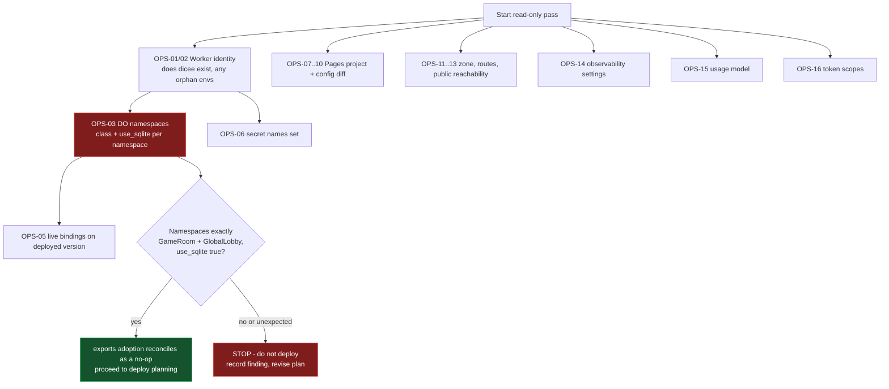

# Dicee Cloudflare operator evidence pass

- **Status:** operator runbook, strictly read-only; carries no deployment, migration, secret, or provider-mutation authority
- **Last reviewed:** 2026-07-22
- **Scope:** a one-time, read-only capture of live Cloudflare state for the `dicee` Worker and Pages project, plus where receipts are recorded in-repo
- **Authority:** canonical for the `OPS-NN` evidence identifiers. Every command here must be run by an authorized operator through the repository's command-scoped credential wrappers. Nothing in this file authorizes a mutation.

> **Read this first.** Every command listed below is intended to be read-only.
> Nothing in this document authorizes a deploy, a secret change, a migration, a
> DNS change, or any other provider mutation. If a step appears to require a
> write, stop and treat it as out of scope for this pass. Where this file is not
> certain a command is read-only, it says so explicitly and marks the item
> **verify before running**.
>
> **Never run `wrangler secret put` as a preflight check.** It is not an
> inspection command: it creates a new Worker version and deploys it
> immediately. The same is true of `wrangler secret bulk` and
> `wrangler secret delete`. To see which secrets exist, use
> `wrangler secret list`, which returns names only. See
> [Looks read-only, but is not](#looks-read-only-but-is-not).

This pass exists to close the standing blocker recorded in
[`README.md`](README.md): the repository declares a Cloudflare topology, but
no receipt proves what is actually live. Repository configuration is not
evidence of live state. Until these receipts exist, every statement about
deployed bindings, secrets, routes, namespaces, or account settings is
unverified.

## Why this pass is unusually consequential right now

The repository is mid-transition between two different deploy targets, and the
two are not the same Worker. This is the single most important thing for the
operator to resolve, and it changes what every later decision means.

| | Committed at HEAD | Current working tree |
|---|---|---|
| Worker config | `packages/cloudflare-do/wrangler.toml` | `packages/cloudflare-do/wrangler.jsonc` (untracked) |
| Durable Object lifecycle | `[[migrations]]` with `new_sqlite_classes` for `GameRoom` and `GlobalLobby`, repeated under `[[env.production.migrations]]` | `migrations` v1/v2 with `new_sqlite_classes`, declared once at the top level (2026-09-12 baseline; declarative `exports` deferred until ADR-005 is accepted) |
| `compatibility_date` | `2025-01-01` | `2026-07-21` |
| Declared environments | top level, `env.staging`, `env.production` | top level, `env.development`, `env.staging` — **no `production`** |
| CI deploy trigger | `if: github.ref == 'refs/heads/main' && github.event_name == 'push'` | `if: github.event_name == 'workflow_dispatch' && inputs.deploy`, gated on GitHub environment `Production` |
| CI deploy command | `deploy --env production` | `deploy --env=""` |
| Resulting Worker name | **`dicee-production`** (Wrangler appends the environment name to the top-level `name`, and HEAD's `[env.production]` declares no name override) | **`dicee`** |

Both configs declare top-level `name = "dicee"`, and
[`packages/web/wrangler.jsonc`](../../packages/web/wrangler.jsonc) binds
`GAME_WORKER` to `service: "dicee"`.

The consequence to test, not assume: **if any deploy ever ran from HEAD, the
live Durable Object namespaces most likely belong to a Worker named
`dicee-production`, while the current configuration and the web Service Binding
both target a Worker named `dicee`.** Namespaces are keyed to the Worker script
name. If that is the live situation, deploying the new configuration would
create or populate a different Worker whose namespaces are empty, and neither
the baseline `migrations` deploy nor the later `exports` adoption would be the
no-op the plan assumes. OPS-02
and OPS-03 exist to settle this before anything is deployed.

Note also that HEAD's CI contains no Wrangler configuration validation of any
kind — its only Wrangler usage is the two deploy steps. So no existing gate has
ever checked either configuration against the live account.

## Safety preamble

### Genuinely read-only

These do not create a Worker version, a deployment, or any provider resource.

Every entry below was re-checked on 2026-07-22 against the **installed Wrangler
4.113.0** by reading its own `--help` output locally, so the flags are the ones
this repository's pinned version actually accepts. That check confirms what each
command *is for*; it does not re-derive server-side behaviour, so anything not
independently confirmed carries an explicit hedge.

| Command | Notes |
|---|---|
| `wrangler whoami` | Identity and account list. `--json` is supported and exits non-zero when unauthenticated. |
| `wrangler deployments list` / `deployments status` | Both accept `--name <worker>` and `--json`. Always pass `--name` to avoid config ambiguity. `list` returns the 10 most recent deployments. |
| `wrangler versions list` / `versions view <version-id>` | Both accept `--name` and `--json`. Version detail includes bindings and compatibility settings. `list` returns the 10 most recent versions. |
| `wrangler secret list` | Returns **names only**, never values. Accepts `--name` and `--format json\|pretty`; `json` is already the default in 4.113.0. |
| `wrangler pages project list` | Accepts `--json`. |
| `wrangler pages deployment list` | Accepts `--project-name`, `--environment production\|preview`, and `--json`. |
| `wrangler pages secret list` | Names only. Accepts `--project-name` (alias `--project`). No `--json`/`--format` flag exists in 4.113.0. |
| `GET` requests to `api.cloudflare.com/client/v4/...` | Only the specific paths listed below. A `GET` is read-only by method; the risk is in the token's scope, not the call. |
| `wrangler types` / `wrangler types --check` | Generates or checks a local declaration file. Creates no provider resource. `--check` verifies the file is current without rewriting it. |
| `wrangler deploy --dry-run` | Installed help: "Compile a project and run checks without actually uploading the Worker." It creates no version and no deployment. Do **not** assume it is guaranteed network-free in every configuration — remote-binding and container features can reach out. Run it from the package directory with no `--outdir` pointing anywhere you care about, and see the warning below about what it does **not** tell you. |

### Looks read-only, but is not

Read this table before improvising any command not listed above.

| Command | What it actually does |
|---|---|
| `wrangler secret put <key>` | **Creates a new Worker version and deploys it immediately.** Cloudflare's command reference states this directly. It is **not** a preflight, inspection, or "check whether the secret is set" command, and there is no flag that makes it one. If you want to know which secrets exist, run `wrangler secret list`. Never run `secret put` during this pass. |
| `wrangler secret bulk [file]` | Same: creates and immediately deploys a new version. Additionally, if the Worker does not exist, Wrangler creates a placeholder draft Worker, and in non-interactive/CI contexts the confirmation prompt falls back to yes. |
| `wrangler secret delete <key>` | Same: creates and deploys a new version. |
| `wrangler versions secret ...` | Creates a new version. Does not deploy it, but is still a mutation. |
| `wrangler versions upload` | Creates a new version. Also fails fast when the configuration contains `exports`. |
| `wrangler versions deploy` | Splits production traffic. A deployment. |
| `wrangler triggers ...` | Wrangler 4.113.0 help, read locally on 2026-07-22: "🎯 Updates the triggers of your current deployment [experimental]", and its only subcommand is `triggers deploy` — "Apply changes to triggers (Routes or domains and Cron Triggers)". Despite the innocuous name this **mutates routes**. Do not run it in this pass; use the dashboard for OPS-12. |
| `wrangler rollback [version-id]` | Help calls it "Rollback a deployment for a Worker". It changes what is live. |
| `wrangler deploy` (any form without `--dry-run`) | A deployment. |
| `wrangler pages deploy` / `pages deployment create` | A deployment. |
| `wrangler pages project create` / `project delete` / `wrangler delete` | Destructive. |
| `wrangler pages download config [projectName]` | Marked experimental. Reads live config but **writes a Wrangler configuration file to disk**, and `--force` overwrites without prompting. Run it only against a scratch directory. See OPS-08. |
| `wrangler dev --remote` | Opens a remote preview session against the account. |
| `wrangler tail` / `wrangler pages deployment tail` | Does not modify the Worker, but does open a server-side tail session that counts against tail session limits. Not required for this pass; skip it unless you have a specific reason. |
| `wrangler login` | Writes credentials to the local machine. Use the repository wrapper instead. |

### Two things `wrangler deploy --dry-run` does not do

1. It gives **no Durable Object lifecycle signal**. Reconciliation between your
   `exports` map and the provisioned namespaces is computed server-side and
   returned only in the response to the real upload. A clean dry run tells you
   the bundle builds and bindings resolve; it tells you nothing about whether
   the lifecycle transition is safe. OPS-03 is the substitute.
2. It does **not** validate `secrets.required` against the live Worker. That
   check runs at deploy time only.

### Do not probe the application's debug endpoints

The Worker exposes `/_debug/*` routes, including a room-clearing action. Inside
the Worker those routes perform no authorization of their own — authorization is
enforced one layer out, in the SvelteKit proxy routes under
`packages/web/src/routes/_debug/`, each of which calls `requireAdminPermission`
against a database-backed permission check before forwarding over the Service
Binding. That is a working control, but it is single-layer: it protects the
public application origin, not the Worker itself.

For this pass that means: **never send a request to any `/_debug/*` path on any
host.** If you need to confirm reachability, request `/health` and nothing else.
A `DELETE` to the room-clearing path would destroy live room state.

## Before you start

1. **Use the command-scoped wrappers.** Do not export a token into your shell.

   ```
   ./scripts/with-dicee-cloudflare.sh -- <command> [args...]
   ```

   [`scripts/with-dicee-cloudflare.sh`](../../scripts/with-dicee-cloudflare.sh)
   brokers the token from 1Password and sets `CLOUDFLARE_ACCOUNT_ID`,
   and `CLOUDFLARE_API_TOKEN` for the duration of one command. For the official
   Cloudflare MCP services, use the `.mcp.json` `cloudflare-docs` entry, or the
   opt-in `cloudflare-api` entry with per-client OAuth and least-privilege
   consent ([`docs/MCP-SETUP.md`](../MCP-SETUP.md)). The token-forwarding MCP
   wrappers were removed on 2026-09-12. The curl recipes below feed the header
   to curl on stdin (`-H @-`) so the expanded token never reaches curl's
   process arguments.

2. **Prefer a read-scoped token if you can mint one.** Every item below is
   satisfied by read permissions. The Durable Object namespace listing accepts
   `Workers Scripts Read`; the Worker version detail accepts `Workers Scripts
   Read`. Running this pass with the full operator token works but is a larger
   blast radius than the task needs.

3. **Work from a scratch directory.** At least one command writes a file. Create
   a throwaway directory outside the repository and run anything that writes
   from there, so nothing can clobber
   [`packages/web/wrangler.jsonc`](../../packages/web/wrangler.jsonc) or
   [`packages/cloudflare-do/wrangler.jsonc`](../../packages/cloudflare-do/wrangler.jsonc).

4. **Pass `--name` explicitly.** Because the repository is mid-transition
   between `dicee` and `dicee-production`, do not let Wrangler infer the target
   from whichever configuration file happens to be on disk.

5. **Record as you go.** Do not batch the whole pass and reconstruct results
   from memory. Use the receipt template in the receipts section.

## Ordering

Run group A and B first. Everything else can be captured in any order.



## Evidence checklist

> **THIS FILE IS THE SINGLE SOURCE OF TRUTH FOR `OPS-` IDENTIFIERS.**
>
> `OPS-01` through `OPS-16` are **defined here and only here**. No other
> document may define, renumber, extend, or reuse an `OPS-` id. If a sibling
> document numbers an evidence item differently, **this file wins** and the
> sibling is wrong — fix the sibling, never this file. If you need a new
> evidence check, add it here first, give it the next unused number, and only
> then reference it elsewhere.
>
> **The `OPS-A`..`OPS-H` scheme once used in
> [`risk-register.md`](risk-register.md) is abolished.** It was a parallel,
> conflicting numbering that never had authority. Translate any surviving
> reference with this table:
>
> | Abolished id | Old question | Canonical id |
> |---|---|---|
> | `OPS-A` | Durable Object namespaces and `use_sqlite` | **OPS-03** |
> | `OPS-B` | Which secret names are set on the Worker | **OPS-06** |
> | `OPS-C` | Does Supabase still issue HS256, or only asymmetric keys | **none — not a Cloudflare check.** See [Open questions](#open-questions-and-unknowns) |
> | `OPS-D` | Is `workers.dev` disabled; any route or custom domain | **OPS-12** |
> | `OPS-E` | Has a CI deploy ever completed successfully | **OPS-01** |
> | `OPS-F` | Live Pages config diff against the repository | **OPS-08** |
> | `OPS-G` | Does the `Production` GitHub environment require reviewers | **none — not a Cloudflare check.** See [Open questions](#open-questions-and-unknowns) |
> | `OPS-H` | Real permission scopes on the live token | **OPS-16** |

### Group A — Worker identity and deployments

#### OPS-01 — Does a Worker named `dicee` exist, and what is deployed to it?

```
./scripts/with-dicee-cloudflare.sh -- pnpm exec wrangler deployments list --name dicee --json
./scripts/with-dicee-cloudflare.sh -- pnpm exec wrangler deployments status --name dicee
```

**Good answer:** either a clear "no such Worker" error, or a deployment list
with dates you can correlate to CI runs. Both are useful; ambiguity is not.

**If it differs from repo config:** if `dicee` exists but has no deployment
history you recognise, suspect a placeholder draft Worker created by a
`wrangler secret bulk` step that ran before a failed deploy. Record the
deployment count and the most recent date, and do not deploy over it until
OPS-03 is answered.

#### OPS-02 — Do differently-named Workers exist from the previous CI target?

Check specifically for `dicee-production`, `dicee-staging`, and
`dicee-development`.

```
./scripts/with-dicee-cloudflare.sh -- pnpm exec wrangler deployments list --name dicee-production --json
./scripts/with-dicee-cloudflare.sh -- pnpm exec wrangler deployments list --name dicee-staging --json
./scripts/with-dicee-cloudflare.sh -- pnpm exec wrangler deployments list --name dicee-development --json
```

Alternatively, list all Workers in the account from the dashboard under Workers
& Pages, or with a read-scoped `GET` to
`/accounts/{account_id}/workers/scripts`.

**Good answer:** an unambiguous yes or no for each name.

**If it differs from repo config:** a live `dicee-production` is the expected
outcome if CI ever ran on a push to `main` at HEAD, and it is the highest-value
discovery in this pass. It means the current configuration targets a different
Worker than the one holding live state. Do not deploy. Record the finding and
route it to the decision register — the choice between adopting
`dicee-production`, transferring namespaces, or accepting fresh empty
namespaces is a decision, not a cleanup task.

### Group B — Durable Object namespaces and lifecycle state

This is the single most important item in this pass.

#### OPS-03 — What Durable Object namespaces exist, on which Worker, with which storage backend?

```
./scripts/with-dicee-cloudflare.sh -- sh -c '
printf "Authorization: Bearer %s\n" "$CLOUDFLARE_API_TOKEN" \
| curl -sS -H @- "https://api.cloudflare.com/client/v4/accounts/$CLOUDFLARE_ACCOUNT_ID/workers/durable_objects/namespaces?per_page=1000" \
| jq "[.result[] | {class, script, use_sqlite}] | sort_by(.script, .class)"
'
```

Verified live on 2026-07-22 against
`developers.cloudflare.com/api/resources/durable_objects/subresources/namespaces/methods/list/`:
this is `GET /accounts/{account_id}/workers/durable_objects/namespaces`, it
"returns the Durable Object namespaces owned by an account", its accepted
permissions are `Workers Scripts Write` **or** `Workers Scripts Read`, and each
result carries `id`, `class`, `name`, `script`, and `use_sqlite`.

The `jq` filter above deliberately drops `id` and `name`, which are identifiers.
See the redaction rules.

**Good answer:** exactly two namespaces attributable to Dicee, `class:
"GameRoom"` and `class: "GlobalLobby"`, both with `use_sqlite: true`, and both
with the **same** `script` value. Record that script name verbatim — it tells
you which Worker actually owns Dicee's live state.

**If it differs from repo config:**

| Observation | Meaning | Action |
|---|---|---|
| `script` is `dicee-production`, not `dicee` | Live state belongs to the previous CI target | Stop. This is the OPS-02 finding confirmed. Escalate to a decision. |
| A third namespace exists on the same script | The `exports` map would not cover it | Stop. Deploying would fail closed with an orphaned-namespace error rather than deleting it, but resolve it deliberately rather than discovering it mid-deploy. |
| `use_sqlite` is `false` on either class | Storage backend mismatch against the declared `"storage": "sqlite"` | Stop. Storage type is immutable once a namespace exists. |
| No namespaces at all | Nothing has ever been deployed | The exports adoption is a first provision, not a transition. Simpler, but confirm OPS-01 agrees. |

#### OPS-04 — Did the live Durable Object state come from a legacy `migrations` array?

**Reframe this question before spending time on it.** Cloudflare documents the
move from a `migrations` array to declarative `exports` as requiring no data
migration — the provisioned namespaces remain in place and only the
configuration shape changes. So the migration-tag history is not what determines
whether the transition is safe.

What determines safety is exactly what OPS-03 returns: which namespaces exist,
on which script, with which storage backend. If OPS-03's good answer holds, the
lifecycle question is settled and you do not need the migration tag.

There is no read-only endpoint this file can confirm that reports a script's
legacy migration tag. **Verify before running** anything you find that claims
to. Do not substitute a write-capable call to satisfy curiosity.

For the record, HEAD's `wrangler.toml` created both classes with
`new_sqlite_classes`, which corresponds to `"storage": "sqlite"` — consistent
with the good answer above. That is repository evidence, and OPS-03 is what
confirms it live.

### Group C — Bindings actually attached live

#### OPS-05 — What bindings does the currently deployed version actually have?

Two steps: get the active version id, then read that version's detail.

```
./scripts/with-dicee-cloudflare.sh -- pnpm exec wrangler deployments status --name <script-from-OPS-03>
./scripts/with-dicee-cloudflare.sh -- pnpm exec wrangler versions view <version-id> --name <script-from-OPS-03>
```

The equivalent read-only API call, verified live on 2026-07-22, is
`GET /accounts/{account_id}/workers/scripts/{script_name}/versions/{version_id}`,
whose accepted permissions include `Workers Scripts Read` and whose response
includes bindings and compatibility settings.

**Good answer:** `GAME_ROOM` and `GLOBAL_LOBBY` Durable Object bindings, an `AI`
binding, and an `ENVIRONMENT` variable — matching
[`packages/cloudflare-do/wrangler.jsonc`](../../packages/cloudflare-do/wrangler.jsonc).
Also record the live `compatibility_date`.

**If it differs from repo config:** a live `compatibility_date` of `2025-01-01`
confirms the deployed Worker came from HEAD's configuration and that the
pending change carries roughly eighteen months of runtime behaviour change.
Record it; it is an argument for splitting the deploy rather than bundling the
lifecycle change with everything else.

### Group D — Secrets present, names only

#### OPS-06 — Which secret names are set on the Worker?

```
./scripts/with-dicee-cloudflare.sh -- pnpm exec wrangler secret list --name <script-from-OPS-03> --format json
```

`wrangler secret list` returns names only. It never returns values.

**Good answer:** a name list you can compare against the four secrets the Worker
source actually reads — `SUPABASE_URL`, `SUPABASE_ANON_KEY`,
`SUPABASE_SERVICE_ROLE_KEY`, and `SUPABASE_JWT_SECRET`.

**If it differs from repo config:** understand precisely what
`secrets.required` does before acting on a mismatch.

`secrets.required` is a **deploy-time presence gate and the source of truth for
type generation**. It does not control what the runtime environment contains.
A secret set with `wrangler secret put` remains bound at runtime whether or not
it appears in `secrets.required`, and deployments do not delete secrets. So:

- A secret present live but absent from `secrets.required` (the current state of
  `SUPABASE_JWT_SECRET`) is **not** a runtime break. What you lose is the
  deploy-time guardrail and the generated type. Separately, in local
  development, once `secrets` is declared, Wrangler only loads `.dev.vars` and
  `.env` keys that appear in `secrets.required` or in `vars` — so an unlisted
  secret is silently dropped locally.
- A secret listed in `secrets.required` but **not** set live is a hard deploy
  failure. This is the mismatch that actually blocks you.

Record the name list and compare it against all four reads before anyone edits
`secrets.required`.

**What this item deliberately does not answer.** Whether `SUPABASE_JWT_SECRET`
*should* be in `secrets.required` depends on whether the Supabase project still
issues legacy HS256 tokens or only asymmetric ones. That is a Supabase question,
not a Cloudflare one, and no `OPS-` id covers it — this runbook's scope is
read-only Cloudflare account evidence. OPS-06 tells you what is *set*; it cannot
tell you what is *needed*. See
[Open questions and unknowns](#open-questions-and-unknowns) for where that
question lives.

### Group E — Pages project configuration and custom domains

#### OPS-07 — Does the Pages project exist, and what deployments does it have?

```
./scripts/with-dicee-cloudflare.sh -- pnpm exec wrangler pages project list
./scripts/with-dicee-cloudflare.sh -- pnpm exec wrangler pages deployment list --project-name dicee
```

**Good answer:** a project named `dicee` with recent deployments consistent with
CI history.

**If it differs from repo config:** note that both the Pages project and the
Worker are named `dicee`. That is not a live conflict — Pages project names and
Worker script names are separate namespaces — but record both so the naming
decision has evidence.

#### OPS-08 — Does the live Pages configuration match the repository?

This closes the reconciliation blocker named in [`README.md`](README.md).

**Handle with care — this is the one item in the pass that writes to your
filesystem.** In Wrangler 4.113.0 the command is
`wrangler pages download config [projectName]`, its help line reads "Download
your Pages project config as a Wrangler configuration file [experimental]", and
its only option is `--force`, "Overwrite an existing Wrangler configuration file
without prompting". It reads live Cloudflare state and creates no provider
resource, but it **writes a Wrangler configuration file to disk**. Run it from a
scratch directory and never pass `--force`.

```
mkdir -p ~/dicee-cf-evidence && cd ~/dicee-cf-evidence
/path/to/dicee/scripts/with-dicee-cloudflare.sh -- pnpm exec wrangler pages download config dicee
```

If you would rather not change directory, `--cwd <dir>` is a global flag on this
command and has the same effect. Either way the target must be outside the
repository, so nothing can clobber
[`packages/web/wrangler.jsonc`](../../packages/web/wrangler.jsonc).

Then diff the downloaded file against
[`packages/web/wrangler.jsonc`](../../packages/web/wrangler.jsonc) by eye. Do
not copy the downloaded file into the repository.

**Good answer:** a `GAME_WORKER` Service Binding is present and points at a
Worker name that matches what OPS-03 reported as owning the live namespaces.

**If it differs from repo config:** a missing `GAME_WORKER` binding means every
backend-dependent route in the web application returns 503. A binding pointing
at `dicee` while OPS-03 says the namespaces live on `dicee-production` is the
same cliff described at the top of this file. Either finding stops the pass and
becomes a decision.

Also record whether the live project's compatibility date and flags match, and
whether the preview environment binds to the same Worker as production.

#### OPS-09 — Which Pages environment variables and secret names are set?

```
./scripts/with-dicee-cloudflare.sh -- pnpm exec wrangler pages secret list --project-name dicee
```

**Good answer:** names only. Compare against what the build actually needs. Note
that the two public Supabase values are inlined at build time from the CI
environment, not read at runtime, so their absence here is expected rather than
a defect.

**If it differs from repo config:** record it; do not reconcile in this pass.

#### OPS-10 — Is the Pages project still configured for automatic Git deployments?

Dashboard: Workers & Pages, project `dicee`, Settings, Builds & deployments.

**Good answer:** a clear yes or no, plus the production branch name.

**If it differs from repo config:** the repository deploys Pages through
[`.github/workflows/ci.yml`](../../.github/workflows/ci.yml) using direct
upload. If the project *also* has a Git integration attached, two independent
deploy paths exist and the last writer wins. Record it.

### Group F — Routes, DNS, and public reachability

#### OPS-11 — Is `dicee.games` a Cloudflare zone on this account, and how is it attached?

```
./scripts/with-dicee-cloudflare.sh -- sh -c '
printf "Authorization: Bearer %s\n" "$CLOUDFLARE_API_TOKEN" \
| curl -sS -H @- "https://api.cloudflare.com/client/v4/zones?name=dicee.games" \
| jq "[.result[] | {name, status, plan: .plan.name}]"
'
```

The `jq` filter drops the zone id and account id deliberately.

**Good answer:** one active zone, on this account.

**If it differs from repo config:** the repository declares nothing about how
`dicee.games` is attached — this is a genuine documentation gap, not a
discrepancy. Record the answer, because it is a hard input to any future
frontend-platform decision: a custom domain served from outside a Cloudflare
zone is supported on Pages and not on Workers.

#### OPS-12 — Does the Worker have any route, custom domain, or enabled `workers.dev` subdomain?

Dashboard is the reliable path here: Workers & Pages, the Worker from OPS-03,
Settings, Domains & Routes.

Do **not** use `wrangler triggers` — installed help describes it as updating
triggers, which is a mutation.

**Good answer:** no routes, no custom domains, and `workers.dev` disabled —
matching `"workers_dev": false` in the repository configuration.

**If it differs from repo config:** any public ingress on the Worker is a
finding that must be recorded immediately and escalated. The Worker delegates
all lobby identity and all `/_debug/*` authorization to the web proxy layer;
that delegation is only sound while the Worker is unreachable except through the
Service Binding. Note that the repository's `workers_dev: false` only takes
effect on a deploy that used that configuration, so a previously enabled
subdomain can still be live.

Two facts that reduce the scope of this check: Preview URLs default to the value
of `workers_dev`, and Preview URLs are not generated at all for Workers that
implement a Durable Object. So preview-URL exposure is not a plausible path
here; an enabled `workers.dev` subdomain or an explicit route is.

#### OPS-13 — Is the Pages origin publicly reachable, and on which hostnames?

```
curl -sS -o /dev/null -w '%{http_code}\n' https://dicee.games/
curl -sS -o /dev/null -w '%{http_code}\n' https://dicee.pages.dev/
```

**Only these paths.** Do not request `/_debug/*` on any host, for the reason
given in the safety preamble.

**Good answer:** whatever is true, recorded plainly. Both being reachable is
expected for a Pages project.

**If it differs from repo config:** if `dicee.pages.dev` and per-deployment
preview hostnames are reachable, the application is served on a second origin.
The admin permission checks in front of `/_debug/*` are database-backed and
apply on any origin, so this is not an open hole — but it is a second public
surface that no repository document currently acknowledges. Record it.

### Group G — Observability

#### OPS-14 — What observability settings are live on the Worker?

```
./scripts/with-dicee-cloudflare.sh -- sh -c '
printf "Authorization: Bearer %s\n" "$CLOUDFLARE_API_TOKEN" \
| curl -sS -H @- "https://api.cloudflare.com/client/v4/accounts/$CLOUDFLARE_ACCOUNT_ID/workers/scripts/<script-from-OPS-03>/script-settings" \
| jq ".result"
'
```

Verified live on 2026-07-22: `GET
/accounts/{account_id}/workers/scripts/{script_name}/script-settings` returns
script-level settings including observability, Logpush, and tail consumers. Its
accepted permissions include `Workers Scripts Read` and `Workers Tail Read`.
Note this endpoint does **not** return bindings — that is OPS-05. It is a `GET`,
so if this path has moved in a later API revision the call returns an error
rather than changing anything; fall back to the dashboard in that case.

**Good answer:** whatever is live, recorded. The repository configuration
declares observability enabled with logs at full head sampling and traces at ten
percent.

**If it differs from repo config:** observability disabled live simply means the
current configuration has never been deployed. That is consistent with the rest
of this pass and is not itself a problem. Record it as a baseline.

#### OPS-15 — Which Workers usage model is the account on?

Dashboard: Workers & Pages, then account-level settings. **Verify before
running** any CLI equivalent — this file has not confirmed a read-only command
that reports the usage model, and the dashboard location has moved between
Cloudflare releases.

**Good answer:** an explicit record of the plan and usage model.

**Framing note, stated honestly.** This item is often justified by the claim
that legacy Bundled and Unbound usage models bill the downstream call of a
Service Binding differently from Standard. That distinction is **not currently
documented** anywhere in Cloudflare's live Workers or Pages pricing pages — the
current wording states unconditionally that requests made from one Worker to
another via a Service Binding do not incur additional request fees. The legacy
exception therefore rests on the operator research document rather than a live
retrieval; recheck it at implementation time rather than treating it as
established. Capture the usage model anyway, because it is cheap and it is a
prerequisite for any later billing question.

### Group H — Credentials

#### OPS-16 — What scopes does the token actually carry, and is it shared?

```
./scripts/with-dicee-cloudflare.sh -- sh -c '
printf "Authorization: Bearer %s\n" "$CLOUDFLARE_API_TOKEN" \
| curl -sS -H @- "https://api.cloudflare.com/client/v4/user/tokens/verify" \
| jq "{status: .result.status, success}"
'
./scripts/with-dicee-cloudflare.sh -- pnpm exec wrangler whoami
```

**Good answer:** an active token whose permissions you can enumerate from the
dashboard, plus a clear answer to whether the CI token, the 1Password operator
token, and any token handed to an MCP server are the same credential or
distinct.

**If it differs from repo config:** if one credential serves all three
consumers, that single token is the entire blast radius. Record the finding.
Note that the repository's Cloudflare MCP wrapper passes the operator token to
whichever endpoint is selected with no read-only constraint, unlike the Supabase
wrapper which pins a read-only parameter — so an enabled write-capable
Cloudflare MCP server is an unguarded mutation surface.

## Receipts

### Before the first receipt

**`docs/cloudflare/live-state/` does not exist yet, and no receipt has ever been
written.** Nothing in this repository has recorded a live Cloudflare
observation. You are creating the directory, not adding to it.

Before writing the first receipt:

```
mkdir -p docs/cloudflare/live-state
```

Git does not track empty directories, so the directory and its first receipt
arrive in the same commit. Do not add a placeholder file to create it early —
an empty `live-state/` invites the misreading that receipts exist.

The worked example further down is **fictional**. Until a real receipt is
committed, treat the entire live-state section as unpopulated, and keep reading
every "live state unverified" caveat elsewhere in this documentation set as
still true.

### Where they go

Create one file per session:

```
docs/cloudflare/live-state/YYYY-MM-DD-<topic>.md
```

For this baseline pass, `docs/cloudflare/live-state/2026-07-22-baseline.md` is
appropriate. Add a short "Live-state receipts" section to
[`README.md`](README.md) linking each receipt file, in the same commit.

Receipts are evidence, not authority. They record what was observed at a
timestamp. They do not authorize any follow-up action.

### Receipt template

Use one block per OPS item. Keep the structure identical across items so the
file is greppable.

```
## OPS-NN — <the question>

- **Run:** <exact command as executed, or dashboard path>
- **Date:** YYYY-MM-DD
- **Operator:** <name>
- **Token scope used:** <read-only | full operator>
- **Result:** <output, redacted per the rules below>
- **Redactions applied:** <what was replaced, and with what placeholder>
- **Matches repository config:** <yes | no | partially — and how>
- **Closes:** <register entry ids>
```

### Worked example — FICTIONAL, not a real receipt

Everything in the block below is **invented** to make the format unambiguous. No
such observation has been made, no operator named below exists, and none of
these values describe live Cloudflare state. Do not commit this example as a
receipt, do not cite it, and do not treat any figure in it as evidence.

It shows two items on purpose: one that resolves cleanly, and one that hits the
`dicee` / `dicee-production` discontinuity described at the top of this file,
because that is the case operators most need to see written down correctly. A
real equivalent would live at
`docs/cloudflare/live-state/2026-07-22-baseline.md`: one H1, a short metadata
block, then one `##` section per OPS item using the template above.

````
# Dicee Cloudflare live-state receipt — FICTIONAL EXAMPLE

- **Status:** FICTIONAL EXAMPLE. Invented values, illustrating format only.
- **Date:** 2026-07-22
- **Operator:** A. N. Operator
- **Pass:** read-only baseline, per docs/cloudflare/operator-evidence.md

## OPS-01 — Does a Worker named `dicee` exist, and what is deployed to it?

- **Run:** `./scripts/with-dicee-cloudflare.sh -- pnpm exec wrangler deployments list --name dicee --json`
- **Date:** 2026-07-22
- **Operator:** A. N. Operator
- **Token scope used:** read-only (Workers Scripts Read, Workers Tail Read)
- **Result:** command exited 0 and returned an empty array, `[]`. No "script not
  found" error, so a Worker named `dicee` exists but carries no deployment.
- **Redactions applied:** none needed — the output contained no identifiers.
- **Matches repository config:** partially. Both `wrangler.toml` at HEAD and the
  untracked `wrangler.jsonc` declare top-level `name = "dicee"`, so the name is
  right, but nothing has ever been deployed under it. Consistent with a
  placeholder draft Worker created by a `wrangler secret bulk` step ahead of a
  deploy that then failed.
- **Closes:** advances OPS-01. Does not close it on its own — not interpretable
  until OPS-02 has run.

## OPS-03 — What Durable Object namespaces exist, on which Worker, with which storage backend?

- **Run:** `./scripts/with-dicee-cloudflare.sh -- sh -c 'curl -sS ".../workers/durable_objects/namespaces?per_page=1000" -H "Authorization: Bearer $CLOUDFLARE_API_TOKEN" | jq "[.result[] | {class, script, use_sqlite}] | sort_by(.script, .class)"'`
- **Date:** 2026-07-22
- **Operator:** A. N. Operator
- **Token scope used:** read-only (Workers Scripts Read)
- **Result:**

      [
        { "class": "GameRoom",     "script": "dicee-production", "use_sqlite": true },
        { "class": "GlobalLobby",  "script": "dicee-production", "use_sqlite": true }
      ]

- **Redactions applied:** the account id was supplied by the wrapper from the
  environment and is not reproduced in the recorded command — the request path
  is shown as `.../workers/durable_objects/namespaces`. The `jq` filter dropped
  each namespace `id` and `name`.
- **Matches repository config:** no. The classes and `use_sqlite: true` match
  the declared `"storage": "sqlite"`, but the owning `script` is
  `dicee-production`, while both `wrangler.jsonc` files and the web Service
  Binding target `dicee`.
- **Closes:** OPS-03, and confirms the OPS-02 hypothesis. **Pass stopped here
  per the stop rule.** Live Durable Object state belongs to a Worker the current
  configuration does not target. Routed to the decision register as a Worker
  identity decision; no deploy may proceed on this evidence.
````

Note what the example does and does not do. It records observations, redactions,
and a stop. It does not decide anything, does not recommend a fix, and does not
authorize the deploy it blocks.

### Redaction rules

Redact **before** the file is written, not before it is committed. Never paste
raw output into the repository and clean it up afterwards.

**Never record:**

- token values, of any kind, in any form
- secret values — record secret **names** only
- the Cloudflare account id
- zone ids and Durable Object namespace ids
- the account's `workers.dev` subdomain
- the Supabase project reference or any URL containing it
- any full URL containing an account, zone, project, or namespace identifier
- absolute paths containing a home directory

**Safe to record:**

- Durable Object class names and `use_sqlite` booleans
- Worker script names and Pages project names
- secret and variable **names**
- deployment and version counts, and dates
- HTTP status codes
- yes/no answers, and plain prose findings

Use stable placeholders so receipts stay diffable: `<ACCOUNT_ID>`,
`<ZONE_ID>`, `<NAMESPACE_ID>`, `<SUBDOMAIN>`, `<SUPABASE_REF>`.

The `jq` filters in this document already drop identifiers for the calls where
that is straightforward. Where you use the dashboard instead, redact by hand.

Before committing any receipt, run the repository's publication scan:

```
pnpm security:public
```

It is backed by
[`scripts/public-safety-scan.sh`](../../scripts/public-safety-scan.sh) and will
fail on a Supabase project reference, among other patterns. Treat a pass as a
floor, not a guarantee — it does not know about Cloudflare account ids or
`workers.dev` subdomains, so the manual rules above still apply.

### Date-stamping

- Put the date in the filename and in every receipt block.
- Use ISO `YYYY-MM-DD`.
- Never edit an existing receipt to reflect newer state. Live state changes;
  receipts are point-in-time. Write a new dated file and, if the finding is
  materially different, note in the new file which receipt it supersedes.

## Open questions and unknowns

Three questions bear on this workstream that this runbook deliberately does
**not** own. They are listed here so nobody assumes an `OPS-` id covers them.

**1. Is the Supabase project still issuing legacy HS256 tokens, or only
asymmetric ones?** This gates whether `SUPABASE_JWT_SECRET` belongs in
`secrets.required`, and therefore gates
[CF-D12](decision-register.md#cf-d12--secretsrequired-contents). It is a
Supabase question, not a Cloudflare one — no Cloudflare read-only call can
answer it, so it gets no `OPS-` id and is out of scope for this pass. It was
referred to as "OPS-C" under the abolished scheme; that id is void. **Tracked
as an input to CF-D12 in [`decision-register.md`](decision-register.md), and as
the blocker on the `SUPABASE_JWT_SECRET` risk in
[`risk-register.md`](risk-register.md).** Answer it from the Supabase project's
JWT signing-keys view, or by reading the project's public JWKS endpoint, under
whatever Supabase authorization applies — not from here. OPS-06 remains useful
alongside it: it says which secret names are set, which is a different fact from
which are needed.

**2. Does the `Production` GitHub environment require reviewers?** Also not a
Cloudflare check — it is a GitHub repository-settings question, answerable with
`gh api`. It was "OPS-G" under the abolished scheme and likewise gets no `OPS-`
id. It matters because that environment gate is the only claimed human approval
in front of the manual deploy path, so it belongs to the CI and deploy-surface
decisions rather than to this evidence pass.

**3. Is this account actually being billed for Durable Object SQLite storage?**
Cloudflare's Durable Objects pricing page, retrieved live on 2026-07-22, still
reads in future tense: it carries a callout stating that storage billing on
SQLite-backed Durable Objects "will be enabled in January 2026, with a target
date of January 7, 2026 (no earlier)", and that only usage on and after that
date incurs charges. That target date is now roughly six months past, but the
page has not been updated out of future tense, so the documentation alone does
not confirm the switch was thrown. Plan as though storage is billed — that is
the prudent assumption, and the cost analysis elsewhere is built on it — but
treat enablement as open. **This is answerable only from the account's own
billing and usage view, by the operator.** It is not a documentation question
and no `OPS-` item in this file settles it.

## After this pass

Results feed two places. Neither is updated automatically.

**Advances the open risks in [`risk-register.md`](risk-register.md).** That
register references the canonical ids defined here; the subset its open risks
depend on is OPS-01, OPS-03, OPS-06, OPS-08, OPS-12, and OPS-16. The remaining
items below are not each tied to a specific risk — they establish the baseline
that the register's "live state unverified" caveats currently stand in for. If
you encounter an `OPS-A`..`OPS-H` id still in that file, it is a leftover from
the abolished scheme: translate it with the table in
[Evidence checklist](#evidence-checklist) and correct the sibling, not this
file.

| Evidence | Effect |
|---|---|
| OPS-01, OPS-02, OPS-03 | Settles whether the declarative `exports` adoption is a no-op transition, a first provision, or a cross-Worker discontinuity. This is the precondition on any deploy. |
| OPS-03, OPS-05 | Establishes the live baseline that "live state unverified" caveats currently stand in for throughout the Cloudflare documentation set. |
| OPS-06 | Determines whether the `secrets.required` mismatch is a deploy blocker or a guardrail and typegen gap. Does not by itself resolve the fourth secret — see [Open questions](#open-questions-and-unknowns). |
| OPS-08 | Closes the Pages reconciliation blocker recorded in [`README.md`](README.md). |
| OPS-12, OPS-13 | Determines whether the Worker's single-layer authorization model is currently sound, and whether a second public origin exists. |
| OPS-11 | Supplies a hard input to any frontend-platform decision. |
| OPS-16 | Determines the real credential blast radius. |

**Feeds decisions in [`decision-register.md`](decision-register.md):**

- CF-D03, Worker identity and naming — informed by OPS-01, OPS-02, OPS-03.
- CF-D10, first declarative `exports` deploy — gated on OPS-03.
- CF-D12, `secrets.required` contents — informed by OPS-06, and additionally
  gated on the Supabase JWT question in
  [Open questions](#open-questions-and-unknowns).
- CF-D02 and CF-D07, frontend platform and custom-domain ownership — informed by
  OPS-08, OPS-11.
- CF-D11, in-Worker authorization — informed by OPS-12, OPS-13.
- CF-D14 and CF-D16, credential custody and mutation surface — informed by
  OPS-16.

**What this pass explicitly does not do:** it does not deploy, does not change a
secret, does not adopt `exports`, does not rename anything, and does not resolve
any decision. It produces receipts. The decisions remain open until an
authorized decision-maker records them.

If OPS-02 or OPS-03 returns anything other than the good answer, stop the pass
at that point, record the finding, and route it for a decision before capturing
the remaining groups. The rest of the checklist is still worth completing, but
it should not be read as clearing the way for a deploy.
