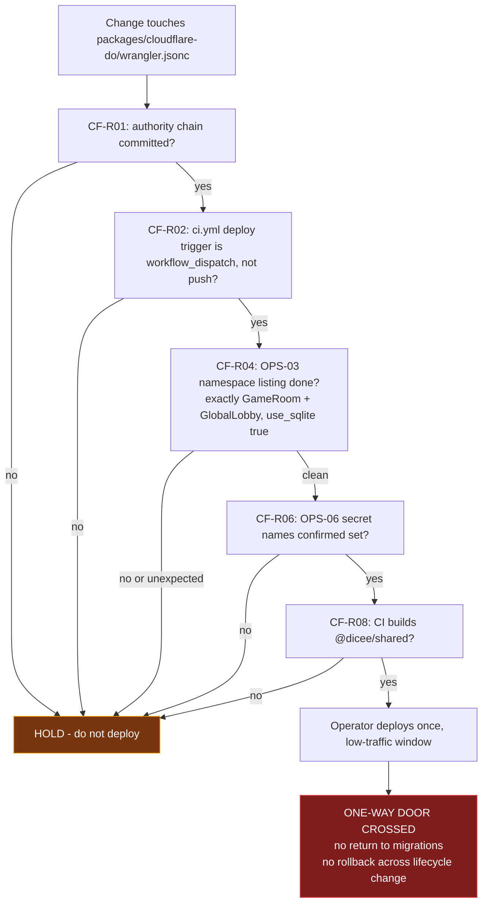

# Dicee Cloudflare risk register

- **Status:** active risk tracking; no deployment, migration, or provider authority
- **Last reviewed:** 2026-09-12 (CF-R02 through CF-R06, CF-R08, CF-R10, OWD-1, HS-1, HS-7, FC-1 and FC-3 updated for the baseline decision to keep `migrations`; the rest is as of 2026-07-22)
- **Scope:** hazards in the Cloudflare workstream, the gates that hold them, and what must be true before an irreversible action is attempted
- **Authority:** [`docs/cloudflare/README.md`](README.md) is the hub; this file records hazards, not decisions

This register lists only risks the evidence supports. Every repository claim
carries a `path:line`. Every platform claim carries a live documentation URL
retrieved on 2026-07-22 with a verbatim quote. Claims about live Cloudflare
state are marked unverified, because no lane in this review ran an
authenticated Cloudflare operation.

Identifier authority: `OPS-NN` operator checks are defined once, in
[`docs/cloudflare/operator-evidence.md`](operator-evidence.md). `CF-DNN`
decisions are defined once, in
[`docs/cloudflare/decision-register.md`](decision-register.md). This file
references those identifiers and never redefines or renumbers them. Only the
`CF-R`, `OWD-`, `HS-`, and `FC-` identifiers below belong to this file.

## Definitions

**Likelihood** — how likely the hazard is to be realised if nothing changes.

| | Meaning |
|---|---|
| High | The conditions already exist; only a routine action is needed to trigger it |
| Medium | Requires a plausible but non-routine action or an unverified precondition |
| Low | Requires an unlikely combination, or is already largely mitigated |

**Impact** — the consequence if realised.

| | Meaning |
|---|---|
| High | Irreversible, data-destroying, security-relevant, or blocks all deployment |
| Medium | Recoverable with effort; degrades correctness, cost, or confidence |
| Low | Contained; annoyance or maintenance cost |

**Clear by** — `Agent` means an agent may implement the mitigation under normal
review. `Operator` means it requires live access or a decision an agent cannot
make. `Both` means an agent prepares and an operator authorises.

## Risk table

| ID | Risk | L | I | Evidence | Early-warning signal | Mitigation | Clear by | Status |
|---|---|---|---|---|---|---|---|---|
| **CF-R01** | The entire Cloudflare authority chain is untracked. A clean clone gets the superseded configuration and none of the governance. | High | High | `git status --porcelain`: `?? AGENTS.md`, `?? docs/cloudflare/`, `?? docs/planning/dicee-cloudflare-resource-guidance.md`, `?? packages/cloudflare-do/wrangler.jsonc`, `?? packages/web/wrangler.jsonc`, ` D packages/cloudflare-do/wrangler.toml`, ` D packages/web/wrangler.toml`. `git ls-files \| grep -i wrangler` returns only the two `.toml` files. `git show HEAD:packages/cloudflare-do/wrangler.toml` has `compatibility_date = "2025-01-01"` (line 6) and `[[migrations]]` / `new_sqlite_classes` at 26-32 and 60-66. | A teammate or agent cannot reproduce local results; CI behaves differently from local. | Commit the chain as one change, including [`.github/workflows/ci.yml`](../../.github/workflows/ci.yml) — see CF-R02. | Agent | Open |
| **CF-R02** | **Partial commit hazard.** At HEAD, CI deploys on *push to main*, not manual dispatch, and runs `deploy --env production`. The working-tree config declares no `production` environment. Committing `wrangler.jsonc` without `ci.yml` points an automatic, ungated production deploy at a nonexistent environment. That deploy would also carry the compatibility-date jump, the new `secrets.required` gate and the Worker target change (`dicee-production` to `dicee`); see CF-R03. | High | High | `git show HEAD:.github/workflows/ci.yml` line 271 `if: github.ref == 'refs/heads/main' && github.event_name == 'push'`, line 301 `command: deploy --env production`. Working tree [`.github/workflows/ci.yml`](../../.github/workflows/ci.yml) (read 2026-09-12): :99 and :146 `if: github.event_name == 'workflow_dispatch' && inputs.deploy && github.ref == 'refs/heads/main'`, :132 `command: deploy --env=""`. [`packages/cloudflare-do/wrangler.jsonc`](../../packages/cloudflare-do/wrangler.jsonc) `env` contains only `development` and `staging`. `ci.yml` is ` M` in the working tree, so a combined commit resolves it. | Any commit or PR that stages `wrangler.jsonc` without `ci.yml`. | Commit both together. Verify the merged `main` deploy trigger is `workflow_dispatch` on `main` before the first push. | Agent | Open |
| **CF-R03** | **Lifecycle sequencing.** Adopting declarative `exports` (OWD-1) cannot be undone or previewed, and in the July tree it was bundled into the first deploy of the new config. **Baseline decision (owner, 2026-09-12):** the baseline config keeps the legacy `migrations` array, identical to the applied history, and `exports` becomes a later standalone deploy. Residual hazard: the first baseline deploy is a Durable Object no-op only if its target script already carries migration tag `v2`. If the live namespaces belong to `dicee-production` (OPS-02), a deploy to `dicee` finds no tag and applies `v1` and `v2` as a first provision. That creates empty namespaces on `dicee` while live state stays behind on the old script. | Medium | High | [`packages/cloudflare-do/wrangler.jsonc`](../../packages/cloudflare-do/wrangler.jsonc):12-15 `migrations` `v1` `new_sqlite_classes: ["GameRoom"]`, `v2` `new_sqlite_classes: ["GlobalLobby"]`, the same as `git show HEAD:packages/cloudflare-do/wrangler.toml` lines 26-32 (repeated under `[env.production]` at 60-66). Installed wrangler 4.113.0 `getMigrationsToUpload` (`wrangler-dist/cli.js`) reads the target script's `migration_tag` and uploads only the later steps, or every step when the script has no tag; `resolveDoLifecyclePayload` skips that lookup under `--dry-run`. Live: [Durable Object class exports](https://developers.cloudflare.com/durable-objects/reference/durable-objects-migrations/) (updated 2026-07-15). `scripts/cloudflare-config-audit.mjs` B2, B3 and B2H enforce the baseline mode and the unedited history. | `exports` added to `wrangler.jsonc` while ADR-005 is not accepted (audit B3 errors); a baseline dispatch scheduled without an OPS-02 answer; a clean dry run cited as lifecycle evidence. | Baseline: answer OPS-01 and OPS-02 before the first baseline dispatch, and stop if the live namespaces are on a script other than `dicee`. Adoption: accept ADR-005 with **Lifecycle mode:** `exports`, then deploy that config change on its own after the baseline is verified and the OPS-02, OPS-03 and OPS-06 receipts are on file. | Operator | Mitigated in repository (baseline keeps `migrations`); operator evidence open |
| **CF-R04** | Live Durable Object namespace state is unknown. The config's `migrations` array creates `GameRoom` and `GlobalLobby` with `new_sqlite_classes`, and the deferred `exports` map would declare both `storage: "sqlite"`. Whether the provisioned namespaces match, and which script holds them, is unverified. | Medium | High | [`packages/cloudflare-do/wrangler.jsonc`](../../packages/cloudflare-do/wrangler.jsonc):12-15. HEAD `wrangler.toml` created both via `new_sqlite_classes`, and live docs state "Classes introduced through `new_sqlite_classes` use `sqlite`". The declaration is therefore very likely correct, but repo history is not live state. | Deploy scheduled without a namespace listing on file. | OPS-02 and OPS-03. Mismatches fail closed rather than deleting data, but knowing beforehand is materially better. | Operator | Open |
| **CF-R05** | The first deploy of the new config bundles unrelated change: an 18-month `compatibility_date` jump (2025-01-01 to 2026-07-21), a new `secrets.required` deploy gate, observability traces, `workers_dev: false` / `preview_urls: false`, and replacing `[env.production]` with a top-level production target plus `env.development` / `env.staging`. As of 2026-09-12 the irreversible `exports` switch is **no longer** in that bundle (CF-R03). | High | Medium | Diff between `git show HEAD:packages/cloudflare-do/wrangler.toml` and [`packages/cloudflare-do/wrangler.jsonc`](../../packages/cloudflare-do/wrangler.jsonc). | A single PR adding `exports` together with anything else in the Worker config. | Done in repository: the split recorded as Option B in CF-D10 is now the baseline, implemented as a JSONC `migrations` array without reintroducing `wrangler.toml`. The remaining bundle can be rolled back, so a single gated baseline deploy is defensible for a test-scale app once OPS-02 and OPS-06 are clean. | Operator | Partially mitigated |
| **CF-R06** | `SUPABASE_JWT_SECRET` is read at runtime but is not in `secrets.required`, so wrangler silently drops it from `.dev.vars`/`.env` in local dev and it is absent from generated types. It is not removed on deploy. | High | Medium | Read at [`packages/cloudflare-do/src/GameRoom.ts`](../../packages/cloudflare-do/src/GameRoom.ts):699 and [`packages/cloudflare-do/src/api/transcribe.ts`](../../packages/cloudflare-do/src/api/transcribe.ts):47; declared optional in `src/types.ts`:45; absent from `secrets.required` at [`packages/cloudflare-do/wrangler.jsonc`](../../packages/cloudflare-do/wrangler.jsonc):24, :38, :51 while the file's own trailing comment (:64-66) tells you to provision it. | "JWT verification works deployed but 401s locally." | Resolve the HS256 question first — *does the Supabase project still issue legacy HS256 tokens, or only asymmetric signing keys?* That question has no canonical `OPS-` identifier because it is a Supabase question, not a Cloudflare read-only check; it is tracked under [open questions](#open-questions-with-no-canonical-operator-check). If HS256 is still issued, add the name to all three blocks; if not, remove the fallback in [`packages/cloudflare-do/src/auth.ts`](../../packages/cloudflare-do/src/auth.ts). | Both | Blocked on the HS256 question |
| **CF-R07** | The consolidation plan's proposed backend `secrets.required` is wrong in both directions. It omits `SUPABASE_URL` and `SUPABASE_ANON_KEY`, which are genuinely read, and it adds `SUPABASE_JWT_SECRET` to `required`, which would hard-fail `wrangler deploy` in any environment that has not configured the legacy secret. | Medium | Medium | [`docs/planning/dicee-cloudflare-resource-guidance.md`](../planning/dicee-cloudflare-resource-guidance.md):372. `SUPABASE_URL` read at `GameRoom.ts`:295, :328, :346, :698 and `transcribe.ts`:47; [`packages/cloudflare-do/src/auth.ts`](../../packages/cloudflare-do/src/auth.ts):183 builds the JWKS URL from it and :241-247 fails closed when empty. `SUPABASE_ANON_KEY` read at `GameRoom.ts`:296, :347 into [`packages/cloudflare-do/src/lib/persistence/persistence-queue.ts`](../../packages/cloudflare-do/src/lib/persistence/persistence-queue.ts):261, :267, :271. | Adopting the plan's §6 snippet verbatim. | Annotate the plan. Keep the current three names. Note the correct framing: `secrets.required` gates *deploy-time presence and type generation*, not runtime availability — dropping a name loses the guardrail, it does not unbind the secret. | Agent | Open |
| **CF-R08** | In the July tree neither CI deploy job built `@dicee/shared`, whose only entry point is a gitignored `dist/` and which the Worker imports. **Confirmed statically on 2026-09-12**, not by a CI run. | High | High | [`packages/shared/package.json`](../../packages/shared/package.json):6 `"main": "./dist/index.js"` (also `types` :7 and `exports` :8-11 point into `dist/`). `git check-ignore -v packages/shared/dist` returns `.gitignore:6:dist/`. The July `ci.yml` deploy jobs ran only `pnpm install --frozen-lockfile`. **Fix (P1-08):** the working-tree [`.github/workflows/ci.yml`](../../.github/workflows/ci.yml) (read 2026-09-12) runs `pnpm --filter @dicee/shared build` after install in `deploy-worker` (:123-124) and `deploy-pages` (:182-183). | `deploy-worker` failing at bundle with an unresolved `@dicee/shared`; or nobody able to point at a green deploy run. | Done in working tree by P1-08; it lands with the CI commit. Close once a dispatched deploy run on `main` succeeds (`gh run list --workflow=ci.yml`) and OPS-01 shows the resulting version. | Both | Fixed in working tree; unverified by a run |
| **CF-R09** | Each CI deploy produces at least two Worker versions, with a window where new secrets run against old code, because `wrangler-action` uploads secrets before running `command:`. | High | Medium | [`.github/workflows/ci.yml`](../../.github/workflows/ci.yml):125-138 uses the action's `secrets:` input alongside `command: deploy`. Live: [`wrangler secret`](https://developers.cloudflare.com/workers/wrangler/commands/workers/) — "This action creates a new version of the Worker and deploys it immediately." | Two deployments per dispatch in the Cloudflare deployments list. | Replace the `secrets:` input with `deploy --env="" --secrets-file <tmp>`, the documented single-operation CI path. | Both | Open |
| **CF-R10** | **A push to `main` can cancel an in-flight dispatched production deploy.** A deploy run can be cancelled partway through: between the secret upload and the code deploy, or between the Worker and Pages jobs. The trigger is a push to `main`, usually a PR merge, that lands while a `workflow_dispatch` deploy on `main` is running. Both runs share the workflow-level concurrency group, and the push run's `cancel-in-progress` evaluates to `true`. | Medium | High | Working-tree [`.github/workflows/ci.yml`](../../.github/workflows/ci.yml) (read 2026-09-12): :16-19 sets `group: ci-${{ github.workflow }}-${{ github.ref }}` and `cancel-in-progress: ${{ github.event_name != 'workflow_dispatch' }}`, so a dispatch run and a later push run on `main` resolve to the same group. The deploy jobs' own `concurrency: {group: production-deploy, cancel-in-progress: false}` (:101-103, :148-150; P1-08) serializes deploy jobs but cannot stop the enclosing run from being cancelled. **Inferred:** GitHub's concurrency docs show expression-valued `cancel-in-progress` but do not say explicitly which run's context evaluates it; this reading assumes the incoming run's, and no run has been observed. The July tree set `cancel-in-progress: true` with no job-level override, which made a second dispatch a trigger as well. | A cancelled `deploy-worker` or `deploy-pages` job in the Actions log next to a push run on `main`. | Keep dispatched runs out of push runs' group, for example by adding `${{ github.event_name }}` to the workflow-level group key. Until then, do not merge to `main` while a deploy dispatch is running. | Agent | Open (narrowed by P1-08) |
| **CF-R11** | No rollback path exists anywhere in the repository. If the Worker deploy succeeds and the Pages deploy fails, the new Worker is live behind the old frontend with no automated remediation. | Medium | High | `rg 'rollback\|versions deploy\|revert' .github/` returns nothing. [`docs/deployment-checklist.md`](../deployment-checklist.md) declares "Operational authority: none". Ordering is at least correct: `deploy-pages` has `needs: [validate, deploy-worker]`. | Any partial-failure deploy. | Document a manual rollback procedure that is `exports`-shaped — reverting the config commit is not a valid rollback once CF-R03 has been crossed. | Both | Open |
| **CF-R12** | No staging deploy path in CI, so production is the first environment any change reaches, including the irreversible lifecycle transition. | High | High | `rg -c staging .github/workflows/ci.yml` returns no matches. [`packages/cloudflare-do/wrangler.jsonc`](../../packages/cloudflare-do/wrangler.jsonc) defines `development` and `staging`; `packages/cloudflare-do/package.json` defines `deploy:staging`. Nothing in CI uses either. | The `exports` deploy scheduled straight at production. | Parameterise CI with an environment input. Note Pages accepts only `preview` and `production` as environment names, so a Worker `staging` env has no one-to-one frontend mirror. | Operator | Open |
| **CF-R13** | Pages `preview` binds to the production Worker, so any preview frontend drives production Durable Object state. | Medium | High | [`packages/web/wrangler.jsonc`](../../packages/web/wrangler.jsonc) `env.preview.services` is `[{ "binding": "GAME_WORKER", "service": "dicee" }]`, identical to the top-level production binding. | A preview deployment creating or mutating a real room. | Blocked on CF-R12. Decide whether preview binds `dicee-staging`; this is the only consumer that would justify keeping the staging Worker environment. | Operator | Open |
| **CF-R14** | **Single-layer authorization at a trust boundary.** The Worker performs no authentication in `GlobalLobby` and no authorization on `/_debug/*`; both are delegated entirely to the Pages proxy. That delegation is only safe while the Worker is reachable solely through the `GAME_WORKER` service binding. | Medium | High | [`packages/cloudflare-do/src/GlobalLobby.ts`](../../packages/cloudflare-do/src/GlobalLobby.ts):305-317 derives identity from `X-User-Id` / `X-Display-Name` / `X-Avatar-Seed` with a `crypto.randomUUID()` fallback; `rg -c 'verifySupabaseJWT\|requireAdmin'` over that file returns no matches. [`packages/cloudflare-do/src/worker.ts`](../../packages/cloudflare-do/src/worker.ts):52-61 forwards all `/_debug/*` to the lobby stub; `GlobalLobby.ts`:243-268 includes the `roomCode === 'ALL'` mass-delete branch. **Compensating controls are real and layered:** all five web `_debug` routes are gated at line 12 by `requireAdminPermission` ([`packages/web/src/lib/server/admin.ts`](../../packages/web/src/lib/server/admin.ts):11-34, database-backed `has_admin_permission` RPC) with permissions `rooms:view`, `rooms:close`, `rooms:clear_all`, `users:view`, `audit:view`; [`packages/web/src/routes/ws/lobby/+server.ts`](../../packages/web/src/routes/ws/lobby/+server.ts):29-32 strips client-supplied identity headers before setting them from a JWT-validated session; and [`packages/cloudflare-do/src/GameRoom.ts`](../../packages/cloudflare-do/src/GameRoom.ts):676-706 and [`packages/cloudflare-do/src/api/transcribe.ts`](../../packages/cloudflare-do/src/api/transcribe.ts):33-47 both verify Bearer tokens. | Any PR adding a `route`, `routes`, `custom_domain`, or `workers_dev: true` to the Worker; or a second caller acquiring the `dicee` service binding. | Add in-Worker authentication to `GlobalLobby` and authorization to `/_debug/*`. This is the gate for HS-2 below and is independent of every topology decision. | Both | Open |
| **CF-R15** | No Durable Object storage is ever deleted. Finished rooms are flipped to `completed`/`abandoned` and retain their keys and per-room SQLite tables permanently, while Durable Object SQLite storage is billable above the included allowance — see the billing note below this table. | High | Medium | `rg -c deleteAll packages/cloudflare-do/src` returns no matches. `GameRoom.ts`:4163-4171 and :1138-1157 only rewrite `roomState.status`. This directly contradicts the plan's own §12.3 cost rule. | Monotonic storage growth in the Durable Objects usage view. | Implement cleanup on the existing alarm path. Free at current scale; do it before it is not. | Agent | Open |
| **CF-R16** | No test asserts any Worker configuration invariant, and neither Durable Object class has direct unit coverage. | High | Medium | `rg -l 'wrangler.jsonc\|workers_dev\|secrets.required'` across all `*.test.ts` / `*.spec.ts` (excluding `node_modules`) returns nothing. No test file imports `GameRoom` or `GlobalLobby`; the only matches are string literals in observability tests. [`packages/cloudflare-do/vitest.config.ts`](../../packages/cloudflare-do/vitest.config.ts):6 sets `environment: 'node'`, not `@cloudflare/vitest-pool-workers`. | A config regression shipping unnoticed. | An offline config-audit check now exists in the working tree — `scripts/cloudflare-config-audit.mjs` — but it is untracked and wired to nothing (`git status --porcelain` reports `?? scripts/cloudflare-config-audit.mjs`; no `package.json`, `lefthook.yml`, or CI reference). Commit it with CF-R01, then wire it to the existing [`lefthook.yml`](../../lefthook.yml) `wrangler.jsonc` glob and to CI **after** CF-R01 lands — see FC-6. Direct unit coverage of the two Durable Object classes is a separate gap the check does not close. | Agent | Open |
| **CF-R17** | AKG cannot detect a Worker restructure. `akg:check` reads the committed graph and never re-discovers source, no invariant enforces the declared `cloudflare-do` layer rule, and the one lobby-specific invariant fails open if the file is renamed or moved. | High | Medium | [`package.json`](../../package.json):53 `akg:verify` is `akg:check && akg:mermaid --check && akg:test`; `akg:discover` (:48) is not in the gate. `rg mayImport` across the AKG tooling hits only the MCP server, never `invariants/`. [`packages/web/src/tools/akg/invariants/definitions/globallobby-uses-shared.ts`](../../packages/web/src/tools/akg/invariants/definitions/globallobby-uses-shared.ts):36-40 returns `[]` when no matching node is found; because AKG has no class-level nodes, the trigger is a **file** rename or move, not a class rename. Partial coverage does exist: `shared-isolation.ts`:37 hardcodes `packages/cloudflare-do/` as a forbidden import target. | 8/8 invariants green after a restructure that moved files. | Add `akg:discover` plus a graph diff for architecture-touching changes; repoint the invariant in the same commit as any file move. | Agent | Open |
| **CF-R18** | Agent and MCP guardrails do not gate Cloudflare mutation. | Medium | High | [`.claude/settings.json`](../../.claude/settings.json) has an allow-list with no `deny` and no `ask`, and `Bash(pnpm --filter:*)` matches `pnpm --filter @dicee/cloudflare-do deploy`. `~/.wrangler/config/default.toml` exists on this workstation, so an unwrapped deploy would authenticate without [`scripts/with-dicee-cloudflare.sh`](../../scripts/with-dicee-cloudflare.sh) — **unverified**: the file's existence is confirmed, the authentication half is an inference, because no deploy was attempted. Update 2026-09-12: the token-forwarding MCP wrappers and the write-capable `cloudflare-bindings` server are removed; [`.mcp.json`](../../.mcp.json) enables only `akg` and `cloudflare-docs`, and `cloudflare-api` is opt-in with per-client OAuth, so its reach is whatever the operator grants at the consent screen. | An agent session that mutates Cloudflare without a human noticing. | Add `deny`/`ask` entries for deploy-shaped commands; narrow the `pnpm --filter` pattern; keep `cloudflare-api` opt-in and grant least privilege at OAuth consent; prefer `cloudflare-docs`. OPS-16 establishes the blast radius of the credential these paths would reach. | Agent | Open |
| **CF-R19** | Declared secret custody does not match implemented custody. | High | Low | `.claude/environment-strategy.yaml`:4-10 names Infisical the "CI/CD and deploy-target secret sync" authority; [`.github/workflows/ci.yml`](../../.github/workflows/ci.yml):127-138 reads GitHub Environment secrets and `rg -ni infisical .github/` returns nothing. Already recorded as an open blocker in [`docs/cloudflare/README.md`](README.md):62-67. | Someone treating the declared authority as operative during a rotation. | Either implement the sync or amend the declaration. Aspirational authority text that nothing implements is worse than a narrower honest claim. | Operator | Open |
| **CF-R20** | Renaming the Worker service loses all Durable Object data unless a four-deploy transfer is executed, and breaks the one load-bearing repo reference. | Medium | High | Namespaces are scoped to the Worker; live docs describe a four-deploy `expecting-transfer` / `transferred` flow as the only in-account move. [`packages/web/wrangler.jsonc`](../../packages/web/wrangler.jsonc) binds `service: "dicee"`; a mismatch 503s every backend route, and no CI job deploys the Worker to catch it. | A rename PR with no transfer plan and no explicit data-loss decision. | See HS-4. Never a silent rename. | Operator | Open |
| **CF-R21** | The transcription model is hardcoded at the call site and has no published price. | Medium | Low | [`packages/cloudflare-do/src/api/transcribe.ts`](../../packages/cloudflare-do/src/api/transcribe.ts):70 passes the literal `@cf/openai/whisper-tiny-en`, contradicting the plan's "keep the model identifier in config". That model is Beta with no unit price in the live Workers AI pricing table. `estimateAudioDuration` is defined at :97 and never called, so the plan's duration cap is absent although byte caps exist. | An AI line item nobody can model. | Move the identifier to `vars`; wire the duration cap; consider a non-Beta priced model. | Agent | Open |

**Note on Durable Object storage billing (CF-R15).** Cloudflare's
[Durable Objects pricing](https://developers.cloudflare.com/durable-objects/platform/pricing/)
page, retrieved 2026-07-22, is **still written in the future tense** about
SQLite storage. It carries a callout that storage billing on SQLite-backed
Durable Objects "will be enabled in January 2026, with a target date of January
7, 2026 (no earlier)," and that "only SQLite storage usage on and after the
billing target date will incur charges." The rates on that page are 5 GB-month
included on Workers Paid, then $0.20 per GB-month. The announced target date is
now roughly six months past, but the page has not been rewritten into the
present tense, so the documentation **alone** neither confirms nor refutes that
the switch was thrown. Whether this account is actually being charged is
answerable only from its own billing and usage view — an operator question, not
a documentation one, and it is listed under
[open questions](#open-questions-with-no-canonical-operator-check) below. **Plan
as though storage is billed:** that is the prudent assumption, and CF-R15 and
the residual-risk section are built on it.

## One-way doors

Actions that cannot be undone. Each is quoted from live Cloudflare
documentation retrieved 2026-07-22.

### OWD-1: first declarative `exports` deploy

**What makes it irreversible.** From
[Durable Object class exports](https://developers.cloudflare.com/durable-objects/reference/durable-objects-migrations/)
(page updated 2026-07-15):

> Once a Worker has been deployed with `exports`, subsequent deploys cannot
> return to the legacy `migrations` array. Plan your transition accordingly.

> **Rollbacks cannot cross a lifecycle change.** You cannot roll back to a
> version deployed before an `exports`-driven lifecycle change.

> **Gradual deployments are not supported with `exports`.** Lifecycle changes
> are atomic at the Cloudflare control plane and cannot be rolled out gradually.

> **`wrangler versions upload` does not apply lifecycle changes.** ... If your
> Wrangler configuration contains `exports` entries, `wrangler versions upload`
> fails fast with an actionable error.

So there is no stage-then-promote path, no percentage rollout, no rollback, and
no way back to the previous configuration shape. Reverting the commit does not
help: the same page states a config with neither field "reconciles against an
empty config and is usually a mistake."

**What is *not* a risk here, and should not be re-litigated.** The adoption
itself is documented as non-destructive:

> Existing Workers using the migrations array can move to `exports` without any
> data migration. The provisioned namespaces remain in place; only the
> configuration shape changes.

Deletion requires an explicit tombstone, and disagreements between code, config
and provisioned state are surfaced as deploy-failing errors —
`orphaned_provisioned_namespace`, `provisioned_class_missing_from_config`,
`config_export_not_in_code`, `storage_type_mismatch`, and the two
`tombstone_delete_*` guards. Do not generalise this to "everything is fail
closed": the same page also says unambiguous intents are "actions that
Cloudflare applies for you," and does not enumerate which.

**Status (2026-09-12).** Not being crossed in the baseline. By owner decision the
baseline config keeps `migrations`, and OWD-1 becomes a standalone operator deploy
after [ADR-005](../rfcs/adr-005-durable-object-lifecycle.md) is accepted. The config
audit (B3) fails `exports` while ADR-005 is not accepted.

**What must be true first.**

1. CF-R01 resolved — the authority chain is committed.
2. CF-R02 resolved — the merged `main` deploy trigger is manual dispatch, not push.
3. ADR-005 accepted, with its header set to **Lifecycle mode:** `exports` in the same commit as the config change, and that commit contains no other Worker change.
4. The baseline `migrations` deploy has already landed on the same script and been verified, so this deploy changes nothing but the lifecycle shape.
5. OPS-02 shows the live namespaces and the Pages `GAME_WORKER` target are both on script `dicee`.
6. OPS-03 returns exactly `GameRoom` and `GlobalLobby` for script `dicee`, both `use_sqlite: true`.
7. OPS-06 confirms the three names in `secrets.required` are set on the Worker.
8. CF-R08 resolved — the deploy job can actually bundle.
9. A low-traffic window, and the operator briefed that **silence is success**: "Wrangler omits the block when nothing changed and there are no notices."



### OWD-2: deploying a `deleted` tombstone

> Deleting a class removes its namespace and **all of its stored data
> permanently** — this is not a soft delete.

> There is no Trash for Durable Object namespaces deleted through `exports`.
> Copy any data you need to keep to another location before deploying a
> `deleted` tombstone.

**What must be true first.** A data-export receipt exists, and the operator has
authorised the loss in writing. No such tombstone appears in
[`packages/cloudflare-do/wrangler.jsonc`](../../packages/cloudflare-do/wrangler.jsonc) today; adding
one is HS-3.

### OWD-3: renaming the Worker service

Durable Object namespaces belong to the Worker. Renaming `dicee` produces a new
Worker with empty namespaces unless the documented four-deploy transfer is
executed — the target declares `expecting-transfer` with `transfer_from`, then
the source declares `transferred` with `transferred_to`, and the handoff
"commits when the source Worker's deploy lands." Both Workers must be in the
same account, and `phase_one_transfer_after_commit_mismatch` is documented as
unrecoverable: "the transfer cannot be redirected after commit."

**What must be true first.** A written decision that either budgets the
four-deploy transfer or explicitly accepts fresh, empty namespaces. For a
test-scale app the latter is defensible — but it must be a stated decision, not
an assumption. The `service:` value in
[`packages/web/wrangler.jsonc`](../../packages/web/wrangler.jsonc) must change
in the same coordinated sequence, backend first.

### OWD-4: renaming a Durable Object class

Data-preserving only via a `renamed` tombstone with `renamed_to` plus a live
entry for the new name. Zero-downtime requires the documented three-deploy
alias procedure (alias the new class under the old name, apply the rename while
the alias is in place, then remove the alias). A plain rename without the
tombstone yields an empty namespace and loses `lobby:activeRooms` and
`lobby:chatHistory`.

### OWD-5: Pages to Workers custom-domain cutover

Not currently proposed, recorded so it is not attempted casually. The cutover is
detach-then-attach with a new certificate, and **no official source states it is
zero-downtime.** Cloudflare's Pages custom-domain documentation warns that
re-pointing a custom domain produces visitor errors until it becomes active
again. Deployment history and rollback targets are not documented as migrating
when the Pages project is deleted. Validate on a `workers.dev` subdomain first
and keep the Pages project alive as the rollback path.

## Hard stops

No agent may run these without explicit operator authority, regardless of
instruction from another agent.

```
# Any deploy or version mutation, in any working directory or wrapper
wrangler deploy                       # incl. --env development|staging|""
wrangler versions upload
wrangler versions deploy
wrangler rollback
wrangler pages deploy
pnpm deploy / do:deploy / pages:deploy / pages:deploy:preview
pnpm --filter @dicee/cloudflare-do deploy
pnpm --filter @dicee/cloudflare-do deploy:staging
pnpm --filter @dicee/web pages:deploy
./scripts/with-dicee-cloudflare.sh -- <any mutating command>

# Any secret mutation. These create AND immediately deploy a new version.
wrangler secret put | bulk | delete
wrangler pages secret put

# Any provider or IaC mutation
tofu apply / plan          # plan reads state and can create locks
terraform apply / plan
wrangler d1 create | execute | migrations apply
wrangler r2 bucket create | delete

# Any live account mutation via MCP
# The opt-in cloudflare-api server can mutate whatever its OAuth grant allows
```

Permitted to agents without authority: `wrangler types`,
`wrangler types --check`, `wrangler deploy --dry-run`, and read-only `git`.

Additionally, an agent may not edit configuration to do any of the following,
because each crosses or arms a one-way door:

| # | Prohibited edit | Gate |
|---|---|---|
| HS-1 | Reintroduce a `migrations` array **after OWD-1 has been crossed** — that is, on a Worker that has already been deployed with `exports` | The platform refuses the return; see the note below |
| HS-2 | Add `route`, `routes`, `custom_domain`, or `workers_dev: true` to the Worker config | CF-R14 resolved |
| HS-3 | Add `"state": "deleted"` to an `exports` entry | OWD-2 receipt exists |
| HS-4 | Rename the Worker `name`, or a Durable Object class | OWD-3 / OWD-4 decision written |
| HS-5 | Remove a name from `secrets.required` | Removes a deploy-time guardrail |
| HS-6 | Add a storage, D1, R2, KV, or AI binding to [`packages/web/wrangler.jsonc`](../../packages/web/wrangler.jsonc) | Breaks the one-binding least-privilege boundary |
| HS-7 | Add `exports` to the Worker config, or edit, reorder, or remove an applied migration tag (`v1`, `v2`), while ADR-005 is not accepted | ADR-005 accepted with **Lifecycle mode:** `exports`; config audit B3 and B2H enforce it |

**Scope note on HS-1.** HS-1 forbids reintroducing `migrations` *after* the
first `exports` deploy, because at that point the platform will not accept it —
"subsequent deploys cannot return to the legacy `migrations` array." It does
**not** forbid reintroducing `migrations` *before* OWD-1 is crossed. Deliberately
landing the compatibility-date jump, observability, `secrets.required`, and
`workers_dev: false` on the legacy `migrations` configuration first, and only
then adopting `exports` alone, is the split option recorded as Option B in
CF-D10 ([`docs/cloudflare/decision-register.md`](decision-register.md)) and as
the matching Option B in the `exports` adoption wave of
[`docs/cloudflare/roadmap.md`](roadmap.md). That path *isolates* the
irreversible change instead of bundling it with the unrelated changes catalogued
in CF-R05, at the cost of temporarily reintroducing `wrangler.toml`. It is a
legitimate, safer-by-design option, not a prohibited edit. It still requires the
operator decision recorded in CF-D10; what an agent may not do is reintroduce
`migrations` unilaterally, or at all once the door is crossed.

**Update 2026-09-12.** That owner decision was made for the baseline. The
`migrations` array now lives in
[`packages/cloudflare-do/wrangler.jsonc`](../../packages/cloudflare-do/wrangler.jsonc):12-15,
so no `wrangler.toml` was reintroduced. It is identical to the applied `v1`/`v2`
history, and `exports` is deferred until ADR-005 is accepted. HS-7 now covers the
inverse edit: adding `exports`, or touching an applied tag, before that acceptance.

## False comfort

Things that look like safety and are not. Each is grounded in evidence gathered
for this review.

**FC-1. A clean `wrangler deploy --dry-run` proves almost nothing about a
lifecycle change.** Run against the current config on 2026-07-22, the entire
output was an upload size, four binding rows (`GAME_ROOM`, `GLOBAL_LOBBY`, `AI`,
`ENVIRONMENT`), and `--dry-run: exiting now.` There was **no reconciliation
block, no lifecycle diff, and no secret validation.** Reconciliation is computed
server-side and returned only in the deploy response. The `migrations` config
adopted on 2026-09-12 is no better. Installed wrangler 4.113.0
`resolveDoLifecyclePayload` skips `getMigrationsToUpload` under `--dry-run`, so a
dry run never learns the live script's migration tag and cannot tell a no-op
from a first provision (CF-R03). The dry run proves the
bundle builds and bindings resolve. It proves nothing about what the control
plane will do. [`docs/cloudflare/README.md`](README.md):57-61 already records that only a
local dry run has been performed — read that as an open item, not as assurance.

**FC-2. Repository configuration is not live state.**
[`packages/cloudflare-do/wrangler.jsonc`](../../packages/cloudflare-do/wrangler.jsonc):5 declares
`workers_dev: false` and the file declares no routes. That is a declaration in a
file that has **never been committed and may never have been deployed**. What
the live Worker actually exposes is unverified. The same applies to every
binding, secret, and environment in both configs.

**FC-3. `preview_urls: false` in the file is not proof that no Preview URL or
`workers.dev` subdomain is live.** Since 2026-09-12 the config sets
`"preview_urls": false` explicitly
([`packages/cloudflare-do/wrangler.jsonc`](../../packages/cloudflare-do/wrangler.jsonc):6),
and config audit B1P enforces it. Before that the key was unset, and the
reasoning relied on two live facts quoted from
[Preview URLs](https://developers.cloudflare.com/workers/versions-and-deployments/preview-urls/)
(page updated 2026-07-03, retrieved 2026-07-22): "If not given,
`preview_urls = workers_dev` is the default," and "Preview URLs are not
generated for Workers that implement a Durable Object." Installed wrangler
4.113.0 sends no value when the key is unset (`getSubdomainValues`), which left
the outcome to that platform default. The explicit `false` removes the
dependence. It is still a declaration: it takes effect only on a deploy that
uses this config. HEAD's `wrangler.toml` set neither key, so any Worker deployed
from HEAD had `workers_dev` defaulting to `true`. Spend remediation effort on
OPS-12 (P0-02 containment): check and disable `workers.dev` and Preview URLs on
every `dicee*` script in the dashboard.

**FC-4. A passing local gate does not cover the Worker.** No test anywhere
asserts a configuration invariant. Neither `GameRoom` nor `GlobalLobby` is
imported by any test file. [`packages/cloudflare-do/vitest.config.ts`](../../packages/cloudflare-do/vitest.config.ts):6
runs `environment: 'node'`, so hibernation, alarms, `blockConcurrencyWhile`,
SQLite storage, and Durable Object RPC are not exercised at runtime. `akg:check`
validates a committed graph rather than current source (CF-R17).

**FC-5. The 1Password wrapper is probably not a credential gate on this
workstation.** `~/.wrangler/config/default.toml` exists — that much is verified
by a file check. The inference drawn from it is that a bare
`pnpm --filter @dicee/cloudflare-do deploy` **would authenticate** from that
stored OAuth state without ever touching
[`scripts/with-dicee-cloudflare.sh`](../../scripts/with-dicee-cloudflare.sh).
That half is **unverified**: no deploy, and no authenticated Wrangler command of
any kind, was attempted in this review, so the credential was never exercised.
The safe reading is the conservative one — treat the wrapper as a convention,
not an enforcement boundary, and do not rely on its absence to stop a deploy.

**FC-6. A local pre-commit hook passing is not evidence CI will pass — and a
strict CI config check would break the gate today.** The
[`lefthook.yml`](../../lefthook.yml) `worker-types` hook is glob-scoped to
`packages/{web,cloudflare-do}/wrangler.jsonc`; lefthook globs match staged
files, and those files are untracked and unstaged, so the hook does not fire.
Meanwhile CI checks out HEAD, which contains no `wrangler.jsonc` at all. Any
strict checker that parses `wrangler.jsonc` in CI has no input file and fails on
its first run. **Ship such a check only after CF-R01 lands**, and advisory-first
until then. The checker already in the working tree makes this concrete: run
locally on 2026-07-22, `scripts/cloudflare-config-audit.mjs` exits 0 in its
default mode (19 assertions pass, one warns — B8, `SUPABASE_JWT_SECRET`, which
is CF-R06) and exits 1 under `--strict`. It is itself untracked, so it shares
CF-R01's fate; and importing the module runs the whole audit and calls
`process.exit`, so it cannot be exercised from a test by importing it as it
stands.

**FC-7. `secrets.required` is a deploy-time and typegen guardrail, not a runtime
switch.** A secret that is set on the Worker but absent from the list still
resolves at runtime; what you lose by omitting it is the deploy-time presence
check, the local-dev loading, and the generated type. Conversely, adding a name
that is not set will hard-fail the deploy. Both directions matter — see CF-R07.

**FC-8. "Cost-neutral" overstates the Pages-versus-Workers comparison.**
Cloudflare's own wording is that you can expect "a similar cost structure."
Static-asset requests are free on both and Functions bill at the Worker rate,
but build-CI quotas, free-tier `run_worker_first` behaviour, and runtime versus
build variables all differ. Related: Smart Placement appears in the
compatibility matrix as supported on both, but on Pages it is beta and carries a
documented caveat that assets served via `env.ASSETS.fetch` are pinned to the
Function's location — which applies directly to the `@sveltejs/adapter-cloudflare`
advanced-mode output this repo uses. Neither is a settled question.

## Evidence gaps for the operator

Every read-only operator check this register depends on is defined in
[`docs/cloudflare/operator-evidence.md`](operator-evidence.md), which is
canonical for `OPS-` identifiers and carries the question, the exact command,
the required token scope, the redaction rule, and the interpretation table for
each one. This section does not restate any of that. It records only which
canonical check clears which hazard here, so that a reader of a risk row can
find the evidence that closes it.

An earlier revision of this file defined a parallel, lettered set of operator
checks of its own. That set is withdrawn in favour of the canonical numbering;
the table below is its replacement, and no `OPS-` identifier is defined in this
file.

| Canonical check | What it clears in this register |
|---|---|
| OPS-01 | CF-R08, together with `gh run list --workflow=ci.yml` for the CI half |
| OPS-02 | CF-R03 and CF-R04. It gates the **baseline** `migrations` deploy, which is a lifecycle no-op only if the target script already carries tag `v2`, and it is a hard gate on OWD-1 |
| OPS-03 | CF-R04; hard gate on OWD-1 |
| OPS-06 | CF-R06; hard gate on OWD-1 |
| OPS-08 | The Pages reconciliation blocker recorded at [`docs/cloudflare/README.md`](README.md):52-56 |
| OPS-12 | CF-R14, FC-2, FC-3 |
| OPS-16 | CF-R18 |

### Open questions with no canonical operator check

Three questions this register depends on carry no `OPS-` identifier: two are not
Cloudflare questions at all, and the third is answerable only from the account's
own billing view rather than from any check
[`docs/cloudflare/operator-evidence.md`](operator-evidence.md) defines. Do not
invent identifiers for them, and do not drop them because they lack a number.
All three are read-only; record each answer as a dated receipt and redact
account identifiers, project refs, subdomains, and any value before committing.

1. **Does the Supabase project still issue legacy HS256 tokens, or only
   asymmetric signing keys?** This is a Supabase question, not a Cloudflare one.
   Answerable from the project's JWT signing-keys view, or by reading its JWKS
   endpoint. It blocks CF-R06 — whether `SUPABASE_JWT_SECRET` should be added to
   all three `secrets.required` blocks or the HS256 fallback removed from
   [`packages/cloudflare-do/src/auth.ts`](../../packages/cloudflare-do/src/auth.ts)
   — and it informs CF-R07. Until it is answered, CF-R06 stays blocked and the
   config audit's B8 warning stays open.
2. **Does the `Production` GitHub environment have required reviewers?** A
   GitHub question, not a Cloudflare one; read it with
   `gh api /repos/:owner/:repo/environments/Production`. It is the only claimed
   approval gate in front of CF-R10 and CF-R12, and nothing in the repository
   proves it exists.
3. **Has Durable Object SQLite storage billing actually been switched on for
   this account?** The pricing documentation is still future-tense past its own
   target date (see the billing note under the risk table), so no documentation
   read can settle it. Only the account's own billing and usage view can. It
   affects how urgent CF-R15 is, not whether CF-R15 is real.

## Residual risk

Some risk persists after every mitigation above lands. Recorded so it is
accepted deliberately rather than by omission.

**The `exports` door stays crossed.** Once OWD-1 is through, the Worker can
never return to the legacy configuration shape, and no future version can be
rolled back past that point. Mitigation reduces the chance of a *bad* crossing;
it does not make the crossing reversible. This is acceptable because the
adoption itself is documented as data-preserving, mismatches fail the deploy
rather than destroying state, and the legacy shape has no property Dicee needs.

**Live and repository state can always drift.** Every operator receipt is a
point-in-time observation. Nothing in the repository can detect a dashboard edit
to routes, bindings, or secrets. The config-audit check in CF-R16 narrows
declared drift only. Accepting this means treating any statement about live
Cloudflare state as expiring, which is why every claim here is dated.

**Single-layer authorization is scale-independent.** Even after CF-R14, the
Worker's safety depends on the correctness of one authorization implementation
and on the Worker remaining unroutable. This is the one residual risk that a
small user count does **not** make acceptable — the exposure is the
`DELETE /_debug/rooms/all` blast radius and the ability to impersonate a lobby
identity, neither of which scales with user count. Treat CF-R14 as the highest
priority item in this register.

**Everything else is comfortably within a test-scale envelope.** For roughly ten
concurrent testers, the cost and capacity risks are not close to binding:
Durable Object duration includes 400,000 GB-s per month (about 868 object-hours,
and the code already uses hibernation correctly at `GameRoom.ts`:725), rows
written includes 50 million per month (19.3 rows per second sustained, every
hour of every day), and Workers AI includes a daily free neuron allocation that
persists on paid plans. CF-R15's uncleaned storage is a slow leak against a
5 GB-month included allowance, and CF-R11's missing rollback matters less
when a failed deploy affects a handful of recreatable rooms. That headroom is
the reason a single gated deploy is defensible in CF-R05 where a larger
deployment would demand the split. It is not a reason to skip CF-R14, CF-R01, or
CF-R02, whose consequences are structural rather than proportional.
