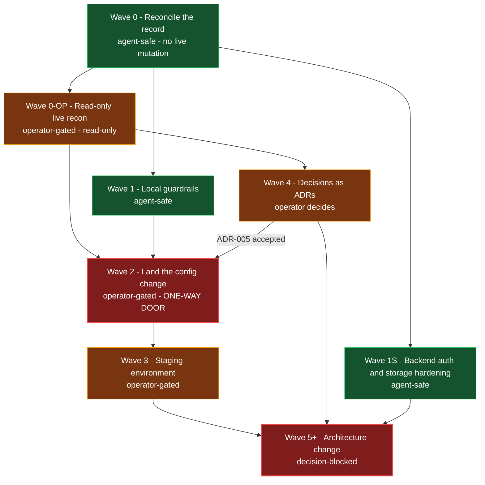

# Dicee Cloudflare roadmap

- **Status:** proposed sequencing; no wave in this document authorizes a deployment, migration, secret change, or provider mutation
- **Last reviewed:** 2026-07-22
- **Scope:** dependency-ordered sequencing from today's repository state to a decided target state, separating work that is safe now from work that is gated on a decision or on live evidence
- **Authority:** [`docs/cloudflare/README.md`](README.md) remains the hub. This file adds ordering; it does not change the authority model or the baseline.
- **Id spaces:** operator checks are `OPS-01`..`OPS-16`, defined only in [`operator-evidence.md`](operator-evidence.md). Decisions are `CF-D01`..`CF-D17`, defined only in [`decision-register.md`](decision-register.md). This file references those ids; it never defines or extends them.
- **Active wave:** Wave 0. The current instruction is understanding and scaffolding, not refactoring.

## How to read this

Three things are conflated across the repository, and this roadmap keeps them apart:

| Layer | What it proves | Example |
|---|---|---|
| Working tree | What one developer's checkout declares | `workers_dev: false` in [`packages/cloudflare-do/wrangler.jsonc`](../../packages/cloudflare-do/wrangler.jsonc) |
| HEAD | What a clean clone and CI actually get | `wrangler.toml` with a legacy `migrations` array and `compatibility_date = "2025-01-01"` |
| Live Cloudflare | What is actually deployed | **Entirely unverified.** No lane in this workstream ran an authenticated Cloudflare operation. |

Every claim below is one of: repository evidence with a `path:line`, a live documentation retrieval with a date, or explicitly labelled unverified. Repository configuration is never evidence of live state.

Work items carry one of three tags:

- **agent-safe** — an agent may do this now, under the normal review gate. No live mutation.
- **operator-gated** — requires authenticated access, a live mutation, or an approval an agent cannot grant.
- **decision-blocked** — cannot start until a named decision is Accepted.

---

## The sequencing constraint that comes before everything

The authority chain is untracked, and HEAD's CI auto-deploys on push. Those two facts interact badly.

Verified this session:

- `git archive HEAD | tar -t` shows HEAD contains only `packages/cloudflare-do/wrangler.toml` and `packages/web/wrangler.toml`. Neither `wrangler.jsonc` exists at HEAD. Nor does `packages/web/worker-configuration.d.ts`.
- HEAD's [`.github/workflows/ci.yml`](../../.github/workflows/ci.yml) deploy jobs are gated `if: github.ref == 'refs/heads/main' && github.event_name == 'push'` and run `command: deploy --env production` from `packages/cloudflare-do` (HEAD lines 271, 300-301).
- The working tree's `ci.yml` is modified: deploys are gated `workflow_dispatch` plus `inputs.deploy` plus `environment: Production`, and the command is `deploy --env=""` (working-tree lines 102, 130).
- HEAD's `wrangler.toml` has an `[env.production]` block. The working tree's `wrangler.jsonc` has **only** top level, `env.development`, and `env.staging` — there is no `production` environment.

The consequence:

> Committing the untracked `wrangler.jsonc` files to `main` **without committing the modified `ci.yml` in the same commit** causes the push itself to trigger a production deploy, running `--env production` against a configuration that no longer declares that environment.

Wave 0 is therefore not merely tidy-up. It is the wave where the deploy trigger is defused. Commit the configuration and the workflow together, or commit neither.

**The mechanism that makes "together" safe, stated explicitly, because everything downstream rests on it.** For a `push` event, GitHub Actions resolves the workflow definition **at the pushed commit** — not at the previous tip, and not at the default branch's prior state. So a commit that both adds `wrangler.jsonc` and replaces the `push`-triggered deploy with `workflow_dispatch` is governed by its own new gate: the trigger evaluated for that push is the `workflow_dispatch`-only one the commit introduces, and no deploy job is eligible to run. That is the entire reason the single-commit sequencing works. Split the two across commits in either order and the mechanism stops protecting you: config-first pushes a commit whose workflow is still HEAD's `push` gate, and workflow-first is safe but leaves a window in which nothing else may land.

**The pull-request route is not an exception — a squash or merge commit into `main` IS a push to `main`.** Landing the change through a PR does not avoid the hazard; it only moves it to the merge. What matters is the content of the resulting commit on `main`. If that commit contains both the configuration and the workflow change, the merge is safe by the same mechanism. If the PR is split so that the configuration merges first, the merge push is evaluated against a `main` tree whose `ci.yml` still carries HEAD's `push` gate, and it deploys. A PR is a review mechanism here, not a safety mechanism.

A related correction worth stating plainly, because it circulated during review: **CI does not validate the old configuration.** HEAD's `ci.yml` contains no `wrangler types`, no `wrangler deploy --dry-run`, and no config-schema check anywhere — its only two wrangler references are the `cloudflare/wrangler-action@v3` deploy steps. The `cloudflare-do` job's type check is `tsc --noEmit`, which never reads wrangler configuration. Nothing gates the configuration swap today, in either direction.

---

## Two classes of work

Keeping these separate is the main reason this document exists. They have different risk profiles, different approvers, and very different expected value.

### Reconciliation and hygiene — high value, low risk, do now

Work that makes the repository describe itself accurately, arms cheap offline guards, and fixes defects the evidence already located. It requires no architecture decision and no live mutation. **Waves 0, 0-OP, 1, and 1S.**

This is where most of the value is. That is not a rhetorical hedge — it follows from the evidence. The proposed target state contains no change that the current scale demands, while the current state contains an unauthenticated lobby, storage that is never reclaimed, a deploy path that appears structurally unable to bundle, and no *enforced* configuration-invariant coverage — an audit script now exists but is untracked and wired into nothing.

### Architecture change — gated on decisions that do not yet exist

Worker renames, the Pages-to-Workers move, custom-domain ownership, D1, R2, OpenTofu, lobby sharding. Every one of these is Pending in the consolidation plan's own decision table (`docs/planning/dicee-cloudflare-resource-guidance.md:50-57`, eight rows).

The Cloudflare decision documents now exist, as of this change: [`decision-register.md`](decision-register.md) carries CF-D01..CF-D17, and [`adr-005-durable-object-lifecycle.md`](../rfcs/adr-005-durable-object-lifecycle.md), [`rfc-004-frontend-platform-and-ingress.md`](../rfcs/rfc-004-frontend-platform-and-ingress.md), and [`rfc-005-durable-data-strategy.md`](../rfcs/rfc-005-durable-data-strategy.md) exist in `docs/rfcs/` alongside the older engine, UI, and data-contract documents. All four are **Draft — not accepted**, and all four are **untracked at HEAD**. Existing is not the same as decided: nothing in Wave 5+ is unblocked until a specific decision reaches Accepted, and nothing in `docs/rfcs/` is in a clean clone until Wave 0.1 commits it. **Waves 4 and 5+.**

---

## Wave 0 — Reconcile the record

**Tag:** agent-safe throughout. No item in this wave touches Cloudflare, Supabase, or GitHub state.

**Goal.** Make a clean clone reproduce local behaviour, defuse the accidental deploy trigger, and correct the planning documents that currently contain executable defects.

**Entry criteria.** None. This wave is unblocked today.

**Work items.**

| # | Item | Detail |
|---|---|---|
| 0.1 | Commit the authority chain **and** `ci.yml` in one commit | Full enumeration below. Nothing in it is optional; a partial commit is the hazard, not a smaller version of the fix. |
| 0.2 | Annotate both `wrangler.jsonc` files | One header comment: the configuration declares intent; live state is unverified as of 2026-07-22. |
| 0.3 | Correct `secrets.required` guidance in the plan | The plan's §6 backend list (`docs/planning/dicee-cloudflare-resource-guidance.md:372`) is incomplete in one direction and over-broad in the other. See the note below. |
| 0.4 | Correct the OpenTofu scaffold in the plan | Two live defects and one wrong constraint. See the note below. |
| 0.5 | Document reconciliation | Record in the hub that `docs/archive/ARCHIVE.md:29,50` contradicts the hub's classification, that `docs/planning/observability-plan.md` carries six unscoped `wrangler tail` commands with no banner, and that `Telemetry-Observability-Report.md:464,575` names `--env production` and `--env dev`, neither of which exists in the current configuration. |
| 0.6 | Publication hygiene | A private hostname survives in an otherwise-sanitised archive file at `docs/archive/migration-guides/unified-cloudflare-stack.md:22`. |
| 0.7 | Draft the read-only recon script | **Not built.** No `scripts/cloudflare-readonly-recon.sh` exists, and nothing in this workstream has created one. The offline audit that *was* built is `scripts/cloudflare-config-audit.mjs`, which is a different thing — it parses repository configuration and makes no network call. See the note below. |

**On 0.1 — the exact commit contents.** Verified against `git status --porcelain` on 2026-07-22. Getting this list wrong is how Wave 0 ends with new files still uncommitted.

Untracked, must be added:

- [`AGENTS.md`](../../AGENTS.md)
- `docs/cloudflare/` — all six files: `README.md`, `current-state.md`, `decision-register.md`, `operator-evidence.md`, `risk-register.md`, `roadmap.md`
- [`docs/planning/dicee-cloudflare-resource-guidance.md`](../planning/dicee-cloudflare-resource-guidance.md)
- `docs/development/` — currently one file, [`toolchain.md`](../development/toolchain.md)
- [`docs/rfcs/adr-005-durable-object-lifecycle.md`](../rfcs/adr-005-durable-object-lifecycle.md), [`docs/rfcs/rfc-004-frontend-platform-and-ingress.md`](../rfcs/rfc-004-frontend-platform-and-ingress.md), [`docs/rfcs/rfc-005-durable-data-strategy.md`](../rfcs/rfc-005-durable-data-strategy.md)
- [`scripts/cloudflare-config-audit.mjs`](../../scripts/cloudflare-config-audit.mjs) — the Wave 1 item 1.3 audit, already written
- [`scripts/public-safety-scan.sh`](../../scripts/public-safety-scan.sh) — untracked too, and Wave 0-OP's receipt procedure depends on it
- [`packages/cloudflare-do/wrangler.jsonc`](../../packages/cloudflare-do/wrangler.jsonc), [`packages/web/wrangler.jsonc`](../../packages/web/wrangler.jsonc)
- [`packages/web/worker-configuration.d.ts`](../../packages/web/worker-configuration.d.ts)

Tracked and modified, must be staged:

- [`.github/workflows/ci.yml`](../../.github/workflows/ci.yml) — **the load-bearing one.** The workflow change is what prevents the push from deploying.
- [`packages/cloudflare-do/worker-configuration.d.ts`](../../packages/cloudflare-do/worker-configuration.d.ts) — tracked already, unlike its `packages/web` counterpart
- Four files under `docs/rfcs/`: `ALL_RFCS.txt`, `adr-001-config-model.md`, `adr-002-transition-strategy.md`, `adr-003-solver-algorithm.md`. These are pre-existing modifications unrelated to Cloudflare. **Review them before staging and split them into their own commit if they are unrelated churn** — the definition of done requires a clean diff, and silently folding four unexplained document diffs into the deploy-defusing commit defeats the review that commit most needs.

Deleted:

- `packages/cloudflare-do/wrangler.toml`, `packages/web/wrangler.toml` — both tracked at HEAD, both superseded by the `.jsonc` files.

The working tree also carries unrelated modifications under `scripts/` and `docs/planning/`, plus an untracked `scripts/templates/`. Wave 0 does not need them. Decide deliberately whether they belong in this commit; the default answer is no.

**On 0.7 — the recon script was not built, and the audit script is not a substitute.** Two different artifacts have been conflated:

- `scripts/cloudflare-readonly-recon.sh` — **does not exist.** It was proposed as a wrapper around the read-only Wave 0-OP commands. It remains a proposal. Either build it in Wave 0 or drop the item; do not cite it as delivered.
- [`scripts/cloudflare-config-audit.mjs`](../../scripts/cloudflare-config-audit.mjs) — **exists and runs**, offline, no credentials, no network call. It is Wave 1 item 1.3, not a recon tool. On 2026-07-22 it reported 19 pass, 1 warning (`SUPABASE_JWT_SECRET` absent from `secrets.required`), exit 0; with `--strict` that warning is fatal and it exits 1.

If 0.7 is kept, its deliverable is a script that runs authenticated read-only commands, which means it is drafted in Wave 0 and **executed only in Wave 0-OP** under an operator token. If it is dropped, Wave 0-OP's methods column stands on its own — every check there is a single documented command.

**On 0.3 — the `secrets.required` correction, stated precisely.** The plan's proposed backend list `["SUPABASE_SERVICE_ROLE_KEY", "SUPABASE_JWT_SECRET"]` has two problems, and neither is the one usually asserted.

`SUPABASE_URL` and `SUPABASE_ANON_KEY` are genuinely read at runtime — `SUPABASE_URL` at [`GameRoom.ts`](../../packages/cloudflare-do/src/GameRoom.ts) lines 295, 328, 346, 698, at [`api/transcribe.ts:47`](../../packages/cloudflare-do/src/api/transcribe.ts), and in [`auth.ts`](../../packages/cloudflare-do/src/auth.ts) at line 183 (JWKS URL) with a fail-closed guard at 241-247; `SUPABASE_ANON_KEY` at `GameRoom.ts:296,347` feeding the `aggregate-game-stats` call. So the plan's inline comment "the backend reads these" is wrong, and the current three-name list in `wrangler.jsonc` should stay.

But dropping a name from `secrets.required` would **not** break the deployed Worker. Per live Wrangler documentation retrieved 2026-07-22 and the installed 4.113.0 config schema, `secrets.required` only drives type generation, deploy-time presence validation, and local-dev warnings. Secrets set out of band remain bound at runtime regardless. The real cost of the plan's list is the loss of a deploy-time guardrail plus reduced typegen coverage — and typegen loss would not even fail the build, because [`packages/cloudflare-do/src/types.ts`](../../packages/cloudflare-do/src/types.ts) lines 34-48 hand-declare all four secrets in `SecretBindings`.

The sharper defect runs the other way: the plan **adds** `SUPABASE_JWT_SECRET` to `required`, while `types.ts:45` declares it optional and the current configuration deliberately omits it. Under documented deploy validation, that one entry would hard-fail `wrangler deploy` in any environment where the legacy HS256 secret is not configured. Resolve the Supabase JWT signing-key question first — whether the project still issues legacy HS256 tokens or has moved to asymmetric keys. That is a Supabase question with no canonical `OPS-NN` id; it is tracked in this file's open-questions list and settled in Wave 0-OP alongside the Cloudflare checks. It is the single blocking fact for CF-D12.

**On 0.4 — the OpenTofu scaffold.** Both defects are present in both circulating copies of the plan, so neither review caught them. Verified against provider `cloudflare/cloudflare` v5.22.0 (current as of 2026-07-22):

- `outputs.tf` uses `v.database_id`. There is no `database_id` attribute on `cloudflare_d1_database`; the computed identifiers are `id` and `uuid`. This fails at plan time, and the output feeds the `${D1_ID}` substitution in the plan's §9 pipeline, so it blocks the whole chain.
- `d1.tf` comments `primary_location_hint` as changeable without recreation. The v5.22.0 schema attaches `RequiresReplace()`, on a resource whose own documentation states that replacing a D1 database loses all data.
- `~> 5.22` means `>= 5.22, < 6.0`, not "the 5.22 patch series". Write `~> 5.22.0` if patch-pinning is the intent.
- `required_version = ">= 1.9.0"` is below the 1.10.0 floor where OpenTofu's native `use_lockfile` state locking shipped. Relevant only if R2 remote state is ever adopted, in which case also note that R2 implements neither bucket versioning nor object tagging, so OpenTofu's recommended state-recovery net and the `state_tags`/`lock_tags` arguments are both unavailable.

**Exit criteria.** `git status` is clean for Cloudflare paths. A clean clone reproduces local behaviour. Pushing to `main` no longer triggers an unattended production deploy. No planning document contains a Terraform snippet known to fail at plan time.

**Rollback. Read this before reverting anything — the obvious rollback is the hazard this wave exists to prevent, inverted.**

A plain `git revert` of the Wave 0.1 commit, pushed to `main`, **is not zero-impact. It re-arms and fires an unattended production deploy.** The mechanism is the same one that makes the single commit safe, running backwards:

- Wave 0.1's commit replaces HEAD's `push`-gated deploy with a `workflow_dispatch` gate. Reverting that commit restores HEAD's [`.github/workflows/ci.yml`](../../.github/workflows/ci.yml), whose deploy job is gated `if: github.ref == 'refs/heads/main' && github.event_name == 'push'`.
- Because Actions evaluates the workflow file **at the pushed commit**, the revert commit is governed by the workflow it restores. The revert push therefore satisfies its own re-armed condition and dispatches the deploy immediately, with no approval step and nobody watching.
- The revert also restores `packages/cloudflare-do/wrangler.toml` and deletes `wrangler.jsonc`, so the deploy that fires runs `deploy --env production` from the legacy `migrations` configuration — the exact command and the exact file this wave was written to stop being executed accidentally.

So the naive rollback does not undo Wave 0; it performs, unattended, the production deploy that Wave 0 was created to make deliberate. Do not do it.

Safe alternatives, in preference order:

1. **Roll forward.** This is the default. Wave 0 changes documentation, configuration files that no CI job reads, and a workflow trigger. There is no failure mode that a follow-up commit cannot fix, and a follow-up commit is evaluated under the already-defused `workflow_dispatch` gate.
2. **Revert on a branch, never directly onto `main`.** Open the revert as a pull request so it is reviewed before it becomes a commit on `main`. Note that this only buys review — see the merge caveat below.
3. **If a revert must land on `main`, preserve the workflow gate.** Revert the configuration and documentation changes while keeping the `workflow_dispatch` version of `ci.yml`. With `$W0` as the Wave 0.1 commit: `git revert --no-commit $W0`, then `git checkout $W0 -- .github/workflows/ci.yml` to put the good workflow back, then commit. The result restores the old configuration without restoring the auto-deploy trigger. Before pushing, verify with `git diff HEAD -- .github/workflows/ci.yml` that it reports **no change** — an empty diff means the `on:` block and the deploy job's `if:` are still the defused ones. A non-empty diff means the revert took the workflow with it; stop.

**The merge caveat applies here too.** Merging or squashing a revert PR into `main` is a push to `main`, evaluated against the merge commit's own workflow file. If that merge commit carries HEAD's `push` gate, it deploys. Option 2 alone is not sufficient; combine it with option 3.

**Blast radius.** Repository only — with the single exception of item 0.1, whose whole purpose is to keep the blast radius at zero. Done wrong (configuration without workflow), 0.1 is the largest-blast-radius item in this document, and its naive rollback is the second largest.

**Effort.** Half a day to a day, dominated by the documentation corrections rather than the commit.

---

## Wave 0-OP — Read-only live reconnaissance

**Tag:** operator-gated, read-only throughout. Runs in parallel with Wave 0.

**Goal.** Convert the largest evidence gap in the workstream — nobody has looked at live Cloudflare — into a small set of dated receipts.

**Entry criteria.** Operator authorises a read-scoped token session. Nothing in Wave 0 needs to finish first.

**Work items.** All read-only. No deploy, no `secret put`, no write API call, no `DELETE /_debug/*`.

The `OPS-NN` ids below are **defined in [`operator-evidence.md`](operator-evidence.md) and nowhere else.** That file is the canonical catalogue of all sixteen checks, with each one's exact command, expected shape, and interpretation. This table does not redefine them; it records which checks this roadmap's waves depend on, and what each one unblocks. If a question here and the catalogue there disagree, the catalogue wins.

| Id | Question | Method | Unblocks |
|---|---|---|---|
| OPS-01 | Does a Worker named `dicee` exist, and what is deployed to it? Has any deploy ever landed a version? | `wrangler deployments list`; corroborate the CI history with `gh run list --workflow=ci.yml` | Wave 2; and it settles the Wave 1 item 1.1 `@dicee/shared` finding either way |
| OPS-02 | Do differently-named Workers exist from the previous CI target — `dicee-development`, `dicee-staging`, a legacy `dicee-production`? | account Workers list | Wave 3; orphan risk from the removed `[env.production]` block |
| OPS-03 | What Durable Object namespaces exist, on which Worker, with which storage backend? For script `dicee`, are they exactly `GameRoom` and `GlobalLobby`, both SQLite? | `GET /accounts/{id}/workers/durable_objects/namespaces`, filter `script == "dicee"`. A Workers Scripts **Read** token suffices. | Wave 2. Highest-value single check. |
| OPS-04 | Did the live Durable Object state come from a legacy `migrations` array? | the same namespace listing, read for provisioning history | Wave 2 — this is what determines whether the first `exports` deploy is a lifecycle transition at all |
| OPS-05 | What bindings does the currently deployed version actually have? | deployed-version detail | Wave 2; catches drift between the deployed Worker and the declared configuration |
| OPS-06 | Which secret **names** are set on the Worker? Is `SUPABASE_JWT_SECRET` among them? | `wrangler secret list` | Wave 2, and CF-D12 (`secrets.required` contents) |
| OPS-08 | Does the live Pages configuration match `packages/web/wrangler.jsonc`? | `wrangler pages download config dicee` | the hub's named reconciliation blocker |
| OPS-11 | Is `dicee.games` a Cloudflare zone **on this account**, and how is it attached? | zone listing | Wave 4 / CF-D07. Custom domains outside Cloudflare zones are Pages-supported and Workers-unsupported, so a negative answer is a hard blocker on the migration decision. |
| OPS-12 | Does the Worker have any route, custom domain, or enabled `workers.dev` subdomain? Is `workers_dev` actually disabled? | Worker settings. If probing, use `/health` only — never `/_debug/*`. | Wave 1S scope, and every ingress decision |
| OPS-13 | Is the Pages origin publicly reachable, and on which hostnames — `dicee.pages.dev`, per-deployment previews? | plain `GET /` | second-origin exposure |
| OPS-16 | What scopes does the token actually carry, and is it shared? | token verify | bounds every other check in this wave; run it first so a failed check is not misread as a negative answer |

The remaining canonical checks — OPS-07 (Pages project and its deployments), OPS-09 (Pages environment variables and secret names), OPS-10 (Pages automatic Git deployments), OPS-14 (live observability settings), OPS-15 (Workers usage model) — belong to the same read-only session and batch with the rest. They are defined in [`operator-evidence.md`](operator-evidence.md); no wave in this roadmap is blocked on them individually, so they are not itemised above.

**Three questions in this session have no `OPS-NN` id, and must not be given one.** The `OPS-NN` space is Cloudflare read-only evidence. These are not Cloudflare checks, and inventing ids for them is what produced the numbering drift this document previously carried:

- **GitHub `Production` environment configuration.** Does it have required reviewers? Do the referenced secrets exist? Method: `gh api /repos/:owner/:repo/environments/Production` and `gh secret list` (names only). This is the only approval gate the deploy jobs claim, so it is worth confirming rather than assuming — but it is a GitHub fact. Gates Wave 3.
- **Supabase JWT signing keys.** Does the project still issue legacy HS256 tokens, or has it moved to asymmetric keys? Method: the Supabase JWT signing-keys view, or `GET /auth/v1/.well-known/jwks.json`. This is the single blocking fact for CF-D12 and for Wave 2 item 2.3. See the open questions section.
- **Supabase table row counts.** How much data exists, and do AI-player games persist at all? Method: read-only `SELECT count(*)`. Feeds RFC-005 sizing. A row count is explicitly *not* a trigger for D1 adoption — see the never-do table — so this is background, not a gate.

**Receipts.** `docs/cloudflare/live-state/YYYY-MM-DD-<topic>.md`, linked from the hub, each naming the `OPS-NN` id (or the explicit non-OPS question) it answers. Redact the account id, `workers.dev` subdomain, Supabase project ref, and any token before committing; record secret **names only**. Run `pnpm security:public` before committing a receipt — [`scripts/public-safety-scan.sh`](../../scripts/public-safety-scan.sh) already fails on a bare Supabase project URL. Note that the script is itself untracked at HEAD and is committed by Wave 0.1.

**Exit criteria.** OPS-01, OPS-03, OPS-04, and OPS-06 answered and committed as receipts, plus the Supabase JWT signing-key question. Those five are what Wave 2 is gated on. The rest can batch.

**Rollback.** Not applicable; no mutations.

**Blast radius.** None, if the read-only constraint holds. The one way to get this wrong is probing `/_debug/*` on a live host, which is why OPS-12 names `/health` explicitly.

**Effort.** One to two hours of operator time.

---

## Wave 1 — Local guardrails

**Tag:** agent-safe throughout. Runs in parallel with Wave 0-OP.

**Goal.** Fix the CI defect that appears to block deployment entirely, and arm cheap offline checks against the specific regressions the evidence found.

The starting position, stated precisely as of 2026-07-22: an offline audit script now exists at [`scripts/cloudflare-config-audit.mjs`](../../scripts/cloudflare-config-audit.mjs) and runs green locally. But it is **untracked at HEAD**, and it is referenced by **no CI job, no package script, and no hook**. So while it is no longer true that no such script exists, it remains true that **nothing in the repository gates any wrangler configuration invariant** — a clean clone gets neither the script nor a check that runs it. Wave 1's job is to close that second gap, not to write the script from scratch.

**Entry criteria.** Wave 0 committed.

**Work items.**

| # | Item | Detail |
|---|---|---|
| 1.1 | Build `@dicee/shared` in the deploy jobs | Its only entry point is `./dist/index.js`, `dist/` is gitignored, and [`packages/shared/package.json`](../../packages/shared/package.json) has scripts `build`, `dev`, `typecheck`, `clean` — no `prepare` or `postinstall`. Both deploy jobs run only `pnpm install --frozen-lockfile`. Inferred, not observed: settle with OPS-01 first. If a deploy has ever run green, this finding is wrong and the run log says so. |
| 1.2 | Non-cancellable deploy concurrency | Workflow-level `cancel-in-progress: true` (working-tree `ci.yml:16-18`) applies to the production deploy jobs, so a second dispatch can cancel a deploy mid-flight. |
| 1.3 | Offline configuration audit | [`scripts/cloudflare-config-audit.mjs`](../../scripts/cloudflare-config-audit.mjs) — written, untracked, unwired. Remaining work is the pending assertions and the CI wiring. Assertions and wiring below. |
| 1.4 | `wrangler deploy --dry-run` in CI | Measured at 2.8 s, fully offline, no credentials. Catches an `exports`/`class_name` mismatch that nothing else catches. |
| 1.5 | AKG coverage note | Add `akg:discover` plus a graph diff for architecture-touching changes. See the AKG note below. |
| 1.6 | Agent guardrails | [`.claude/settings.json`](../../.claude/settings.json) has an allow-list with no `deny` and no `ask`, and `Bash(pnpm --filter:*)` matches `pnpm --filter @dicee/cloudflare-do deploy`. Add deny entries. Update 2026-09-12: the `cloudflare-bindings` MCP server and its token wrapper are removed; `cloudflare-api` is opt-in with per-client OAuth. Previously [`.mcp.json`](../../.mcp.json) handed it the full-scope operator token with no read-only constraint, unlike the Supabase wrapper. |
| 1.7 | Terraform gitignore entries | [`.gitignore`](../../.gitignore) has **no** `*.tfstate`, `*.tfvars`, or `.terraform/` entry — verified. The plan's own checklist requires them before any IaC work. |
| 1.8 | Close the `app.d.ts` drift hole | [`packages/web/src/app.d.ts`](../../packages/web/src/app.d.ts) hand-declares `Platform.env.GAME_WORKER` independently of the generated [`packages/web/worker-configuration.d.ts`](../../packages/web/worker-configuration.d.ts), which no tsconfig references. A partial binding rename passes `svelte-check` today. |

**How the audit is wired — and why not strict in CI yet.** This is the one place where an obvious plan is wrong.

CI runs `actions/checkout` against HEAD. Until Wave 0 lands, HEAD contains no `wrangler.jsonc`, so a strict checker that parses `wrangler.jsonc` has no input file and fails on its first run regardless of how many assertions pass locally. Symmetrically, a [`lefthook.yml`](../../lefthook.yml) hook glob-scoped to `packages/{web,cloudflare-do}/wrangler.jsonc` never fires while those files are unstaged. Local green is not evidence of CI green.

Therefore: **ship advisory-only first (always exit 0), and promote to strict only after Wave 0 has committed both `wrangler.jsonc` files and `packages/web/worker-configuration.d.ts`.** Do not add the audit to `pnpm validate` in this wave; `validate` semantics stay unchanged for everyone mid-stream.

Assertions worth having, grouped by what they defend. **This table is the target specification, not a description of the script as it stands.** The status column separates the two so the document and the script cannot silently drift apart: *implemented* means the assertion runs today under the named check id; *pending* means it is specified here and not yet in the script. Verified by running `node scripts/cloudflare-config-audit.mjs` on 2026-07-22 (19 pass, 1 warn, exit 0).

| Group | Assertion | Status |
|---|---|---|
| Lifecycle safety | exactly one lifecycle mode, and it is the one ADR-005 authorises (`migrations` until ADR-005 is accepted; updated 2026-09-12 by owner decision) | implemented — `B2`, `B3`, `B3E` |
| Lifecycle safety | applied `migrations` history (v1, v2) is unedited; new steps are flagged | implemented — `B2H`, `B2N` (warn) |
| Lifecycle safety | every `class_name` in `durable_objects.bindings` resolves to a class declared by the lifecycle mode, and every declared class has a binding | implemented — `B4`, `B4R` |
| Lifecycle safety | every declared Durable Object export uses `"storage": "sqlite"` | implemented — `B2S` |
| Lifecycle safety | every declared Durable Object class is named in `export { … }` in [`worker.ts`](../../packages/cloudflare-do/src/worker.ts) | implemented — `B10` (updated 2026-09-12). Before `B10`, `B4`/`B4R` cross-checked configuration against itself, not against source. This is the assertion that catches a class renamed in code but not in configuration. |
| Lifecycle safety | no `wrangler.toml` in either package | **pending** — and it stays advisory until Wave 0.1 deletes both files, since both are tracked at HEAD |
| Ingress | `workers_dev === false` | implemented — `B1` |
| Ingress | no `route`, `routes`, or `custom_domain` key | **pending.** Lifting this later requires Wave 1S to have landed — say so in the failure message when it is written. |
| Secrets | every `secrets.required` name is read as `env.NAME` in source | implemented — `B7` |
| Secrets | `secrets.required` identical across the top level and every named environment | implemented — `B9` |
| Inheritance | non-inheritable keys (`vars`, `secrets`, `durable_objects`, `ai`, `services`) repeated in every named environment | implemented — `B5`/`B5A`, `F5`/`F5A` |
| Inheritance | inheritable keys (`migrations`, `exports`, `observability`, `workers_dev`, `preview_urls`, `compatibility_date`) **absent** from environment blocks — this one prevents the wrong "fix" | implemented — `B6`, `F6` |
| Frontend boundary | `packages/web` declares no Durable Object, D1, R2, KV, AI, `exports`, or queue binding | implemented — `F1` |
| Frontend boundary | exactly one service binding | **pending** |
| Frontend boundary | its `service` value equals the backend's top-level `name` | **pending** |
| Hygiene | no hardcoded account id or API token literal, glob-scoped to the wrangler configs | implemented — `X1` |

That last frontend-boundary assertion — `service` equals the backend `name` — is the only mechanical guard against a backend rename silently 503-ing every route, because no CI job deploys the Worker. It is currently **not implemented**, which means that guard does not exist yet. Treat it as the highest-priority pending item in 1.3, not as protection already in place.

Some assertions fail today by design and should ship advisory. One is implemented; three are specified and pending:

- `SUPABASE_JWT_SECRET` read in source but absent from `secrets.required` — **implemented** as `B8`, and it is the single warning the audit emits today.
- `ENVIRONMENT` declared in three environment blocks and never read in source — **pending**.
- Pages `preview` bound to the production Worker — **pending**. This is a live hazard (Wave 3 names it), so it is worth writing early even though it can only warn.
- The configuration files untracked at HEAD — **pending**, and self-resolving once Wave 0.1 lands.

Each is a live finding; promoting it from advisory to enforced is the completion signal for the corresponding fix.

One caveat on scope: an account-id literal check must be glob-scoped to the wrangler configs, workflows, and any `infra/` files. A repository-wide 32-hex scan would match the wrangler-types hash comment in both `worker-configuration.d.ts` files and break the gate on day one.

**On 1.5 — what AKG actually covers.** The layer rule for `cloudflare-do` is `mayImport: ['shared']` in [`akg.config.ts`](../../akg.config.ts), and no invariant enforces it — `mayImport` is read only by the MCP server for the interactive import check and diagram generation, never by `pnpm akg:check`. Two corrections to the framing that circulated: coverage is not zero (`shared-isolation.ts` hardcodes `packages/cloudflare-do/` as a forbidden import target, covering the reverse direction), and [`globallobby-uses-shared.ts`](../../packages/web/src/tools/akg/invariants/definitions/globallobby-uses-shared.ts) does **not** fail open on a class rename. AKG has no class-level nodes; the invariant matches `n.name === 'GlobalLobby' || filePath.includes('GlobalLobby.ts')`, so it fails open when the **file** is renamed or moved — which is the realistic restructure move. The compounding problem is that `akg:check` reads the committed graph and never re-discovers source, so after a restructure it would report green against a stale graph.

**Exit criteria.** `pnpm validate` still green. A deliberate `workers_dev: true` fails the audit locally (`B1` covers this today). Every assertion marked *pending* above is either implemented or explicitly retired with a reason. The audit runs advisory in CI without failing the build — it is wired into no workflow, no package script, and no hook as of 2026-07-22, so "runs in CI" is itself pending work, not a description of the present.

**Rollback.** Per item; each is independent and local-only.

**Blast radius.** Repository and CI configuration. Item 1.1 changes what CI does, so review it against OPS-01 rather than assuming.

**Effort.** One to two days originally, of which the script's core and its JSONC reader are now written: [`scripts/cloudflare-config-audit.mjs`](../../scripts/cloudflare-config-audit.mjs) exists with `--strict`, `--json`, and `--self-test` modes. Both `wrangler.jsonc` files carry comments after the closing brace and `//` inside string values, so the comment stripper had to be string-aware or it would corrupt `$schema` values; the `--self-test` mode exists to prove that and the whole audit should fail if it fails, because a silently broken parser that passes everything is the worst outcome. Remaining effort is the pending assertions above plus the CI wiring — call it half a day, not two.

---

## Wave 1S — Backend authentication and storage hardening

**Tag:** agent-safe throughout. Runs in parallel with Wave 1 — the two waves touch disjoint files.

**Goal.** Close the two defects that are independent of every topology decision and that gate every ingress change.

**Entry criteria.** Wave 0 committed.

**Work items.**

| # | Item | Detail |
|---|---|---|
| 1S.1 | Authenticate `GlobalLobby` | [`GlobalLobby.ts`](../../packages/cloudflare-do/src/GlobalLobby.ts) lines 305-317 derive identity verbatim from `X-User-Id` / `X-Display-Name` / `X-Avatar-Seed` with a `crypto.randomUUID()` fallback, and the file contains no reference to `verifySupabaseJWT` or `Authorization` at all. Mirror the pattern already in `GameRoom.ts:676-706`. |
| 1S.2 | Authorise `/_debug/*` inside the Worker | [`worker.ts`](../../packages/cloudflare-do/src/worker.ts) lines 52-61 forward every `/_debug/*` path to the lobby stub with no check, including the `roomCode === 'ALL'` mass-delete branch. |
| 1S.3 | Reclaim room storage | `deleteAll()` appears nowhere in `packages/cloudflare-do/src`. On game over the room is flipped to `completed`/`abandoned` and written back; `room`, `room_code`, `game_state`, `alarm_queue`, `chat:*` and the per-room SQLite tables persist indefinitely. Implement cleanup on the existing `GameRoom` alarm path. |
| 1S.4 | Replace `setTimeout` with an alarm | `GlobalLobby.scheduleRoomRemoval` uses `setTimeout` inside a Durable Object (`GlobalLobby.ts:950-958`); the code comment already concedes it. Finished rooms leak from the directory whenever the object hibernates inside the window. |
| 1S.5 | Move the Workers AI model id to configuration | [`api/transcribe.ts:70`](../../packages/cloudflare-do/src/api/transcribe.ts) hardcodes `@cf/openai/whisper-tiny-en` at the call site, contradicting the plan's own §11. Wire the duration cap while there: `estimateAudioDuration` is defined at line 97 and never called. |

**State the lobby risk accurately.** The framing that circulated — "authorization lives only in one route file" — is wrong, and the correction matters because it changes the remediation.

Authorization is enforced at **all five** `_debug` proxy routes, each at line 12, via `requireAdminPermission` from [`packages/web/src/lib/server/admin.ts`](../../packages/web/src/lib/server/admin.ts), which does a `safeGetSession()` plus a database-backed `has_admin_permission` RPC and returns 401/403/503: `rooms:view`, `rooms:close`, `rooms:clear_all`, `users:view`, `audit:view`. Separately, [`packages/web/src/routes/ws/lobby/+server.ts`](../../packages/web/src/routes/ws/lobby/+server.ts) lines 29-32 explicitly strip client-supplied `X-User-Id`, `X-Display-Name`, `X-Avatar-Seed`, and `Authorization` before setting them from a JWT-validated session — its inline comment names the reason. And `/api/transcribe` does authenticate, so `GameRoom` is not the lone exception.

So the accurate finding is **single-layer authorization at a trust boundary**: the Worker delegates all lobby identity and all `_debug` authorization to the Pages proxy, and that delegation is safe only while the Worker is unreachable except through the `GAME_WORKER` service binding. Ten `+server.ts` route files under `packages/web/src/routes` proxy through that binding — verified by `grep -rln GAME_WORKER packages/web/src/routes --include='+server.ts'`. (Twelve `+server.ts` files exist; `api/telemetry` and `auth/callback` do not proxy.) The repository declares that posture; OPS-12 is what would confirm it.

That reframing does not reduce the priority. It changes the argument from "there is an open hole today" to "there is no second layer, so any ingress change is a cliff." Which is precisely why this wave gates Wave 4's ingress decisions.

**Exit criteria.** The backend Worker is defensible on its own if reached directly. Focused tests exist for the new authentication path — note that today `GameRoom.ts` (6652 lines) and `GlobalLobby.ts` (1380 lines) have **zero** direct unit coverage, and the only Worker-runtime test asserts HTTP status codes with three empty WebSocket test bodies.

**Rollback.** Standard revert. No live coupling.

**Blast radius.** Worker source. 1S.1 and 1S.2 change request-handling behaviour on paths the frontend proxies, so they need integration coverage, not just unit tests.

**Effort.** Two to three days, and the honest driver is the missing test scaffolding rather than the fixes themselves.

---

## Wave 2 — Land the configuration change

**Tag:** operator-gated. **This wave contains a one-way door.**

**Goal.** Get the declared configuration deployed, with the lifecycle transition performed deliberately rather than incidentally.

**Entry criteria.** All of:

1. Wave 0 committed, including `ci.yml`.
2. Wave 1 item 1.1 resolved, or OPS-01 showing a green historical deploy.
3. OPS-03 confirming live namespaces on script `dicee` are exactly `{GameRoom, GlobalLobby}`, both SQLite-backed.
4. OPS-04 establishing whether those namespaces were provisioned by a legacy `migrations` array — that is what decides whether this deploy is a lifecycle transition or an ordinary one.
5. OPS-06 confirming the three required secrets are set. `secrets.required` is a hard deploy gate.
6. [`ADR-005`](../rfcs/adr-005-durable-object-lifecycle.md) Accepted. The ADR is a precondition for this wave, not a report on it: lines 421-423 explicitly prohibit `wrangler deploy` against the new `wrangler.jsonc` in any environment until the ADR is accepted.

A clean local `--dry-run` satisfies **none** of these.

**What the evidence says about the risk.** Four points, each from a live retrieval:

- Adoption over a `migrations`-provisioned Worker requires **no data migration** — "the provisioned namespaces remain in place; only the configuration shape changes."
- It cannot silently delete a namespace. Deletion requires an explicit `deleted` tombstone, and disagreements surface as deploy-failing errors (`orphaned_provisioned_namespace`, `provisioned_class_missing_from_config`, `storage_type_mismatch`). Do not over-generalise this to "everything is fail-closed" — the same documentation says unambiguous intents are applied automatically.
- Storage type is already correct: HEAD's `wrangler.toml` created both classes with `new_sqlite_classes`, which maps to `"storage": "sqlite"`.
- It is nonetheless irreversible. Subsequent deploys cannot return to the legacy `migrations` array; rollback cannot cross a lifecycle change; gradual deployment is unavailable; `wrangler versions upload` refuses configurations containing `exports`; and **`--dry-run` gives zero lifecycle signal**, because reconciliation is computed server-side and returned only on the PUT.

**Work items.**

| # | Item | Tag |
|---|---|---|
| 2.1 | Decide the split. Option A: single deploy. Option B: land compatibility date, observability, `secrets.required`, and `workers_dev` on the legacy `migrations` configuration first, then adopt `exports` alone. | operator-gated |
| 2.2 | Execute in a low-traffic window. Capture the reconciliation output as a receipt. | operator-gated |
| 2.3 | Resolve `SUPABASE_JWT_SECRET` — add it to all three `secrets.required` blocks, or remove the HS256 fallback. | decision-blocked on the Supabase JWT signing-key question (no canonical `OPS-` id; see Wave 0-OP and the open questions) and on CF-D12 |
| 2.4 | Collapse the double deploy. The wrangler action runs `secret bulk` before the deploy command, and `secret bulk` creates and immediately deploys a new version, so each dispatch produces two versions with a window where new secrets run against old code. `deploy --secrets-file` is the documented single-operation path. | operator-gated |

**Recommendation on 2.1.** Option A, with the pre-flight as a hard precondition. Cloudflare advises deploying lifecycle changes independently of other code changes, and the current tree bundles the switch with an eighteen-month compatibility-date jump, a new deploy-time secrets gate, observability traces, `workers_dev: false`, and an environment restructure. That is a real argument for Option B. Against it: Option B means reintroducing `wrangler.toml` after Wave 0 deleted it, for a ten-user test app, on a Worker whose namespaces the pre-flight will already have confirmed. If OPS-03 surfaces anything unexpected — an extra namespace, a KV-backed namespace — or OPS-02 surfaces a stray `dicee-production` Worker, fall back to Option B without further discussion.

**Brief the operator on one detail before they run it:** if reconciliation is a genuine no-op, Wrangler prints **no** reconciliation block. Silence is the success signal, not an omission.

**Exit criteria.** One deployment per CI dispatch. Live namespaces match `exports`. A dated receipt records the reconciliation output or its absence.

**Rollback.** Item 2.1-A and 2.2 are **not** rollback-able once the lifecycle change lands — that is the entire point of the pre-flight. Contingency is forward-fix only. Under Option B, the first deploy is rollback-able and the second is not.

**Blast radius.** Production. Every backend route.

**Effort.** Two to four hours of operator time, most of it pre-flight and receipt capture.

---

## Wave 3 — Staging environment

**Tag:** operator-gated.

**Goal.** Stop production being the first environment any change reaches.

**Entry criteria.** Wave 2 stable. OPS-02 answered, so that a pre-existing `dicee-staging` Worker is discovered before a first deploy creates a second one. And the GitHub `Production` environment's required-reviewer and secret configuration confirmed — a GitHub check, not a Cloudflare one, so it carries no `OPS-` id.

**Work items.**

| # | Item | Tag |
|---|---|---|
| 3.1 | Parameterise CI with an environment input | operator-gated |
| 3.2 | First staging deploy via `--secrets-file` | operator-gated |
| 3.3 | Decide whether Pages `preview` binds `dicee-staging` | decision-blocked |
| 3.4 | Add staging redirect URLs in Supabase | operator-gated — the repository cannot express this |

**Constraints worth knowing before starting.** Named environments create separate Workers, so a first `--env staging` deploy hits the `secrets.required` first-deploy gate and must use `--secrets-file` rather than `wrangler secret put`. The wrangler action derives `--env` for the secret upload **only** from its `environment:` input, never by parsing the deploy command — so changing the command without the input silently sends secrets to the wrong Worker. And Pages accepts only the environment names `preview` and `production`, so a Worker `staging` environment has no one-to-one frontend mirror.

Also resolve the live footgun this wave exists to remove: `packages/web/wrangler.jsonc` binds Pages *preview* to `service: "dicee"` — the production Worker — so any preview frontend today drives production Durable Object state.

**Exit criteria.** A change can reach staging before production.

**Rollback.** Staging is disposable by construction.

**Blast radius.** New environment; production untouched if 3.3 is decided correctly.

**Effort.** One to two days plus operator time. Consider whether it is worth it at all — see Wave 4's environment decision. Three declared environments that nobody deploys are pure maintenance cost, and one of them is currently a live hazard.

---

## Wave 4 — Decisions

**Tag:** agent drafts, operator decides. Runs in parallel with Waves 1 through 3.

**Goal.** Convert the consolidation plan's eight Pending rows into Accepted, Rejected, or Deferred-with-trigger. No implementation in this wave.

**Entry criteria.** None for drafting. Individual decisions are blocked on specific receipts.

**Artifacts, and where they actually live.** The decision register is [`decision-register.md`](decision-register.md) — that is the filename; there is no `decisions.md`. It carries CF-D01 through CF-D17, and those ids are defined there and nowhere else. Alongside it, three durable records in [`docs/rfcs/`](../rfcs) cover the decisions that genuinely have architectural option space. All three now exist as drafts:

| Id | Covers | Register entries | Blocked on |
|---|---|---|---|
| [`RFC-004`](../rfcs/rfc-004-frontend-platform-and-ingress.md) | Frontend platform, Worker identity, and ingress ownership — Pages versus Workers Static Assets, the `dicee`/`dicee` name collision, custom-domain ownership | CF-D02, CF-D03, CF-D04, CF-D07 | OPS-08, OPS-11, OPS-12 |
| [`RFC-005`](../rfcs/rfc-005-durable-data-strategy.md) | Durable data strategy — D1, R2, Supabase coexistence, and OpenTofu ownership | CF-D01, CF-D06 | the Supabase row-count read (no canonical `OPS-` id — a Supabase check, and background rather than a gate) |
| [`ADR-005`](../rfcs/adr-005-durable-object-lifecycle.md) | Durable Object lifecycle and namespace ownership — the standing procedure for renames and transfers | CF-D10; standing policy for CF-D03 and CF-D05 | OPS-01, OPS-03, OPS-04; **gates** Wave 2 |

The ADR's direction matters and was previously recorded backwards. ADR-005 is **not** blocked on the Wave 2 outcome — it is what unblocks Wave 2. Its lines 421-423 prohibit deploying the new `wrangler.jsonc` in any environment until the ADR is accepted, so "blocked on Wave 2" would be a deadlock in which neither side can move. It is blocked on read-only evidence only.

Three is the right number. The remaining register entries are not RFCs: secret custody (CF-D14) is one edit plus a runbook section, `secrets.required` (CF-D12) is one factual answer then two config lines, lobby authentication (CF-D11) is a defect fix, the AI model (CF-D15) is a config change, and Cloudflare Access (CF-D08) is purely downstream.

**Two corrections that belong in RFC-004, because they were overstated during review:**

- The Pages-to-Workers move is not established as cost-neutral. Cloudflare's own wording is "you can expect a **similar** cost structure." Static-asset requests are free on both and Pages Functions bill at the Worker rate, but the same documentation flags a free-tier `run_worker_first` 429 behaviour, a separate build-CI quota surface, and non-shared runtime and build variables. Write "similar cost structure per Cloudflare, exact parity unmodelled."
- Smart Placement is **not** a settled non-issue for Dicee. It is supported on both platforms at matrix granularity, but on Pages it is explicitly beta and carries a caveat absent on Workers: assets served through the `ASSETS` fetcher are pinned to the Function's location rather than the user's. [`packages/web/svelte.config.js`](../../packages/web/svelte.config.js) uses `@sveltejs/adapter-cloudflare`, which emits advanced-mode `_worker.js` and serves via that fetcher — so the caveat applies directly. Enabling Smart Placement on the current Pages frontend is an open latency question, not a refuted one.

**Four findings that should not be re-litigated**, all live-verified 2026-07-22: Pages is not deprecated; service bindings work on Pages; `exports` adoption cannot silently delete a namespace; and `exports`/`observability` are inheritable, so declaring them only at top level is correct — do not "fix" the configuration by duplicating them into environment blocks.

**Exit criteria.** Each decision carries a status and a date. Deferred decisions carry a trigger.

**Rollback.** Supersede with a new decision.

**Blast radius.** None. This wave produces text.

**Effort.** Ongoing. RFC-004 is the expensive one because OPS-11 can invalidate it outright — if `dicee.games` is not a zone on this account, the Workers custom-domain path is unavailable and the frontend-platform option space collapses.

---

## Wave 5+ — Architecture change

**Tag:** decision-blocked, entirely.

**Goal.** Implement whatever Wave 4 accepted.

**Entry criteria.** A specific Accepted decision. **Do not pre-build any of this.**

Ordering if approved: naming → namespace transfer or accepted data loss → Pages-to-Workers → custom domain → IaC → D1/R2.

**Five traps that must appear in the implementation checklist**, because each silently breaks something:

1. Do **not** set `assets.not_found_handling: "single-page-application"`. With `compatibility_date` at 2026-07-21 — past the 2025-04-01 threshold — navigation requests bypass the Worker entirely, and the installed adapter writes an SPA `index.html` into the assets directory. SSR stops working silently.
2. Workers serve assets **before** the Worker unless `assets.run_worker_first` is set, inverting today's Pages behaviour.
3. The `routes` option in `svelte.config.js` becomes dead code on the Workers target.
4. `routes` is not an accepted key in a Pages configuration, so custom-domain ownership is not incrementally adoptable — it is hard-coupled to the platform decision.
5. The custom-domain cutover is detach-then-attach with a new certificate, and no official source claims it is zero-downtime. Validate on a `workers.dev` subdomain first and keep the Pages project alive with automatic deployments disabled as the rollback path.

**Blast radius.** Everything. **Effort.** Weeks.

---

## Wave dependencies

Green is agent-safe. Amber is operator-gated. Red is irreversible or decision-blocked.

## Parallelizable

| Can run concurrently | Why it is safe |
|---|---|
| Wave 0 and Wave 0-OP | One touches only the repository; the other touches only live reads. No shared artifact except the receipts directory. |
| Wave 1 and Wave 1S | Disjoint file sets. Wave 1 touches `wrangler.jsonc`, `ci.yml`, `scripts/`, `.claude/`, `.gitignore`, `lefthook.yml`. Wave 1S touches `packages/cloudflare-do/src/**`. Safe for two agent lanes. |
| Wave 4 and everything before Wave 5 | Wave 4 produces text only. **Drafting** is parallel-safe throughout. **Accepting ADR-005** is not merely parallel work — Wave 2 cannot start without it, so it sits on the critical path even though it produces no code. |

Strictly sequential: Wave 0 before Waves 1 and 1S (they build on the committed baseline); Wave 0-OP, Wave 1, and an Accepted ADR-005 before Wave 2; Wave 2 before Wave 3; Waves 3, 4, and 1S before Wave 5.

The critical path to a deployable state is **Wave 0 → Wave 1 (item 1.1) → Wave 0-OP (OPS-01, OPS-03, OPS-04, OPS-06) → ADR-005 Accepted → Wave 2**. Everything else can run beside it.

---

## Candidate never-do or defer indefinitely

Proposals the evidence does not justify at Dicee's current scale. Each carries the trigger that would change the answer. None is rejected on principle; each is rejected on the absence of a consumer, a bottleneck, or a forcing function.

| Proposal | Why not now | Trigger that changes the answer |
|---|---|---|
| **R2 bucket with the `commands/` lifecycle rule** | The rule is named `expire-transcribed-command-audio` and targets prefix `commands/`. There is no voice-command feature. Today's SFX are eight committed `.ogg` files totalling 628K served as static assets; the transcription path streams and stores nothing; the one real user-uploaded blob workload is bug-report voice notes, already in a Supabase Storage bucket the proposal does not mention. | A voice-command feature ships, **or** a decision to move bug audio off Supabase Storage. In the second case, retarget the bucket at that workload and keep short-retention objects in `Standard` — Infrequent Access has a 30-day minimum duration and double the Class A cost. |
| **D1 adoption** | Cost is not a driver in either direction, and D1 storage is more expensive per GB-month than Durable Object SQLite, so "move state to D1 to save storage" is backwards. (That comparison assumes Durable Object SQLite storage is billed at the published $0.20 per GB-month beyond the 5 GB-month included allowance. Whether this account is actually being charged yet is an open question — see below. The conclusion does not change either way: if DO storage is not yet billed, D1 is more expensive still.) Only nine of fifteen declared tables are touched by any code. The unbudgeted costs are an identity mirror (every foreign key roots at `profiles(id) → auth.users(id)` via an `AFTER INSERT` trigger) and replacing RLS — the entire browser-side authorization model — with hand-written Worker authorization, plus roughly 700 lines of `SECURITY DEFINER` plpgsql. | A stated query workload Supabase cannot serve, **or** a decision to retire Supabase for reasons other than cost. Not a row count. |
| **OpenTofu module** | There is no `infra/` directory and no `.tf` file. A module managing zero resources is pure overhead, and the proposed scaffold has two defects that fail at plan time. | D1 or R2 accepted. Fix both scaffold defects and raise `required_version` first. |
| **`GlobalLobby` → `LobbyShard` rename** | The rename is cheap; the capability it implies does not exist. `idFromName('singleton')` is hardcoded in two places, and presence counting, chat broadcast, invite delivery, and join-request routing all iterate `ctx.getWebSockets()` on one instance. The room directory is a single storage key rewritten as a whole-array blob. The rename would also convert a passing AKG invariant into a vacuous no-op. | The lobby object approaching the documented 1,000 requests-per-second per-object soft limit, **or** a measured presence fan-out cost. Do the `setTimeout`-to-alarm fix (Wave 1S) instead — that is the real defect in that file. |
| **Worker rename `dicee` → `dicee-game-{env}` as a standalone change** | Zero functional benefit. Namespaces are keyed to the Worker script name, so a rename yields empty namespaces unless a four-deploy transfer is executed, and it breaks the one load-bearing service-binding reference with no CI job to catch it. | Wave 4 accepting the Pages-to-Workers move, which is the only context where the name collision becomes real. Fold it in there. |
| **`GAME_WORKER` → `GAME_SERVICE` as a standalone change** | Fourteen sites of pure churn. | Same trigger as the Worker rename. Close the `app.d.ts` drift hole (Wave 1 item 1.8) regardless — that is worth doing on its own. |
| **Pages-to-Workers argued as remediation** | Pages is not deprecated. No deadline exists, and cost is approximately a wash. | A stated need for repository-managed frontend observability, Workers Logs or Logpush, or gradual deployment. Those are the honest arguments; make one of them explicitly or do not move. |
| **Cloudflare Access** | No identity or access-policy material exists in the repository, and organization-level Cloudflare policy has not been incorporated. Preview URLs are additionally never generated for Workers implementing a Durable Object, which removes the usual driver. | Public ingress on the backend Worker, **or** an organization identity policy landing. |
| **Explicit `preview_urls: false`** | `preview_urls` defaults to the value of `workers_dev`, already `false`, and Preview URLs are not generated for Durable Object Workers regardless. | Nothing. Add it as one line of self-documentation if desired; it is not a fix. |

---

## Open questions and unknowns

Questions this roadmap depends on and cannot answer from the repository. Each is listed with what would settle it. None has a canonical `OPS-NN` id, either because it is not a Cloudflare read-only check or because no catalogue entry covers it — and none should be given one. Inventing ids for these is exactly what produced the earlier numbering drift.

| Question | Why it matters here | What settles it |
|---|---|---|
| **Supabase JWT signing keys: does the project still issue legacy HS256 tokens, or has it moved to asymmetric keys?** | The single blocking fact for CF-D12 and for Wave 2 item 2.3. [`auth.ts`](../../packages/cloudflare-do/src/auth.ts) reads `SUPABASE_URL` at line 183 to construct the JWKS URL and guards fail-closed at lines 241-247, while `types.ts:45` declares `SUPABASE_JWT_SECRET` optional. If the project is asymmetric-only, the HS256 fallback is dead code and should be removed rather than declared required; if it is not, adding the name to `secrets.required` is mandatory before any environment that lacks the secret is deployed to. Adding it while the secret is unset hard-fails `wrangler deploy`. | An operator read of the Supabase JWT signing-keys view, or `GET /auth/v1/.well-known/jwks.json`. Read-only. Batches with Wave 0-OP. |
| **Is this account actually being charged for Durable Object SQLite storage?** | The never-do table's D1 row compares per-GB-month storage cost, and Wave 1S item 1S.3 is partly justified by storage that is never reclaimed. Both arguments assume storage is billed. | Only the account's own billing and usage view — an operator read, not a documentation question. See the note below; do not answer it from the docs page. |
| **GitHub `Production` environment: are required reviewers configured, and do the referenced secrets exist?** | It is the only approval gate the deploy jobs claim, and Wave 3 depends on it. A GitHub fact, not a Cloudflare one. | `gh api /repos/:owner/:repo/environments/Production` and `gh secret list` (names only). |
| **Supabase table row counts, and whether AI-player games persist at all.** | Background for RFC-005 sizing. Explicitly **not** a trigger for D1 adoption. | Read-only `SELECT count(*)`. |

**On Durable Object SQLite storage billing — state this carefully, in both directions.** Cloudflare's [Durable Objects pricing page](https://developers.cloudflare.com/durable-objects/platform/pricing/), retrieved live on 2026-07-22, is **still worded in future tense**. It carries a callout reading that storage billing on SQLite-backed Durable Objects "will be enabled in January 2026, with a target date of January 7, 2026 (no earlier)", and that only SQLite storage usage on and after the billing target date will incur charges. The rates given are 5 GB-month included on Workers Paid, then $0.20 per GB-month.

That announced target date is now roughly six months past. But Cloudflare has not updated the page out of future tense, so **the page alone does not confirm that billing was switched on.** Do not write "billing is live"; do not write "billing has not started". Both overclaim. Whether this account is being charged is answerable only from its own billing view, which is why the question is routed to an operator check above rather than settled by a documentation citation.

Plan as though storage is billed. That is the prudent assumption, it is the assumption the storage-reclamation work in Wave 1S already rests on, and it is the assumption under which the D1 cost comparison holds. Label the enablement question as open, because it is.

---

## Definition of done, per wave

Each wave inherits the five criteria in [`AGENTS.md`](../../AGENTS.md). This table records what each one means concretely for that wave — including where a criterion is legitimately not applicable, which must be stated rather than silently skipped.

| Wave | Focused tests | Generated types and lockfiles | `pnpm validate` | Clean diff review | Handoff separation |
|---|---|---|---|---|---|
| **0** | Not applicable — documentation and git state only. State this explicitly. | Both `worker-configuration.d.ts` files committed alongside their `wrangler.jsonc` — `packages/cloudflare-do`'s is tracked and modified, `packages/web`'s is untracked and must be added. No lockfile change expected. | Must pass unchanged. Wave 0 alters no build input except configuration files CI does not yet read. | `git diff --check`. Confirm no secret, no account id, no generated noise. Confirm `ci.yml` is in the same commit as `wrangler.jsonc`. Re-run `git status --porcelain` after staging and check the 0.1 enumeration against it: every file listed there is staged, and nothing unrelated rode along. | Local: everything. Operator-only: nothing. Explicitly state that no deploy has occurred and live state remains unverified, and that the rollback for this commit is not a plain `git revert` — see the Wave 0 rollback section. |
| **0-OP** | Not applicable. | Not applicable. | Not applicable. | Receipts reviewed for redaction before commit; `pnpm security:public` run. | Entirely operator work. Handoff records which register entries each receipt unblocks. |
| **1** | The configuration audit ships with a `--self-test` covering JSONC edge cases (it does). Item 1.1 verified against OPS-01 rather than assumed. | `pnpm check:workers` clean for both packages. | Must pass. The audit is **not** added to `validate` in this wave. | Confirm the audit is advisory-only in CI and that the account-id assertion is glob-scoped so it does not match the wrangler-types hash comments. | Local: audit, CI fixes, guardrails. Operator-only: none. Name the assertions shipping advisory and why. |
| **1S** | Required and load-bearing. New tests for lobby authentication, `_debug` authorization, and storage cleanup. Note in the handoff that both Durable Object classes had zero direct coverage before this wave. | `pnpm --filter @dicee/cloudflare-do types:check` clean. | Must pass, including `pnpm --filter @dicee/cloudflare-do test:agent`. | Confirm no ad hoc `console.log` was added — `AGENTS.md` forbids it, and there is already one deliberate exception at `GameRoom.ts:299`. | Local: all source changes. Operator-only: OPS-12 to confirm ingress posture, and the deploy that makes the fix live. |
| **2** | Not applicable — no code change. If item 2.3 changes `secrets.required`, the Wave 1 audit assertion must be promoted from advisory to enforced in the same change. | Regenerate and commit types if configuration changes. | Must pass before the deploy, not after. | Review the deployed diff against the committed configuration. | Almost entirely operator-only. Local handoff: pre-flight evidence. Operator handoff: reconciliation output, deployment ids, and an explicit statement of what is now irreversible. |
| **3** | CI workflow changes exercised on a non-production dispatch first. | Types current for any new environment block. | Must pass. | Confirm the deploy command and the wrangler action `environment:` input agree — they resolve independently. | Local: workflow and configuration. Operator-only: GitHub environment setup, first staging deploy, Supabase redirect URLs. |
| **4** | Not applicable — text only. | Not applicable. | Must still pass; documentation changes should not break it. | Confirm every decision cites evidence with a path, a live URL and date, or an explicit "unverified". | Local: drafts. Operator-only: the decision itself. Each decision states which receipts it consumed. |
| **5+** | Per the accepted decision. Assume substantial new coverage; there is very little to build on. | Regenerate everything the change touches. | Full gate. | Full diff review across both packages plus CI. | Expect the majority to be operator-gated. |

---

## Honest assessment of where the value is

Waves 0 and 1 together are perhaps two to three days of work — less than originally scoped, because the audit script is already written — and they resolve: a repository that does not describe itself, a commit that would trigger an unattended production deploy against a configuration missing the environment it targets, a deploy path that appears structurally unable to bundle a workspace dependency, and configuration invariants that are asserted by a script nothing runs.

Wave 1S is another two to three days and closes the one security gap that is genuinely independent of every architecture decision, plus the storage growth that nothing currently reclaims.

Wave 2 is hours of operator time, but it is the only irreversible step in the near term, and its entire risk profile is determined by whether a five-minute read-only pre-flight was run.

Waves 4 and 5 are, on today's evidence, mostly work that should be declined or deferred with a trigger. That is a legitimate outcome. The consolidation plan is a good piece of research; what it mostly establishes is that Dicee does not currently need what it proposes. Writing that down — with triggers, so the question can be reopened when something changes — is more valuable than building any of it.

The one thing in the target state that is clearly worth doing eventually, and is not in the plan's decision table, is giving the backend Worker a second layer of authorization. Wave 1S does that, and it needs no decision at all.
